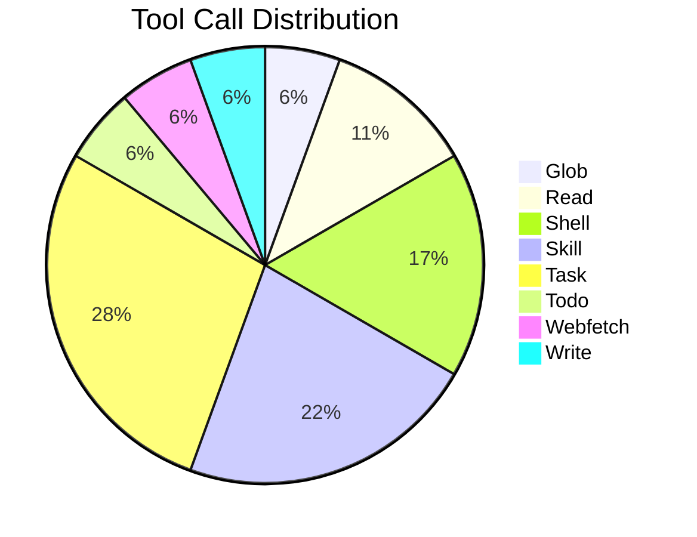
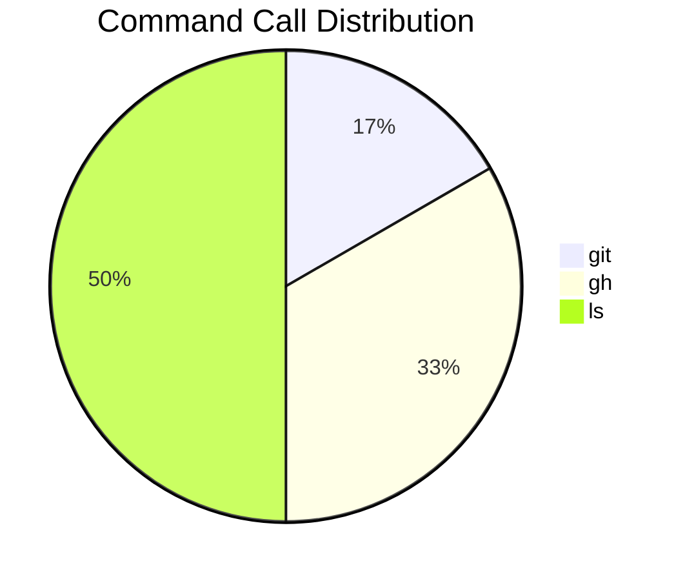
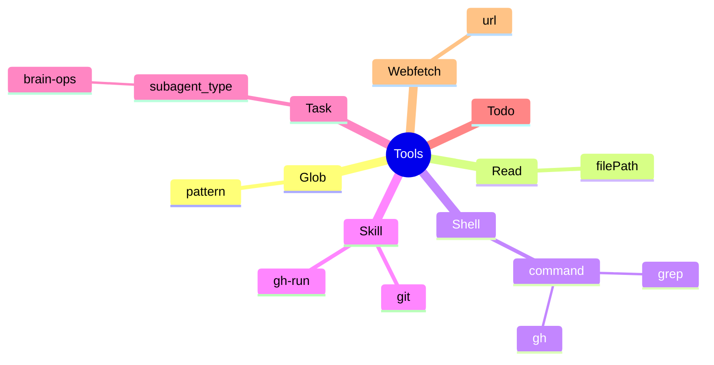
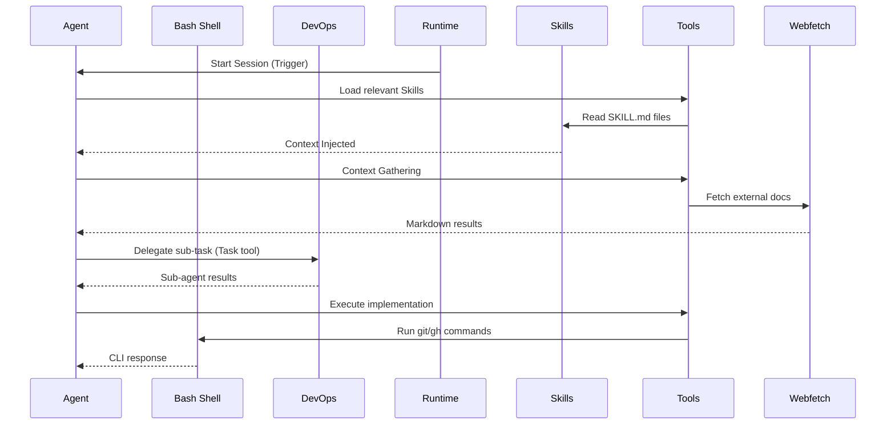
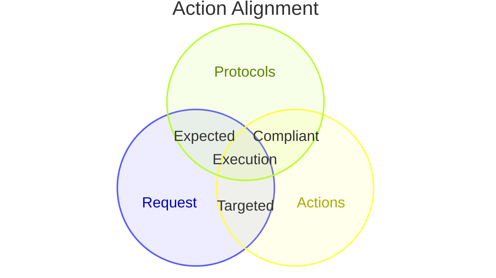
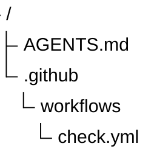
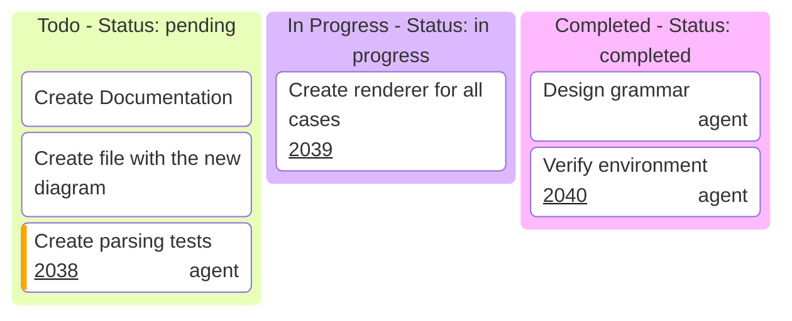
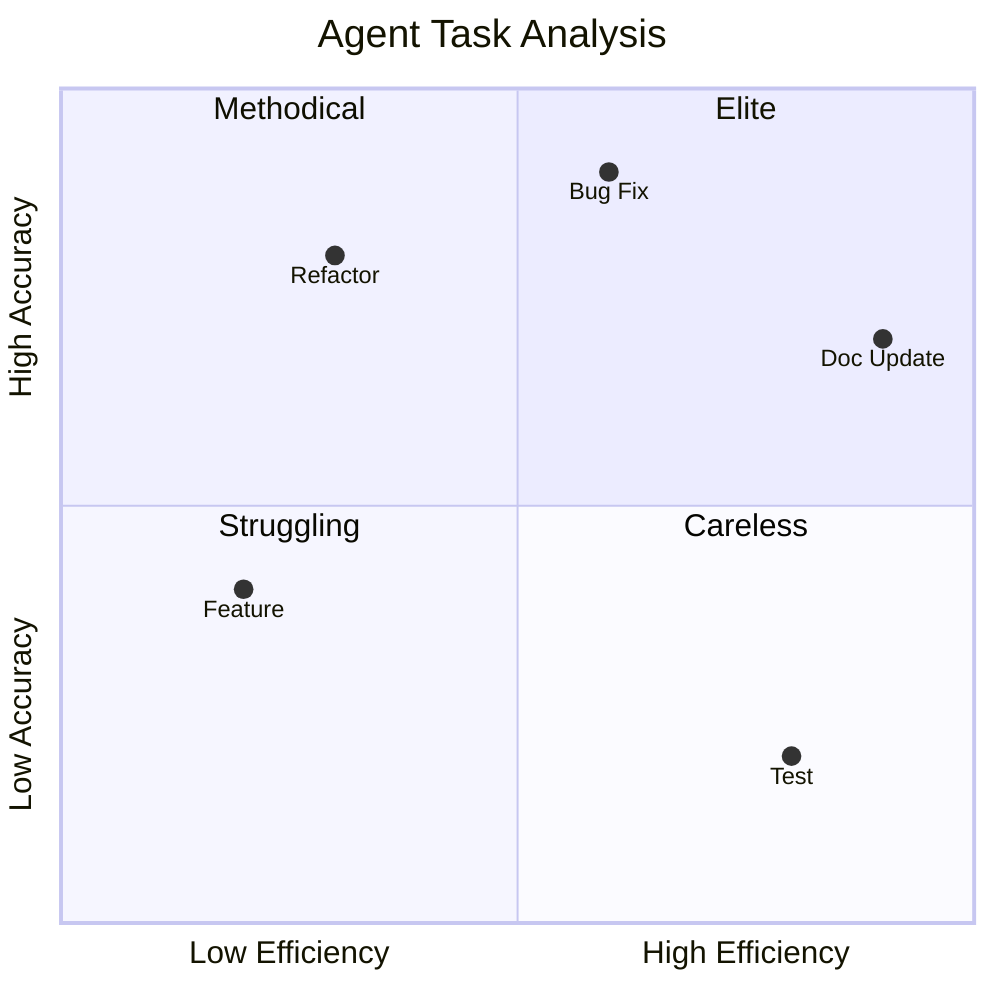
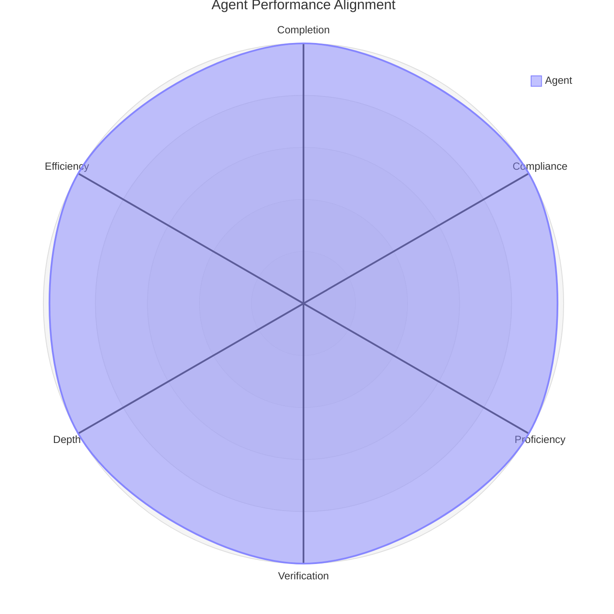

# Agent Log Analysis & Reporting

This skill dictates the mechanical execution and rigid formatting requirements for auditing AI agent session logs.

## 1. Log Retrieval Mechanics

If logs are not directly provided in the prompt, retrieve them using:

- **GitHub Actions Runs**: `gh run view <run-id> --log` or `gh run view <run-id> --log-failed`
- **Local Artifacts**: Parse directories under `temp/extract/` or `logs/` using `grep`, `cat`, or file search tools.

Raw logs from GitHub runs can be filtered by:

```bash
awk '/PROMPT:/,/Post job cleanup/ { $1=""; print substr($0,2) }'
```

## 2. Artifact Extraction

When analyzing logs, specifically identify any external artifacts created or modified:
- **Pull Requests**: Look for "Created PR #<number>", "Creating pull request...", or "gh pr create" success messages.
- **Issues**: Look for "Created issue #<number>", "gh issue create" success messages, or comments.
- **Commits/Branches**: Look for "git push", "Pushed to <branch>", or commit SHA references.

## 3. Skill Loading Analysis

When analyzing logs, verify the skill loading process:
- **Skill Discovery**: Identify which skills the agent attempted to load (e.g., `skill` tool calls).
- **Loading Success**: Confirm if the skills were successfully loaded into the context.
- **Missing Skills**: Identify if the agent failed to load a skill that was clearly relevant to the task.

## 4. Standardized Reporting Structure

You MUST systematically output your findings adhering to this strict standardized structure.
Do not invent new structures or deviate from these templates.

### 4.1 Text Report (Markdown)

```markdown
#### Brief

The agent session for **github.run_id [Run ID] (attempt [Attempt Number])** was [successful / unsuccessful / partially successful]
and [followed / deviated from] established protocols.
Operating as the `[Agent Persona]`, the agent completed the task of [Brief Task Description]
while maintaining strict adherence to the project's initialization and verification workflows.

#### Prompt Summary

* **Prompt Summary:**
  [Brief summary of the input prompt/trigger.]

* **Trigger Source:**
  [e.g., GitHub issue comment, manual workflow run]

#### Key Actions & Decisions

* **Agent Interactions:**
  [List any sub-agents called and their purpose (e.g., Architect -> Brain Ops)]

* **Context Gathering:**
  [How did the agent acquire necessary information?]

* **Execution / Tracing:**
  [What were the core actions taken?]

* **Self-Verification:**
  [Did it verify the environment state?]

* **Task/Workflow Management:**
  [How did it track progress?]

#### Root Cause Identified (If Applicable)

The agent discovered a **[brief description of the core issue]**:

1. **[Step 1]**: [Description]

#### Produced Artifacts

* **[Artifact Type]:** [Link/Reference, e.g., Pull Request #179, Issue #42, or commit `deadbeef`]

#### Session Summary

* **Conclusion:**
  [What was the final state?]

* **Primary Task:**
  [What was the agent explicitly instructed to do?]

* **Workflow Compliance:**
  [Did the agent load the necessary constraints, flows, and instructions?]

#### Session Telemetry

* **Execution Time:**
  [Total time taken]

* **Steps Taken:**
  [Number of steps]

* **Total Skills:**
  [Number of skills loaded] ([List of skills loaded])

* **Total Tasks:**
  [Total number of tasks (from todos)]

* **Tool Calls:**
  [Total number of tool calls] ([Tool1]: [N], [Tool2]: [M], ...)

* **Tokens Used:**
  [Optional: total tokens if available]

#### Issues/Limitations Encountered

* **[Issue / None]:**
  [Describe any tool failures or explicitly state "None"]
  [Include any syntax errors, command hungs or other unexpected activity]

* **[Limitation / None]:**
  [Describe any failures due to access or environment limitations]

* **[Performance / None]:**
  [Describe any performance concerns such as sloweness, hungs]

#### Recommendation Provided (Optional)

[Summarize any recommendations]
```

Note: The Text Report must be output as direct Markdown; do not wrap the resulting report in an outer code block.

### 4.2 Comprehensive Visual Audit Suite (Mermaid & Data)

#### A. Agent Tool Utilization (Pie Chart)

Generate the following Mermaid `pie` diagrams to visualize the relative frequency of tool and command calls.

**Tool Utilization Pie Chart**



Note: Include only high-level tool names without actual commands.

**Command Utilization Pie Chart**



Note: Include only actual bash tool commands.

#### B. Agent Tool Usage Mindmap

Generate a Mermaid `mindmap` visualizing the hierarchy of tools
and their key parameters or sub-commands executed during the session.

**Tool Usage Mindmap**



#### C. Agent Execution Flow (Sequence Diagram)

Generate a Mermaid `sequenceDiagram` visualizing chronological actions.

- **Participants**: `Workflow`, `Agent`, `[Sub-Agent]`, `Tools`, `FileSystem`, `GitHub`
- **Focus**: Initialization, Skill Loading, Context Gathering, Agent Interactions
  (e.g., Task/delegation calls), Execution, Verification.

Example showing sub-agent interaction:

**Agent Execution Flow**



#### D. Agent Execution Journey (Friction & Success Map)

Generate a Mermaid `journey` diagram of problem-solving friction.

- **Score 1-5**: (5: Flawless, 1: Error/Hard failure).
- **Sections**: `Initialization`, `Investigation`, `Execution`, `Verification`.
- **Actors**: `Agent`, `Bash`, `GitHubAPI`, `FileSystem`.

#### E. Agent Execution Alignment (Venn Diagram)

Generate a Mermaid `venn-beta` diagram visualizing action alignment. Ensure strings are properly delimited.



#### F. Root Cause & System Architecture (If Errors Occurred)

If failures or bugs hit the agent, you MUST generate:

1. **`ishikawa-beta`**: Evaluate branches to find the root cause of the failure.

   ```mermaid
   ishikawa-beta
       Agent Failure Description
       Context & Prompts
           Missing instructions
       Tools & Capabilities
           Bash restricted
       Logic & Reasoning
           Hallucinated path
       Workflow & Protocols
           Skipped verification
       Environment
           Read-only repo
   ```

2. **`architecture-beta`**: Visualize mechanical boundaries to show where data dropped or the chain failed.

   ```mermaid
   architecture-beta
       group api(cloud)[API Gateway]
       service auth(server)[Auth Service] in api
       service db(database)[Session DB] in api

        service user(user)[Agent Session]
        user:R -- L:auth
        auth:R -- L:db
    ```

#### G. Agent File Access Hierarchy

Generate a Mermaid `treeView-beta` diagram visualizing the hierarchy of files and directories accessed by the agent.

**Accessed Files Tree**



#### H. Agent Task Board (Kanban)

Generate a Mermaid `kanban` diagram to visualize the task board and tracking state.
Column headers SHOULD include status metadata.
**IMPORTANT**: Do not use special characters such as brackets `()` within task labels; they must be escaped or removed as they will break Mermaid syntax.
This MUST be based on the actual `todos` found in the agent session logs
(e.g., from `todowrite` tool calls or explicit task tracking), not invented tasks.
To avoid breaking Mermaid syntax, DO NOT use structural characters like
`{}`, `[]`, `()`, `<`, or `>` in labels.

**Agent Task Board**



#### I. Agent Cognitive & Execution Loop (State Diagram)

Generate a Mermaid `stateDiagram-v2` modeling the internal state machine.

- **States**: `Initializing`, `ContextGathering`, `Executing`, `ErrorRecovery`, `Verifying`.
- **Transitions**: Explain *why* the agent moved states (e.g., "Syntax Error Detected").

#### J. Agent Performance Quadrant

Generate a `quadrantChart` to visualize agent performance across tasks:



#### K. Agent Radar Analysis

Generate a `radar-beta` diagram to score the agent from 1 to 10 on core competencies:



## Related Skills

- **gh-run**:
  Must be loaded when working with `gh run` and `gh workflow` commands.
