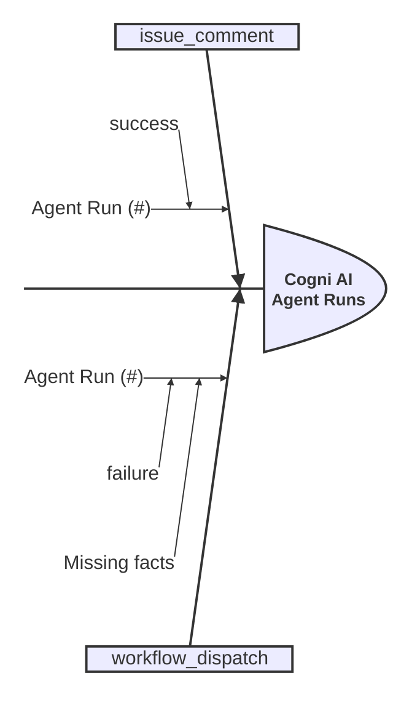

# Skill: brainstorm-agent-runs

<!-- markdownlint-disable MD013 MD023 MD031 MD032 -->

Analyze execution logs of agentic runs in CI/CD pipelines to extract insights about implementation status, challenges, and next steps for a Pull Request.

## Core Process

1. **Trigger Recognition**: Activate when an active Pull Request is associated with the runtime context or the user requests PR analysis.
2. **Identify Runs**: Use the GitHub API to query all runs matching either the PR branch OR title, bypassing `gh pr checks` limitations.
3. **Extract Insights**: Analyze the identified runs (successes, failures, missing facts) without checking detailed logs prematurely.
4. **Visualize**: Generate an `ishikawa-beta` diagram representing the findings.

## Commands / Usage Patterns

List all agent runs for a PR by matching either branch name or PR title:

```bash
branch_name=$(gh pr view <pr_number> --repo <owner>/<repo> --json headRefName -q .headRefName)
pr_title=$(gh pr view <pr_number> --repo <owner>/<repo> --json title -q .title)

gh api repos/<owner>/<repo>/actions/runs --paginate \
  -q ".workflow_runs[] | select((.head_branch == \"$branch_name\" or .display_title == \"$pr_title\") and .name == \"Cogni AI Agent\") | {id: .id, status: .status, conclusion: .conclusion, event: .event}"
```

## Brainstorming - Agent runs

When an active Pull Request is associated with the runtime context or the user requests PR analysis,
you MUST identify agentic runs in the CI/CD pipeline and analyze their execution logs
to extract insights about the implementation status, challenges, and next steps.

### Step 1: Agent PR runs

First, identify any agentic runs in the CI/CD pipeline associated with the Pull Request.
Because `gh pr checks` only shows the HEAD commit's latest runs and routinely misses manual workflow calls (`workflow_dispatch`)
or keyword triggers (`issue_comment`), you MUST use the GitHub API to query all runs matching either the PR branch OR title.

**Command to list all agent runs for a PR:**

```bash
branch_name=$(gh pr view <pr_number> --repo <owner>/<repo> --json headRefName -q .headRefName)
pr_title=$(gh pr view <pr_number> --repo <owner>/<repo> --json title -q .title)

gh api repos/<owner>/<repo>/actions/runs --paginate \
  -q ".workflow_runs[] \
  | select((.head_branch == \"$branch_name\" or .display_title == \"$pr_title\") and .name == \"Cogni AI Agent\") \
  | {id: .id, status: .status, conclusion: .conclusion, event: .event}"
```

**Example `ishikawa-beta` Diagram:**



At this step, don't check for more detailed logs yet.

## Related Skills

- **brainstorm**:
  You MUST load this skill when asked to brainstorm, explore options, or break down complex problems.
- **brainstorm-github-pr**:
  You MUST load this skill when asked to analyze or brainstorm a Pull Request.
- **gh-api**:
  You MUST load this skill when executing advanced GitHub CLI API queries.
- **mermaid**:
  You MUST load this skill when creating or maintaining stable Mermaid.js diagrams.
- **mermaid-beta**:
  You MUST load this skill when creating or maintaining experimental Mermaid.js beta diagrams like `ishikawa-beta`.
