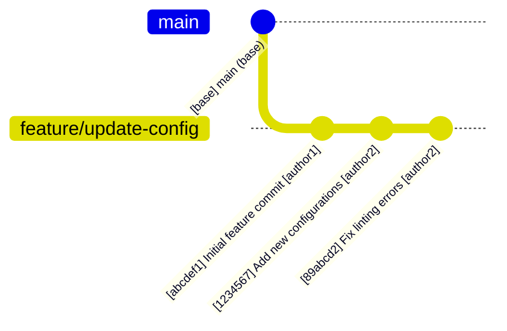
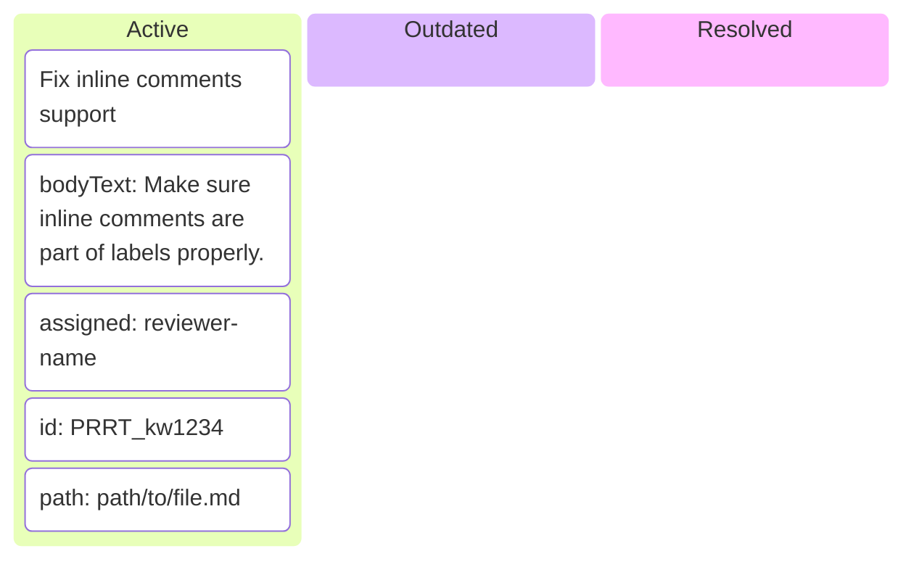
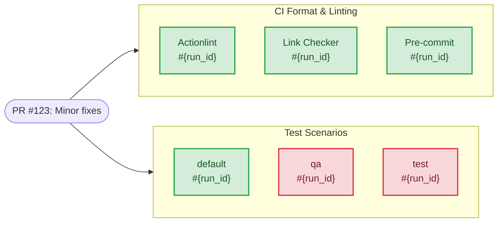
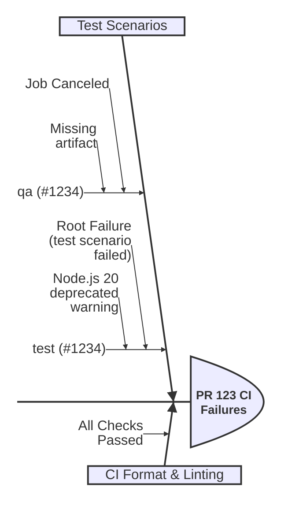

# Skill brainstorm-github-pr

<!-- markdownlint-disable MD013 MD023 MD031 MD032 -->

Analyze and visualize GitHub Pull Requests by mapping commit history, reviewer feedback, and CI/CD status into structured Mermaid diagrams to establish context before deep analysis.

## Core Process

1. **Commit History Visualization**: Map out the historical context of the PR by generating a list of commits into a Mermaid `gitGraph` diagram.
2. **PR Review Kanban Diagram**: Map active, outdated, and resolved review threads or comments into a Mermaid `kanban` diagram.
3. **CI Checks State Visualization**: Visualize the current state of Continuous Integration (CI) checks (passing, failing, pending) using a Mermaid `flowchart` diagram.
4. **CI Failures Summarization**: Categorize and summarize the root causes and affected jobs of any CI failures using a Mermaid `ishikawa-beta` diagram.

## Core Principles

- **Visual State Mapping**: Always translate raw PR data (commits, reviews, checks) into easy-to-read diagrams before diving into code or detailed logs.
- **Native Tooling**: Rely on native CLI commands like `gh pr view`, `gh pr checks`, `gh run view`, and `gh api graphql` for fast data extraction.
- **Progressive Disclosure**: Map high-level structure (commits, reviews, pipeline topology) first, then drill down into detailed logs only if needed.

## Brainstorming - Pull Request

When an active Pull Request is associated with the runtime context or the user requests PR analysis,
you MUST activate the PR Brainstorming protocol.

### Step 1: Commit History Visualization

First, map out the historical context of the PR by generating a list of commits in the form of a Mermaid `gitGraph` diagram.
This establishes the structural history before deep fact finding.

**Example `gitGraph` Diagram:**

To extract the list of commits that belong to the PR, use `gh pr view` or `git log`.

### Step 2: PR Review Kanban Diagram

Next, map out the active, outdated, and resolved review threads or comments on the Pull Request into a Mermaid `kanban` diagram.
This provides a clear track of outstanding issues and reviewer feedback before diving into the code checks.

**Example `kanban` Diagram:**

To extract PR comments and review threads, use `gh api graphql` with the GitHub GraphQL API.

### Step 3: CI Checks State Visualization

Next, visualize the current state of the Continuous Integration (CI) checks to identify passing,
failing, or pending jobs. Map these findings using a Mermaid `flowchart` diagram.

**Example `flowchart` Diagram:**

To extract the list of checks, use the `gh pr checks <pr_number>` command.

### Step 4: CI Failures Summarization

If any CI checks fail, use a Mermaid `ishikawa-beta` (fishbone) diagram to categorize
and summarize the root causes and affected jobs.

**Example `ishikawa-beta` Diagram:**

To gather a summary of failures,
use `gh run view <run_id>`.
At this step, don't check for more detailed logs yet.

## What to Avoid

- Attempting to map commit history without identifying the base and head branch structure.
- Diving into detailed job logs or codebase checks before visualizing the overall CI state and PR history.
- Rendering diagrams that include invalid Mermaid syntax or overly complex elements that break rendering.

## Related Skills

- **brainstorm**: You MUST load this skill when asked to brainstorm, explore options, or break down complex problems.
- **brainstorm-agent-runs**: You MUST load this skill when identifying agentic runs in CI/CD for a Pull Request.
- **mermaid**: You MUST load this skill when constructing `gitGraph`, `kanban`, and `flowchart` diagrams.
- **mermaid-beta**: You MUST load this skill when building `ishikawa-beta` diagrams.
