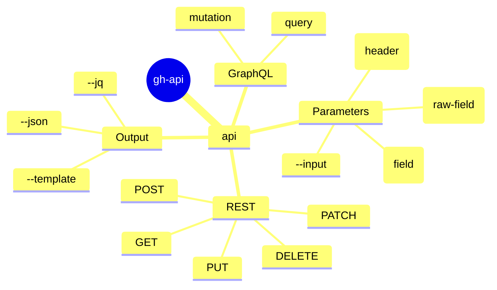

<!-- markdownlint-disable MD003 MD022 MD026 MD041 -->
---
name: gh-api
description: >-
  Use when planning or executing advanced GitHub CLI (`gh api`) queries and mutations via REST or GraphQL.
---
# gh-api Skill

Use `gh api` and `gh api graphql` when standard `gh` subcommands do not expose the required functionality or metadata.

## When to Activate

- User specifically asks to hit GitHub API endpoints via `gh api`.
- Task requires fetching data unavailable in native commands (`gh pr view`, `gh issue view`).
- Task involves GitHub Discussions (requires GraphQL).
- Task involves reading file contents directly from the API when `curl` is missing or disallowed.
- Need to perform precise, authenticated curl-like interactions with GitHub.
- Task requires interacting with GitHub resources not supported by native `gh` subcommands
  (e.g., repository variables, environment secrets, discussions).
- Task requires complex GraphQL queries or mutations.
- Task to resolve outdated PR comments.
- User specifically asks for `gh api` or `gh api graphql` usage.

## Mindmap of Commands



## API Parameter Handling

When using `gh api` (including `gh api graphql`), choose the correct flag for parameters:

- Use `-F` (`--field`) for **magic type conversion**:
  - **File expansion**: `-F body=@path/to/file.md` (reads file content).
  - **Typed values**: `-F is_public=true`, `-F count=42`, `-F parent=null`.
  - **Placeholders**: `-F repo=<repo>`, `-F owner=<owner>`.
- Use `-f` (`--raw-field`) for **static strings**:
  - Use this when you want the literal value.
  - **CAUTION**: `-f` DOES NOT expand `@`. Using `-f body=@file` posts the literal string "@file".
  - For GraphQL, `query` is usually passed with `-f` to avoid accidental expansion or type conversion
    of the query string itself.

**Large Bodies & Files**:

- Prefer `-F body=@path/to/file.md` for large content.

- **Process Substitution**: Avoid `-F body=@<(...)` in `gh api`; it is brittle across shells. Write to a temporary
  file first, then use `-F body=@tempfile`.

**GraphQL Variables**:
For `gh api graphql`, all fields other than `query` and `operationName` are automatically passed as GraphQL variables.
Example: `gh api graphql -f query='mutation($title: String!) { ... }' -F title=@title.txt`

## Reading Files via API

If you need to fetch from a repository using the CLI's authentication,
use the `contents` endpoint. The response is base64 encoded.

Example to fetch a file from a repository using `gh api` + `base64`:

```bash
gh api /repos/<org>/<repo>/contents/<path/to/file.md>?ref=<SHA> --jq .content | base64 -d
```

Example with just `gh api`:

```bash
gh api -H "Accept: application/vnd.github.raw" /repos/<org>/<repo>/contents/<path/to/file.md>?ref=<SHA>
```

Notes:

- Above are robust alternatives to `curl -s https://raw.githubusercontent.com/<org>/<repo>/<SHA>/<path>`.
  It uses native GitHub CLI auth, avoiding 401s for internal repositories.
- Especially useful when `curl` is not available or restricted.

## Downloading Workflow Logs via API

When `gh run view --log` fails to retrieve logs (often returning empty strings for canceled matrix jobs or cached runs),
you can download the full artifact zip via the REST API, bypassing CLI streaming limits.

```bash
gh api -H "Accept: application/vnd.github+json" /repos/<owner>/<repo>/actions/runs/<run_id>/logs > /tmp/run_logs.zip
unzip -d /tmp/run_logs /tmp/run_logs.zip
```

## Discussion Patterns (via GraphQL)

Since `gh` often lacks a native `discussion` subcommand, use `gh api graphql`.
Avoid process substitution for the body; use a temporary file.

- **Get repositoryId and categoryId**:

  ```bash
  gh api graphql -f query='query {
    repository(owner: "OWNER", name: "REPO") {
      id
      discussionCategories(first: 10) {
        nodes { id name }
      }
    }
  }'
  ```

- **Create Discussion**:

  ```bash
  gh api graphql -F repositoryId="$REPO_ID" -F categoryId="$CAT_ID" \
    -F title="Title" -F body=@/tmp/body.md \
    -f query='mutation($repositoryId:ID!, $categoryId:ID!, $title:String!, $body:String!){
      createDiscussion(input:{repositoryId:$repositoryId,categoryId:$categoryId,title:$title,body:$body}){
        discussion{url}
      }
    }'
  ```

- **Comment on Discussion**:

  ```bash
  gh api graphql -F discussionId="$DISCUSSION_ID" -F body=@/tmp/comment.md \
    -f query='mutation($discussionId:ID!, $body:String!){
      addDiscussionComment(input:{discussionId:$discussionId,body:$body}){
        comment{url}
      }
    }'
  ```

## Authentication Context

- `gh` uses `GH_TOKEN` or `GITHUB_TOKEN` environment variables if set.
- By default, it uses the token stored in `~/.config/gh/hosts.yml` (from `gh auth login`).
- Some API operations (e.g., fine-grained scopes, cross-org access) might require a Personal Access Token (PAT)
  with specific permissions.
- In GitHub Actions, `secrets.GITHUB_TOKEN` is available by default but may have restricted permissions
  (e.g., no access to private repositories in other orgs).

## Fetching PR Workflow Runs via API

Due to `gh pr checks` limitation to the current HEAD commit which frequently misses manually
triggered (`workflow_dispatch`) or comment-triggered (`issue_comment`) runs, the most robust
way to list all workflow runs associated with a Pull Request is via the REST API.

You can query the `/actions/runs` endpoint filtering by both the PR branch name and the PR title
(since PR comment triggers map the PR title to `display_title`):

```bash
branch_name=$(gh pr view <pr_number> --repo <owner>/<repo> --json headRefName -q .headRefName)
pr_title=$(gh pr view <pr_number> --repo <owner>/<repo> --json title -q .title)

gh api repos/<owner>/<repo>/actions/runs --paginate \
  -q ".workflow_runs[] | select((.head_branch == \"$branch_name\" or .display_title == \"$pr_title\")) | {id: .id, name: .name, status: .status, conclusion: .conclusion, event: .event}"
```

## Pagination & Robustness

- **Pagination**: Use `--paginate` to automatically fetch all pages of results.

  ```bash
  gh api repos/<owner>/<repo>/issues --paginate
  ```

- **Common Failure Modes**:

  - **403 Forbidden**: Often occurs when accessing logs or when the token lacks required scopes.
    Check `gh auth status`.
  - **404 Not Found**: Verify the repository path and resource ID. Ensure the token has access
    to the target repository.
  - **Rate Limiting**: Use `gh api rate_limit` to check your current quota.

## Structured Query Patterns

- `gh api repos/<owner>/<repo>/actions/jobs/<job_id>`

## Common API Patterns

Use these when standard `gh` commands (like `gh pr view` or `gh issue view`) do not provide enough detail:

- **Generate PR Review Threads Kanban Diagram (GraphQL + jq)**:

  ```bash
  gh api graphql -F owner="<owner>" -F repo="<repo>" -F number=<number> -f query='
  query($owner:String!, $repo:String!, $number:Int!) {
    repository(owner:$owner, name:$repo) {
      pullRequest(number:$number) {
        reviewThreads(first:100) {
          nodes {
            id
            path
            isResolved
            isOutdated
            comments(first:1) {
              nodes { author { login } authorAssociation bodyText }
            }
          }
        }
      }
    }
  }' --jq '
    def clean_text:
      gsub("\n"; " ") | gsub("\\["; "") | gsub("\\]"; "") | gsub("\\("; "") | gsub("\\)"; "") |
      gsub("\\{"; "") | gsub("\\}"; "") | gsub("<"; "") | gsub(">"; "") | gsub("#"; "") | gsub("\""; "´");

    def format_title:
      .comments.nodes[0].bodyText | split("\n")[0] | clean_text | split(" ")[0:5] | join(" ") + "...";

    def format_body:
      .comments.nodes[0].bodyText | clean_text | if length > 80 then .[0:77] + "..." else . end;

    def kanban_card:
      "    [" + format_title + "]\n      bodyText: " + format_body + "\n      id: " + .id +
      "\n      assigned: " + .comments.nodes[0].author.login +
      "\n      authorAssociation: " + .comments.nodes[0].authorAssociation +
      "\n      path: " + .path;

    "---\nkanban:\n  tickInterval: 1\n---\n" +
    "%% gh api graphql -F owner=\"<owner>\" -F repo=\"<repo>\" -F number=<number> ... (query above)\n" +
    "kanban\n  Active\n" +
    ( [.data.repository.pullRequest.reviewThreads.nodes[] |
        select(.isResolved==false and .isOutdated==false) | kanban_card ] | join("\n") ) +
    "\n  Outdated\n" +
    ( [.data.repository.pullRequest.reviewThreads.nodes[] |
        select(.isResolved==false and .isOutdated==true) | kanban_card ] | join("\n") ) +
    "\n  Resolved\n" +
    ( [.data.repository.pullRequest.reviewThreads.nodes[] |
        select(.isResolved==true) | kanban_card ] | join("\n") )
  '
  ```

  Use it when you need a visual overview of PR review threads categorized by status
  (active, outdated, resolved) with metadata like author and file path.

- **List Unresolved PR Inline Review Comments (GraphQL)**:

  ```bash
  gh api graphql -f query='
  query($owner:String!, $repo:String!, $number:Int!) {
    repository(owner:$owner, name:$repo) {
      pullRequest(number:$number) {
        reviewThreads(first:100) {
          nodes {
            id
            isResolved
            isOutdated
            path
            comments(first:100) {
              nodes {
                author { login }
                body
                url
              }
            }
          }
        }
      }
    }
  }' -F owner=<owner> -F repo=<repo> -F number=<number> \
  --jq '.data.repository.pullRequest.reviewThreads.nodes[]
        | select(.isResolved == false)
        | {
            id, path,
            outdated: .isOutdated,
            comments: [.comments.nodes[] | {author: .author.login, url, body}]
          }'
  ```

  Used it when you need a structured list of all unresolved inline review comments on a PR,
  including their file paths and whether they are outdated.

- **List PR Comments (REST)**:

  ```bash
  gh api repos/<owner>/<repo>/pulls/<number>/comments
  ```

- **List PR Reviews**:

  ```bash
  gh api repos/<owner>/<repo>/pulls/<number>/reviews
  ```

- **List Issue Comments**:

  ```bash
  gh api repos/<owner>/<repo>/issues/<number>/comments
  ```

- **List Workflow Runs for a specific branch and event (REST + jq)**:

  ```bash
  gh api -X GET "repos/<owner>/<repo>/actions/runs" \
    -f branch="<branch>" \
    -f event="pull_request" \
    -f per_page=10 \
    --jq '.workflow_runs[] | {id, head_branch, name, event, status, conclusion, created_at, html_url}'
  ```

  Note: Using `-f` implicitly changes the underlying request to POST.
  You must specify `-X GET` explicitly or encode parameters directly into the URL like `...?branch=<branch>&event=pull_request`.

- **List Workflow Runs with Filters (REST)**:

  ```bash
  gh api -X GET "repos/<owner>/<repo>/actions/runs" \
    -f branch="<branch>" \
    -f event="pull_request" \
    -f per_page=10 \
    --jq '.workflow_runs[] | {id, head_branch, name, event, status, conclusion, created_at, html_url}'
  ```

- **Resolve a PR Review Thread by ID (GraphQL)**:

  ```bash
  gh api graphql -f query='
  mutation($threadId:ID!) {
    resolveReviewThread(input:{threadId:$threadId}) {
      thread {
        id
        isResolved
      }
    }
  }' -F threadId=<thread_id>
  ```

Notes:

- **Generate Mermaid `gitGraph` commit lines**:
  - **With Git (`git`)**:
    `git log origin/main..HEAD --reverse --format='commit id: "%s"'`
  - **With GitHub API (`gh api`)**:
    `gh api repos/<owner>/<repo>/pulls/<number>/commits \`
    `--jq '.[] | "commit id: \"[\(.sha[0:7])] \(.commit.message | split("\n")[0] | gsub("\""; "'\''"))\""'`
  - **With GitHub CLI (`gh`)**:
    `gh pr view <number> --json headRefName,baseRefName,commits`
  - For more context, load relevant skill files when working with this type of diagrams.
- **Filter with jq**: Prefer `--jq` or `--template` for parsing results before using external filters.

## What to Avoid

- Do not use `-f` (`--raw-field`) when you intend to read a value from a file using `@`;
  always use `-F` (`--field`) for file expansion.
- Do not build `gh ... | grep ... | grep ...` chains as the default diagnostic path.
- Do not use process substitution (`<()`) for large bodies in `gh api`.

## Related Skills

- **gh**: For standard GitHub CLI operations (issues, repos, prs).
- **gh-pr**: For pull request tracking and management.
- **gh-run**: For workflow runs, jobs, logs, and diagnostic tools.
