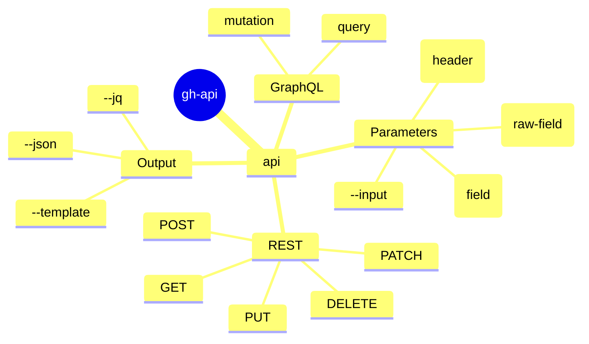

<!-- markdownlint-disable MD003 MD022 MD026 MD041 -->
---
name: gh-api
description: >-
  Use when planning or executing advanced GitHub CLI (`gh api`) queries and mutations via REST or GraphQL.
---
# gh-api Skill

Use `gh api` and `gh api graphql` when standard `gh` subcommands do not expose the required functionality or metadata.

## Mindmap of Commands



## When to Activate

- User specifically asks to hit GitHub API endpoints via `gh api`.
- Task requires fetching data unavailable in native commands (`gh pr view`, `gh issue view`).
- Task involves GitHub Discussions (requires GraphQL).
- Task involves reading file contents directly from the API when `curl` is missing or disallowed.
- Need to perform precise, authenticated curl-like interactions with GitHub.
- Task requires interacting with GitHub resources not supported by native `gh` subcommands
  (e.g., repository variables, environment secrets, discussions).
- Task requires complex GraphQL queries or mutations.
- User specifically asks for `gh api` or `gh api graphql` usage.

## API Parameter Handling

When using `gh api` (including `gh api graphql`), choose the correct flag for parameters:

- Use `-F` (`--field`) for **magic type conversion**:
  - **File expansion**: `-F body=@path/to/file.md` (reads file content).
  - **Typed values**: `-F is_public=true`, `-F count=42`, `-F parent=null`.
  - **Placeholders**: `-F repo={repo}`, `-F owner={owner}`.
- Use `-f` (`--raw-field`) for **static strings**:
  - Use this when you want the literal value.
  - **CAUTION**: `-f` DOES NOT expand `@`. Using `-f body=@file` posts the literal string "@file".
  - For GraphQL, `query` is usually passed with `-f` to avoid accidental expansion or type conversion of the query string itself.

**Large Bodies & Files**:
- Prefer `-F body=@path/to/file.md` for large content.
- **Process Substitution**: Avoid `-F body=@<(...)` in `gh api`; it is brittle across shells. Write to a temporary file first, then use `-F body=@tempfile`.

**GraphQL Variables**:
For `gh api graphql`, all fields other than `query` and `operationName` are automatically passed as GraphQL variables.
Example: `gh api graphql -f query='mutation($title: String!) { ... }' -F title=@title.txt`

## Reading Files via API

If you need to fetch from a repository using the CLI's authentication,
use the `contents` endpoint. The response is base64 encoded.

Example to fetch a file from a repository using `gh api` + `base64`:

```bash
gh api /repos/{org}/{repo}/contents/{path/to/file.md}?ref={SHA} --jq .content | base64 -d
```

Example with just `gh api`:

```bash
gh api -H "Accept: application/vnd.github.raw" /repos/{org}/{repo}/contents/{path/to/file.md}?ref={SHA}
```

Notes:

- Above are robust alternatives to `curl -s https://raw.githubusercontent.com/{org}/{repo}/{SHA}/{path}`.
  It uses native GitHub CLI auth, avoiding 401s for internal repositories.
- Especially useful when `curl` is not available or restricted.

## Discussion Patterns (via GraphQL)

Since `gh` often lacks a native `discussion` subcommand, use `gh api graphql`.
Avoid process substitution for the body; use a temporary file.

- **Get repositoryId and categoryId**:
  ```bash
  gh api graphql -f query='query {
    repository(owner: "OWNER", name: "REPO") {
      id
      discussionCategories(first: 10) {
        nodes { id name }
      }
    }
  }'
  ```
- **Create Discussion**:
  ```bash
  gh api graphql -F repositoryId="$REPO_ID" -F categoryId="$CAT_ID" \
    -F title="Title" -F body=@body.md \
    -f query='mutation($repositoryId:ID!, $categoryId:ID!, $title:String!, $body:String!){
      createDiscussion(input:{repositoryId:$repositoryId,categoryId:$categoryId,title:$title,body:$body}){
        discussion{url}
      }
    }'
  ```
- **Comment on Discussion**:
  ```bash
  gh api graphql -F discussionId="$DISCUSSION_ID" -F body=@comment.md \
    -f query='mutation($discussionId:ID!, $body:String!){
      addDiscussionComment(input:{discussionId:$discussionId,body:$body}){
        comment{url}
      }
    }'
  ```

## Structured Query Patterns

- Use `gh api repos/<owner>/<repo>/issues/<number>/comments` to get all comments.
- Use `gh api repos/<owner>/<repo>/pulls/<number>/comments` for PR review comments.
- Prefer `--jq` or `--template` before external filters.

## What to Avoid

- Do not use `-f` (`--raw-field`) when you intend to read a value from a file using `@`;
  always use `-F` (`--field`) for file expansion.
- Do not build `gh ... | grep ... | grep ...` chains as the default diagnostic path.
- Do not use process substitution (`<()`) for large bodies in `gh api`.

## Related Skills

- **gh**: For standard GitHub CLI operations (issues, repos, prs).
- **gh-pr**: For pull request tracking and management.
- **gh-run**: For workflow runs, jobs, logs, and diagnostic tools.
