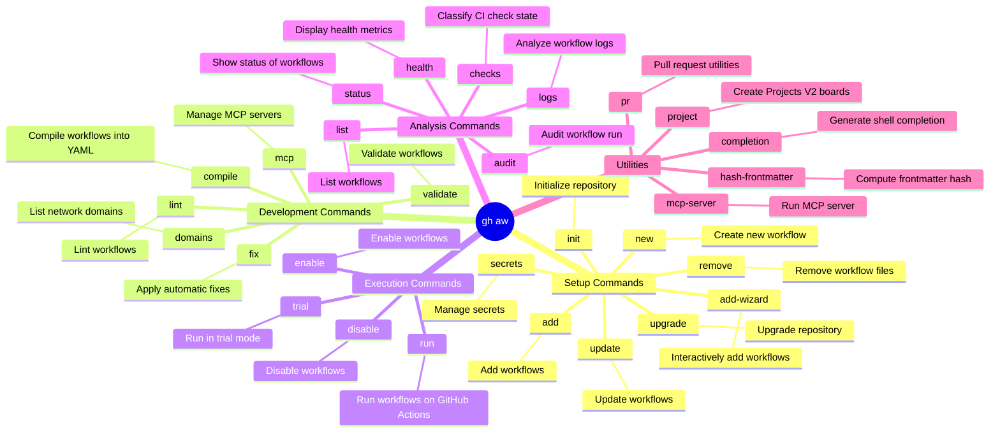

<!-- markdownlint-disable MD013 MD023 MD031 MD032 -->
# gh-aw Skill

Use `gh aw` to orchestrate GitHub Agentic Workflows for repository automation.

## How to Install the Extension

To install the GitHub Agentic Workflows extension for the GitHub CLI, run:

```bash
gh extension install github/gh-aw
```

## Mindmap of Commands



## Core Process

1. **Setup**: Use `gh aw init` to initialize a repository, followed by `gh aw new <workflow-name>` or `gh aw add-wizard`.
2. **Development**: Workflows are markdown files compiled via `gh aw compile` into GitHub Actions YAML (`.lock.yml`).
3. **Execution**: Use `gh aw run <workflow-name>` to execute a workflow or `gh aw trial` for simulated runs.
4. **Analysis**: If a run fails, use `gh aw audit <run-id-or-url>` to debug the failed run. View logs with `gh aw logs <workflow-name>`.
5. **Updating**: Run `gh aw upgrade` to get the latest agent files and apply codemods.

## What to Avoid

- Always review the changes made by the AI agent, especially considering security and context.
- Do not manually edit the generated `.lock.yml` files; they are intended to be compiled from the markdown workflows.

## References

- <https://gh.io/gh-aw>
- <https://github.com/github/gh-aw>
- <https://github.com/github/gh-aw/blob/main/.github/aw/runbooks/workflow-health.md>

## Related Skills

- **gh-aw-compile**:
  You MUST load this skill when recompiling Agentic Workflows.
- **gh-run**:
  You MUST load this skill when working with GitHub Actions workflow runs.
