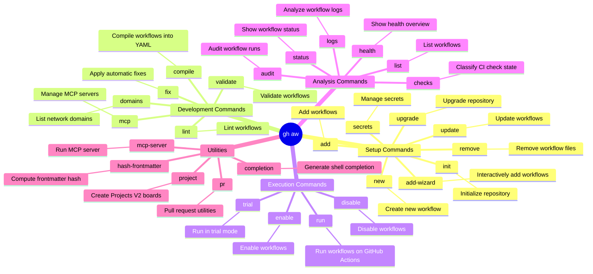

<!-- markdownlint-disable MD013 MD023 MD031 MD032 -->
# gh-aw Skill

Use `gh aw` to orchestrate GitHub Agentic Workflows for repository automation.

## When to Use

- To initialize, create, update, or run GitHub Agentic Workflows.
- When compiling `.md` agent definitions into executable `.lock.yml` GitHub Actions.
- To manage MCP (Model Context Protocol) servers and toolsets within a repository's agent configuration.

## When Not to Use

- For standard GitHub CLI operations that don't involve the Agentic Workflows extension (e.g., just listing issues or PRs).
- When writing application code that simply uses the OpenAI or Anthropic API directly.
- For troubleshooting a failed workflow run (use `gh-aw-troubleshooting` instead).

## Common Pitfalls

- **Manual Lockfile Edits**: Directly editing the `.lock.yml` file, which will be silently overwritten the next time `gh aw compile` is run.
- **Skipping Compilation**: Changing an agent's `.md` definition but forgetting to run `gh aw compile`, causing the CI pipeline to run the outdated version.
- **Missing Extension**: Attempting to run `gh aw` commands on a fresh runner without first executing `gh extension install github/gh-aw`.

## How to Install the Extension

To install the GitHub Agentic Workflows extension for the GitHub CLI, run:

```bash
gh extension install github/gh-aw
```

If `gh extension install` is unavailable or fails (e.g., in environments
without GitHub CLI extension support), you can download and run the
installation script:

```bash
curl -sL https://raw.githubusercontent.com/github/gh-aw/v0.74.3/install-gh-aw.sh -o install-gh-aw.sh
head -n 50 install-gh-aw.sh # Review the script before executing
bash install-gh-aw.sh
```

## Mindmap of Commands



## Core Process

1. **Setup**: Use `gh aw init` to initialize a repository, followed by `gh aw new <workflow-name>` or `gh aw add-wizard`.
2. **Development**: Workflows are markdown files compiled via `gh aw compile` into GitHub Actions YAML (`.lock.yml`).
3. **Execution**: Use `gh aw run <workflow-name>` to execute a workflow or `gh aw trial` for simulated runs.
4. **Analysis**: If a run fails, load the `gh-aw-troubleshooting` skill to diagnose the root cause using `gh aw audit` and `gh aw logs`.
5. **Updating**: Run `gh aw upgrade` to get the latest agent files and apply codemods.

## What to Avoid

- Always review the changes made by the AI agent, especially considering security and context.
- Do not manually edit the generated `.lock.yml` files; they are intended to be compiled from the markdown workflows.

## References

- [GitHub Agentic Workflows](https://gh.io/gh-aw)
- [Official gh-aw Repo](https://github.com/github/gh-aw)
- [gh-aw Runbook](https://github.com/github/gh-aw/blob/v0.74.3/.github/aw/runbooks/workflow-health.md)
- [Maintaining Repositories](https://github.com/github/gh-aw/blob/v0.74.3/docs/src/content/docs/practices/maintaining-repos.md)

### Agentic Workflow Prompts

When asked to create, update, debug, or upgrade GitHub Agentic Workflows,
use `webfetch` to retrieve and read the appropriate instruction prompt from the official repository before proceeding:

- [Create New Workflow](https://raw.githubusercontent.com/github/gh-aw/v0.74.3/.github/aw/create-agentic-workflow.md)
- [Update Existing Workflow](https://raw.githubusercontent.com/github/gh-aw/v0.74.3/.github/aw/update-agentic-workflow.md)
- [Upgrade Agentic Workflows](https://raw.githubusercontent.com/github/gh-aw/v0.74.3/.github/aw/upgrade-agentic-workflows.md)
- [Create Shared Agentic Workflow](https://raw.githubusercontent.com/github/gh-aw/v0.74.3/.github/aw/create-shared-agentic-workflow.md)

### Setup docs

- [CLI Commands](https://github.com/github/gh-aw/blob/v0.74.3/docs/src/content/docs/setup/cli.md)
- [Creating Agentic Workflows](https://github.com/github/gh-aw/blob/v0.74.3/docs/src/content/docs/setup/creating-workflows.mdx)
- [Quick Start](https://github.com/github/gh-aw/blob/v0.74.3/docs/src/content/docs/setup/quick-start.mdx)

## Related Skills

- **gh-aw-compile**:
  You MUST load this skill when recompiling Agentic Workflows.
- **gh-aw-troubleshooting**:
  You MUST load this skill to diagnose and fix failing Agentic Workflows.
- **gh-run**:
  You MUST load this skill when working with GitHub Actions workflow runs.
