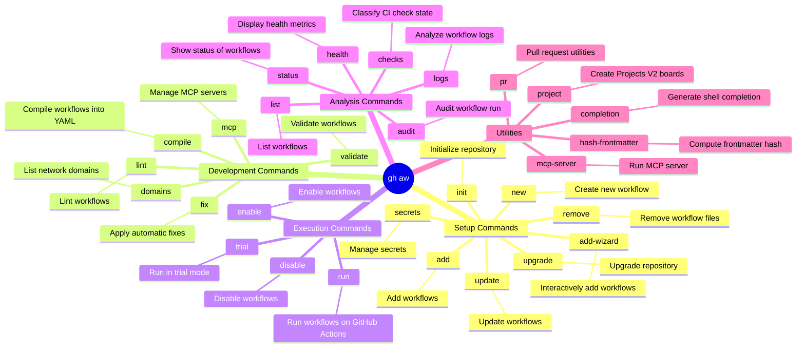

<!-- markdownlint-disable MD013 MD023 MD031 MD032 -->
# gh-aw Skill

Use `gh aw` to orchestrate GitHub Agentic Workflows for repository automation.

## How to Install the Extension

To install the GitHub Agentic Workflows extension for the GitHub CLI, run:

```bash
gh extension install github/gh-aw
```

## Mindmap of Commands



## Core Process

1. **Setup**: Use `gh aw init` to initialize a repository, followed by `gh aw new <workflow-name>` or `gh aw add-wizard`.
2. **Development**: Workflows are markdown files compiled via `gh aw compile` into GitHub Actions YAML (`.lock.yml`).
3. **Execution**: Use `gh aw run <workflow-name>` to execute a workflow or `gh aw trial` for simulated runs.
4. **Analysis**: If a run fails, use `gh aw audit <run-id-or-url>` to debug the failed run. View logs with `gh aw logs <workflow-name>`.
5. **Updating**: Run `gh aw upgrade` to get the latest agent files and apply codemods.

## Common Workflow Failure Patterns

Step-by-step procedures for diagnosing workflow issues, resolving failure patterns, applying incident-response learnings, and maintaining reliability.

### Missing Tool Configurations

**Symptoms**:
- Error messages containing "missing-tool" or "tool not found"
- Workflow fails when attempting to access GitHub APIs
- Agent cannot perform GitHub operations (read issues, create PRs, etc.)

**Common Causes**:
- GitHub MCP server not configured in workflow frontmatter
- Missing toolsets specification
- Incorrect toolset names

### Authentication and Permission Errors

**Symptoms**:
- HTTP 403 (Forbidden) errors
- "Resource not accessible" errors
- Token scope errors

**Common Causes**:
- Missing `permissions:` block in workflow frontmatter
- Insufficient token permissions for requested operations
- GITHUB_TOKEN not passed to custom actions

### Input/Secret Validation Failures

**Symptoms**:
- MCP Scripts action fails
- Environment variable not available
- Template expression evaluation errors

**Common Causes**:
- MCP Scripts action not configured
- Missing required secrets
- Incorrect secret references

## Investigation Steps

### Step 1: Analyze Workflow Logs

Use the `gh aw logs` command to download and analyze workflow logs:

> **Note**: The commands below are meant to be run from a local machine or a Copilot coding agent session. If you include `gh aw logs` or `gh aw audit` as steps inside a generated workflow, you must add `actions: read` to `permissions:` and install the extension with the `setup-cli` action before calling these commands — see [Logs and Metrics](../github-agentic-workflows.md#logs-and-metrics) for details.

```bash
# Download logs from last 24 hours
gh aw logs --start-date -1d -o /tmp/workflow-logs

# Download logs for a specific workflow run
gh aw logs --run-id <run-id> -o /tmp/workflow-logs

# Analyze logs for a specific workflow
gh aw logs --workflow <workflow-name> --start-date -7d
```

**What to look for**:
- Error messages in the "Run AI Agent" step
- Missing-tool errors
- HTTP error codes (401, 403, 404, 500)
- Stack traces or exception details

### Step 2: Identify Missing-Tool Errors

Missing-tool errors typically appear in this format:

```
Error: Tool 'github:read_issue' not found
Error: missing tool configuration for mcpscripts-gh
```

To identify which tools are missing:

1. Check the workflow `.md` file for the `tools:` section
2. Compare with similar working workflows
3. Verify the tool is properly configured in frontmatter

### Step 3: Verify MCP Server Configurations

Check if the workflow has proper MCP server configuration:

```aw
---
tools:
  github:
    toolsets: [default]   # Enables repos, issues, pull_requests
---
```

Use `gh aw mcp inspect <workflow-name>` to verify MCP server configuration:

```bash
# Inspect MCP servers for a workflow
gh aw mcp inspect <workflow-name>

# List all workflows with MCP servers
gh aw mcp list
```

### Step 4: Check Permissions Configuration

Verify the workflow has required permissions:

```aw
---
permissions:
  contents: read      # For reading repository files
  issues: write       # For creating/updating issues
  pull-requests: write # For creating/updating PRs
  actions: read       # For accessing workflow runs
---
```

Common permission requirements:
- **Reading issues**: `issues: read`
- **Creating issues**: `issues: write`
- **Reading PRs**: `pull-requests: read`
- **Creating PRs**: `pull-requests: write`
- **Reading workflow runs**: `actions: read`

## Resolution Procedures

### Adding GitHub MCP Server to Workflows

**Problem**: Workflow fails with missing GitHub tool errors.

**Solution**: Add GitHub MCP server configuration to the workflow frontmatter.

1. Open the workflow `.md` file
2. Add or update the `tools:` section:

```aw
---
tools:
  github:
    toolsets: [default]
---
```

3. Compile the workflow:

```bash
gh aw compile <workflow-name>.md
```

4. Verify the configuration:

```bash
gh aw mcp inspect <workflow-name>
```

**Available toolsets**:
- `default`: repositories, issues, pull requests, and common operations
- `repos`: repository management tools
- `issues`: issue operations
- `pull_requests`: PR operations
- `actions`: GitHub Actions workflow tools

**Example**: Dev workflow with GitHub MCP server

```aw
---
description: Development workflow with GitHub integration
on:
  workflow_dispatch:
permissions:
  contents: read
  issues: read
  pull-requests: read
engine: copilot
tools:
  github:
    toolsets: [default]
---

# Development Agent

Analyze repository issues and provide insights.
```

### Configuring MCP Scripts and Safe-Outputs

**Problem**: Workflow fails with missing mcpscripts-gh or safe-output errors.

**Solution**: Configure mcp-scripts and safe-outputs in the workflow.

#### Adding MCP Scripts

MCP Scripts securely pass GitHub context to AI agents:

```aw
---
mcp-scripts:
  issue:
    title: ${{ github.event.issue.title }}
    body: ${{ github.event.issue.body }}
    number: ${{ github.event.issue.number }}
---
```

The mcp-scripts are automatically made available to the agent as environment variables.

#### Adding Safe-Outputs

Safe-outputs enable AI agents to create GitHub resources:

```aw
---
safe-outputs:
  create-issue:
    labels: ["ai-generated"]
  create-pull-request:
    labels: ["ai-generated"]
  create-discussion:
    category: "general"
---
```

**Example**: Complete workflow with mcp-scripts and safe-outputs

```aw
---
description: Issue triage workflow
on:
  issues:
    types: [opened]
permissions:
  contents: read
  issues: write
engine: copilot
tools:
  github:
    toolsets: [default]
mcp-scripts:
  issue:
    title: ${{ github.event.issue.title }}
    body: ${{ github.event.issue.body }}
    number: ${{ github.event.issue.number }}
safe-outputs:
  create-issue:
    labels: ["ai-generated", "triage"]
---

# Issue Triage Agent

Analyze the issue and determine appropriate labels and priority.
```

### Testing Workflow Fixes

After making changes, test the workflow:

1. **Compile the workflow**:

```bash
gh aw compile <workflow-name>.md
```

2. **Trigger manually** (if `workflow_dispatch` is enabled):

```bash
gh workflow run <workflow-name>.lock.yml
```

3. **Monitor the run**:

```bash
# Get the run ID
gh run list --workflow=<workflow-name>.lock.yml --limit 1

# Watch the run
gh run watch <run-id>

# Download logs if it fails
gh aw logs --run-id <run-id>
```

4. **Verify success**:
   - Check that no missing-tool errors occur
   - Verify the agent completes successfully
   - Confirm any created resources (issues, PRs, discussions)

## Case Study: DeepReport Incident Response

Three failing workflows were fixed:

**Weekly Issue Summary** — missing `actions: read` permission. Added and recompiled.

**Dev Workflow** — "Tool 'github:read_issue' not found" (GitHub MCP server not configured):

```aw
tools:
  github:
    toolsets: [default]
```

**Daily Copilot PR Merged** — "missing tool configuration for mcpscripts-gh":

```aw
mcp-scripts:
  pull_request:
    number: ${{ github.event.pull_request.number }}
    title: ${{ github.event.pull_request.title }}
```

## Quick Reference

### Essential Commands

```bash
# Download recent workflow logs
gh aw logs --start-date -1d -o /tmp/logs

# Inspect MCP configuration
gh aw mcp inspect <workflow-name>

# List all workflows with MCP servers
gh aw mcp list

# Compile workflow after changes
gh aw compile <workflow-name>.md

# Trigger workflow manually
gh workflow run <workflow-name>.lock.yml

# Watch workflow execution
gh run watch <run-id>
```

### Common Configuration Patterns

**Basic GitHub integration**:
```aw
---
permissions:
  contents: read
  issues: read
tools:
  github:
    toolsets: [default]
---
```

**Issue-triggered workflow with mcp-scripts**:
```aw
---
on:
  issues:
    types: [opened]
permissions:
  contents: read
  issues: write
mcp-scripts:
  issue:
    title: ${{ github.event.issue.title }}
    body: ${{ github.event.issue.body }}
tools:
  github:
    toolsets: [default]
---
```

**Workflow with safe-outputs**:
```aw
---
permissions:
  contents: read
  issues: write
  discussions: write
safe-outputs:
  create-issue:
    labels: ["ai-generated"]
  create-discussion:
    category: "general"
tools:
  github:
    toolsets: [default]
---
```

## What to Avoid

- Always review the changes made by the AI agent, especially considering security and context.
- Do not manually edit the generated `.lock.yml` files; they are intended to be compiled from the markdown workflows.

## References

- <https://gh.io/gh-aw>
- <https://github.com/github/gh-aw>
- <https://github.com/github/gh-aw/blob/main/.github/aw/runbooks/workflow-health.md>

## Related Skills

- **gh**:
  You MUST load this skill when working with the base `gh` command.
- **gh-run**:
  You MUST load this skill when working with GitHub Actions workflow runs.
