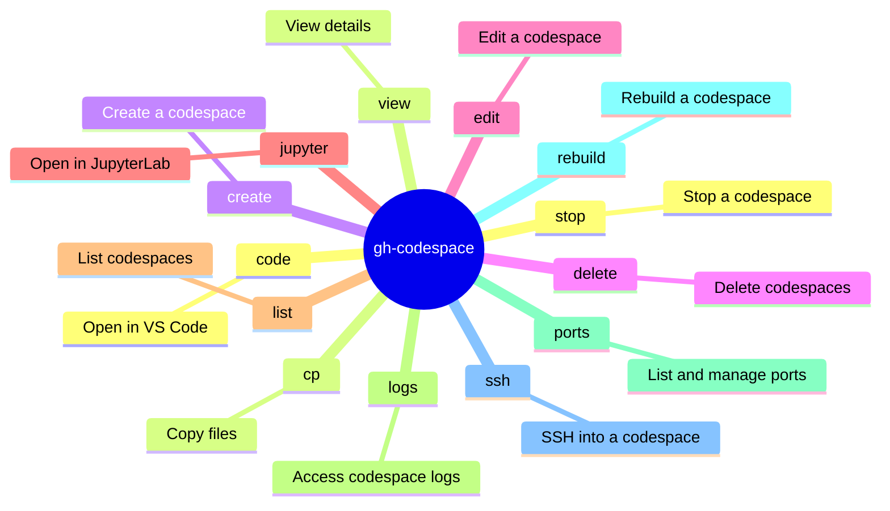

<!-- markdownlint-disable MD013 MD023 MD031 MD032 -->
# gh-codespace

Connect to and manage GitHub Codespaces natively from the CLI.

## Mindmap of Commands

## Core Principles

- Verify codespace status with `gh codespace list` or `gh codespace view` before attempting interactive connections.
- Use `gh codespace cp` for transferring files between the local machine and the codespace instead of manually configuring SCP.
- Manage port forwarding natively via `gh codespace ports forward` for local testing.

## Commands / Usage Patterns

- **List Codespaces**: View active codespaces to find the `<codespace-name>`:
  `gh codespace list --json name,repository,state`

- **Create a Codespace**:
  `gh codespace create --repo <repository-name> --branch <branch-name>`

- **Copy Files**: Transfer files from a codespace to the local machine:
  `gh codespace cp -c <codespace-name> remote:/path/to/file local/path/`
  Transfer files from local to codespace:
  `gh codespace cp -c <codespace-name> local/path/ remote:/path/to/file`

- **Port Forwarding**: Expose a port from the codespace to your local machine:
  `gh codespace ports forward <remote-port>:<local-port> -c <codespace-name>`

- **Stop/Delete Codespace**: Clean up resources when done:
  `gh codespace stop -c <codespace-name>`
  `gh codespace delete -c <codespace-name>`

## Diagnostics and Troubleshooting

- **Connection Failures**: If `gh codespace ssh` hangs or fails, check codespace logs:
  `gh codespace logs -c <codespace-name>`
- **Rebuilding Environment**: If the Devcontainer configuration is modified or corrupted, trigger a rebuild:
  `gh codespace rebuild -c <codespace-name>`

## What to Avoid

- Do not attempt to SSH manually without using `gh codespace ssh` as it requires specific key exchanges handled by the CLI.
- Avoid using interactive commands (like `gh codespace code` or `gh codespace ssh`) in automated agent workflows. Use them only when providing instructions to the user.

## Limitations

- The CLI depends on active network connections and the GitHub Codespaces service availability.
- Port forwarding `gh codespace ports forward` blocks the terminal and requires background execution (`&`) or a separate process in non-interactive environments.

## References

- [gh codespace manual](https://cli.github.com/manual/gh_codespace)
