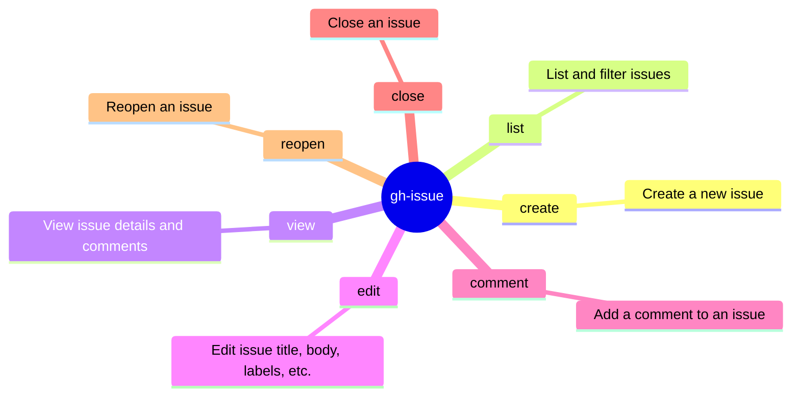

# gh-issue Skill

Use `gh issue` to natively interact with GitHub Issues. Prefer native fields and explicit routing over brittle shell post-processing.

## When to Activate

- User asks to manage, view, list, or inspect an issue using the GitHub CLI (`gh issue`).
- Task involves querying issue metadata, comments, labels, or assignees.
- Extracting issue context, reviewing issue body, or commenting on specific issues.

## Mindmap of Commands



## Advanced Issue Workflows

- **Issue Creation**:
  Always prefer non-interactive creation in automated environments:

  ```bash
  gh issue create --title "bug: unexpected crash" --body-file /tmp/description.md --label "bug" --assignee "@me"
  ```

- **Listing Issues**:
  To quickly identify open issues with specific labels:

  ```bash
  gh issue list --state open --label "bug" --json number,title,createdAt --limit 10
  ```

- **Viewing Issue Details**:
  For quick structured review of an issue without leaving the terminal:

  ```bash
  gh issue view <number> --json title,body,state,labels,assignees,comments
  ```

- **Modifying Issues**:
  Be explicit about the modifications:

  ```bash
  gh issue edit <number> --add-label "in-progress" --add-assignee "@me"
  gh issue close <number> --reason "completed"
  ```

## Interaction & Comments

For issue thread interactions, response routing, and workspace invariants in GitHub Actions,
refer to the **github-issue** skill.

## Related Skills

- **gh**: For general GitHub CLI usage (auth, extensions, API).
- **github-issue**: For runtime behaviors and routing from issue comments in GitHub Actions.
- **gh-pr**: For detailed pull request creation, management, and review workflows.
