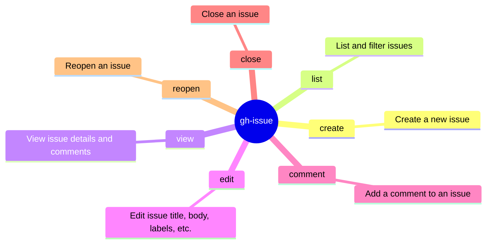

# gh-issue Skill

Use `gh issue` to natively interact with GitHub Issues.
Prefer native fields and explicit routing over brittle shell
post-processing.

## When to Use

- User asks to manage, view, list, or inspect an issue using the GitHub CLI (`gh issue`).
- Task involves querying issue metadata, comments, labels, or assignees.
- Extracting issue context, reviewing issue body, or commenting on specific issues.

## Mindmap of Commands



## Advanced Issue Workflows

- **Issue Creation**:
  Always prefer non-interactive creation in automated environments:

  ```bash
  gh issue create --title "bug: unexpected crash" --body-file /tmp/description.md --label "bug" --assignee "@me"
  ```

- **Listing Issues**:
  To quickly identify open issues with specific labels:

  ```bash
  gh issue list --state open --label "bug" --json number,title,createdAt --limit 10
  ```

- **Viewing Issue Details**:
  For quick structured review of an issue without leaving the terminal:

  ```bash
  gh issue view <number> --json title,body,state,labels,assignees,comments
  ```

- **Modifying Issues**:
  Be explicit about the modifications:

  ```bash
  gh issue edit <number> --add-label "in-progress" --add-assignee "@me"
  gh issue close <number> --reason "completed"
  ```

## Interaction & Comments

- For issue thread interactions, use `gh issue comment`.
- For long comments, avoid heredocs as they can cause shell hangs if truncated.
  Write the comment to a temporary file first, then use `--body-file`:

  ```bash
  # Use your file-writing tools to write the comment to /tmp/comment.md, then:
  gh issue comment <number> --body-file /tmp/comment.md
  ```

For high-level issue thread interactions, response routing, and workspace invariants in GitHub Actions,
refer to the **github-issue** skill.

## GitHub Actions Runtime

When executing autonomously within a GitHub Actions environment, adhere strictly to these interaction constraints:

### Response Detection & Routing

Check `github.event_name` and payload to identify trigger source:

- **Issue comment** (`issue_comment`):
  - Condition: `if: ${{ !github.event.issue.pull_request }}`
  - Reply Method: `gh issue comment`
- **General PR comment** (`issue_comment`):
  - Condition: `if: ${{ github.event.issue.pull_request }}`
  - Reply Method: `gh pr comment`

**Routing Invariants**:

- **Symmetric Routing**: ALWAYS reply via the exact originating channel. NEVER cross threads.
- **Direct API Responses ONLY**: Use `gh issue comment` to post directly. NEVER write comment text to files in the
  workspace.
- Parse `github.event.comment.id` to maintain thread continuity.

## Failure Signatures

- **"Could not resolve to an issue"**: Verify the issue number and ensure the repository context is correct.
- **"Permission denied"**: Check `gh auth status`. Ensure the token has `repo` and `issue` scopes.
- **"Issue is locked"**: Some repositories restrict comments on locked issues.

## What to Avoid

- Avoid using `gh api` for issue operations that have native `gh issue` subcommands.
- Do not use `gh issue comment` to provide large code blocks if they can be committed to a branch instead.

## Pre-Completion

Before finishing your session, you MUST ensure the workspace is in a valid state.

### Workspace Cleanliness (Non-Modifying Tasks)

If the runtime did not involve intended modification of files:

1. **Verify**: Run `git status` to confirm the workspace is clean.
2. **Clean**: If untracked or modified files exist (e.g., temporary analysis artifacts), run `git clean -fd` and
   `git checkout -- .`.
3. **Assert**: Ensure no PR or commit is triggered for purely informational tasks.

## Related Skills

- **gh-pr**:
  You MUST load this skill when working with the `gh pr` command.
