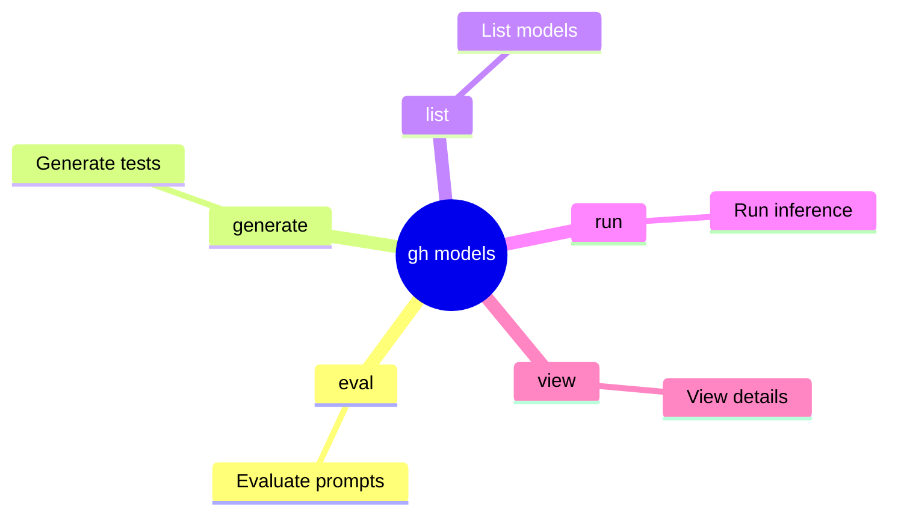

<!-- markdownlint-disable MD013 MD023 MD031 MD032 -->

# gh-models Skill

**CLI extension for GitHub Models service** — `gh extension install github/gh-models` (requires authenticated `gh` CLI).

Run, evaluate, and auto-generate tests for AI prompts directly from the terminal. Ideal for CLI-centric
agentic workflows on issues, PRs, repo events, and prompt engineering at scale.

## Mindmap of Commands



## When to Activate

- Agentic workflows require automated prompt engineering, scoring, or regression testing for LLMs.
- Need to execute specific prompts in parallel, so they can be delegated to subagents.
- Need to version control prompts as `.prompt.yml` assets and perform structured evaluations.
- User asks to use GitHub Models, `gh models`, or perform AI inference via CLI.
- Task involves running, evaluating, or generating tests for AI prompts and LLM-based workflows.

## Installation & Upgrade

```bash
gh extension install github/gh-models
gh extension upgrade github/gh-models
gh models list  # verify + list available model IDs (e.g. openai/gpt-4.1, openai/gpt-4o-mini)
```

## Core Commands

### `gh models run` — Inference (single-shot, REPL, or piped repo content)

- **REPL (interactive chat)**: `gh models run` (select model; `/help`, `/model`, `/clear` supported).
- **Single prompt**: `gh models run openai/gpt-4o-mini "Summarize the following PR description in 3 bullets"`
- **Piped repo content** (issues/PRs/events):

  ```bash
  cat issue_body.txt | gh models run --file summarize.prompt.yml > /tmp/summary.txt
  gh issue view 123 --json body | jq -r .body | gh models run openai/gpt-4.1 "Extract action items and risks"
  ```

- **With model params**: `gh models run --temperature 0.2 --max-tokens 500 openai/gpt-4.1 "..."`

### `gh models eval` — Structured evaluation with test cases + scorers

```bash
gh models eval my_prompt.prompt.yml                    # human-readable summary + scores
gh models eval my_prompt.prompt.yml --json > /tmp/results.json  # parseable (test cases, outputs, scores, pass/fail)
```

- Uses same evaluators as GitHub Models UI (string match, similarity, LLM-as-judge, custom rules).

### `gh models generate` — Auto-generate robust test suites + evaluator (PromptPex methodology)

```bash
gh models generate my_prompt.prompt.yml
# Advanced (recommended for production prompts)
gh models generate \
  --effort high \
  --groundtruth-model "openai/gpt-4.1" \
  --instruction-intent "Focus on edge cases, hallucinations, and security risks" \
  --session-file my_prompt.session.json \
  my_prompt.prompt.yml
```

- **Process**: Intent analysis → Input spec → Output rules (pre/post-conditions) → Inverse rules (invalid inputs)
  → Diverse test cases + evaluator.
- Effort levels: `min` (fast) | `low` | `medium` | `high` (max coverage, higher token cost).
- Post-generate: immediately run `gh models eval` on the updated `.prompt.yml`.
- **Never skip**: Treat prompt changes like code changes — generate + eval before use.

## .prompt.yml — First-Class Version-Controlled Prompt Assets

Store prompts anywhere in repo (e.g. `.github/prompts/`). Structure enables:

- Model + params (temperature, max_tokens, etc.)
- System/user message templates with `{{variables}}`
- Test cases (inputs + expected outputs/ground truth)
- Evaluators (built-in + custom LLM judges)
- Metadata (name, description, tags)

**Benefits**:

- Git history, branching, rollback for prompts.
- Reproducible experiments across team/agents.
- Direct input to `eval`/`generate`/`run --file`.

## Best Practices (Entropy-Pruned for Max Efficiency)

- **Prompts as code**: Never edit prompts in UI only — commit `.prompt.yml` + generate/eval.
- **Generate-first**: On any prompt edit, run `gh models generate --effort high` then `eval` before use
  (catches 80%+ failure modes early).
- **JSON everywhere for agents**: `--json` + `jq` for pass/fail, metrics extraction, automated rollback.
- **Model selection discipline**: Use `gh models list`; prefer cheap/fast (gpt-4o-mini) for high-volume triage;
  reserve high-intelligence models for complex reasoning.
- **Piping + context injection**: Always pipe exact repo event payload (issue body, PR diff, commit message) —
  avoid hard-coded examples.
- **Rate-limit & cost awareness**: Monitor via GitHub token; use `--max-tokens` + low temp for deterministic
  tasks; batch via multiple short runs.
- **REPL for exploration**: Use interactive `gh models run` for rapid prototyping before freezing
  into `.prompt.yml`.
- **Kaizen loop**: After each production use, append failure examples to test cases in `.prompt.yml` and re-generate.
- **Agent orchestration**: In multi-agent setups, designate one sub-agent to own `gh models` calls with
  strict contracts (input schema, output schema, eval gate).

## Termination Invariants

- Never commit/use a `.prompt.yml` without passing `gh models eval --json` (pass_rate ≥ target).
- Never use `run` without corresponding eval harness.
- Always version the exact model ID + parameters + prompt hash.
- On any regression: root-cause via single-variable delta (change one test case or param), re-generate, re-eval.

## Related Skills

- **gh**: For general GitHub CLI usage (issues, PRs, and REST API).
- **gh-pr**: For detailed pull request creation, management, and review workflows.
- **gh-run**: For interacting with GitHub Actions workflows and checking run/job status.
