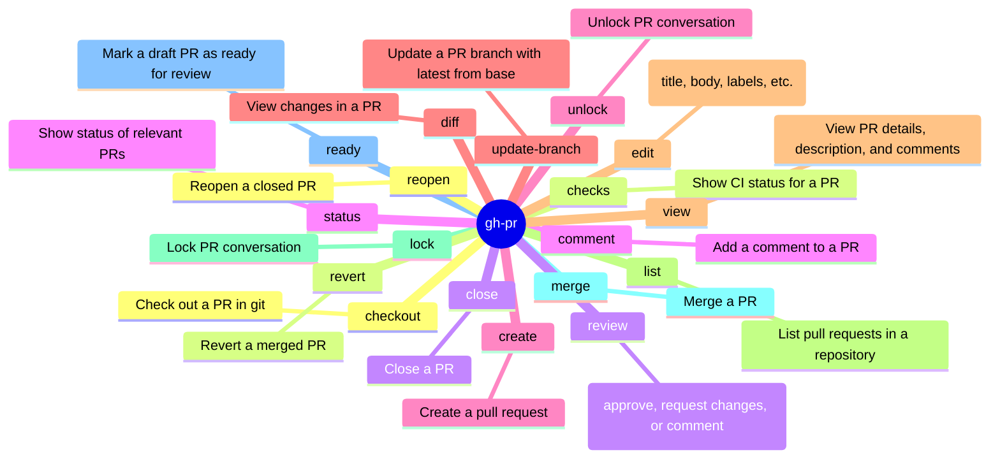

<!-- markdownlint-disable MD003 MD022 MD026 MD041 -->
---
name: gh-pr
description: >-
  Use when planning or executing GitHub CLI (`gh pr`) commands for creating,
  viewing, reviewing, and managing pull requests.
---
# gh-pr Skill

Use `gh pr` to manage the lifecycle of pull requests. Prefer structured output and native subcommands over manual git operations when interacting with PR metadata or status.

## Mindmap of Commands



## Advanced PR Workflows

- **PR Creation with Metadata**:
  Always prefer non-interactive creation in automated environments:
  ```bash
  gh pr create --title "feature: add new component" --body-file description.md --label "enhancement" --assignee "@me"
  ```

- **Inspecting PR Checks and Logs**:
  To see exactly why a PR is failing:
  ```bash
  gh pr checks <number> --watch
  ```
  If checks fail, use `gh-run` skill to diagnose specific workflow failures.

- **Reviewing Changes**:
  For quick review of changes without leaving the terminal:
  ```bash
  gh pr diff <number> --color always | less -R
  ```

- **Merging Strategies**:
  Be explicit about the merge method:
  ```bash
  gh pr merge <number> --merge  # Create a merge commit
  gh pr merge <number> --squash # Squash and merge
  gh pr merge <number> --rebase # Rebase and merge
  ```

## Structured Query Patterns

- **Extracting Specific Metadata**:
  ```bash
  gh pr view <number> --json headRefName,baseRefName,title,body,state,author
  ```

- **Listing PRs for a Specific Author**:
  ```bash
  gh pr list --author "@me" --state open
  ```

- **Checking Mergeability**:
  ```bash
  gh pr view <number> --json mergeable,mergeStateStatus
  ```

## Failure Signatures

- **"Draft PRs cannot be merged"**: Use `gh pr ready <number>` first.
- **"Permission denied"**: Check `gh auth status`. You may need to request additional scopes.
- **"PR already exists"**: If creating a PR fails because one exists for the branch, use `gh pr list --head <branch>` to find it and `gh pr edit` if updates are needed.

## What to Avoid

- Avoid using `git push` then `gh pr create` separately if you can use `gh pr create --fill` or `--head` to do it in one flow (though `git push` is often safer to ensure remote is updated).
- Do not use `gh api` for PR operations that have native `gh pr` subcommands unless you need raw JSON fields not exposed by `--json`.

## Related Skills

- **gh**: For general GitHub CLI usage and REST API.
- **gh-run**: For detailed GitHub Actions workflow and job diagnostics.
- **git**: For low-level branch and commit management.
