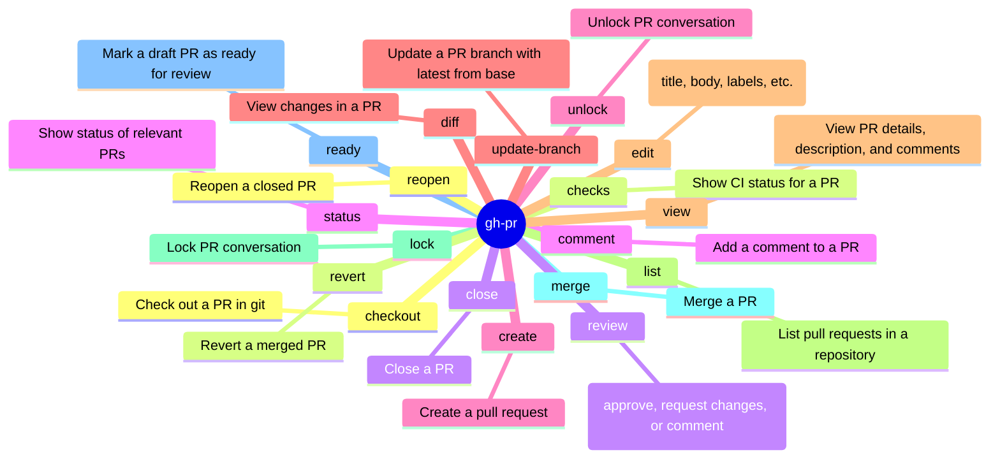
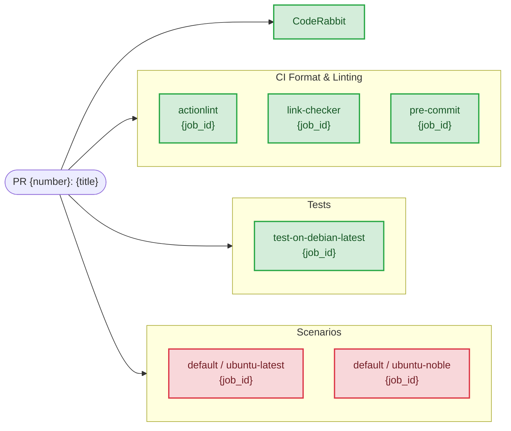

# gh-pr Skill

Use `gh pr` to natively interact with GitHub Pull Requests. Prefer native
fields and explicit routing over brittle shell post-processing.

## When to Use

- User asks to manage, review, or inspect a pull request using the GitHub CLI (`gh pr`).
- Task involves querying PR CI/CD checks (`gh pr checks`), logs, mergeability, or PR metadata.
- Need to perform branch synchronizations, merges, or PR updates inside a GitHub Actions runtime.
- Extracting PR context, reviewing diffs, or commenting on specific PR threads.

## Mindmap of Commands



## Advanced PR Workflows

- **PR Creation with Metadata**:
  Always prefer non-interactive creation in automated environments:

  ```bash
  gh pr create --title "feature: add new component" --body-file /tmp/description.md --label "enhancement" --assignee "@me"
  ```

- **Inspecting PR Checks and Logs**:
  To see exactly why a PR is failing:

  ```bash
  gh pr checks <number> --watch
  ```

  If checks fail, use `gh-run` skill to diagnose specific workflow failures.

- **Listing Failed Checks**:
  To quickly identify only the failing jobs for a specific PR:

  ```bash
  gh pr checks <number> --repo <owner>/<repo> | grep fail
  ```

- **Reviewing Changes**:
  For quick review of changes without leaving the terminal:

  ```bash
  gh pr diff <number> --color always | less -R
  ```

- **Merging Strategies**:
  Be explicit about the merge method:

  ```bash
  gh pr merge <number> --merge  # Create a merge commit
  gh pr merge <number> --squash # Squash and merge
  gh pr merge <number> --rebase # Rebase and merge
  ```

## Pull Request Diagnostics & Checks

- **Checking Runs for a Pull Request**:
  - `gh pr checks <number> --repo <owner>/<repo>` is the quickest way to map checks directly to the PR's HEAD commit.
    This outputs standard CI/CD checks (successes, failures, skips) and provides direct URLs to the workflow jobs.
  - **Limitation**: `gh pr checks` *only* evaluates the HEAD commit.
    It completely misses manually triggered (`workflow_dispatch`) or comment-triggered (`issue_comment`) agent runs.
  - **Workaround**: To comprehensively fetch *all* workflow runs associated with
    a PR (including custom actions and agentic runs),
    refer to the `gh-api` skill for instructions on using `gh api` to query by branch and display title.

### Visualizing PR Checks

When you need to visualize the results of `gh pr checks`, you can
generate an architectural flowchart (using Mermaid) that categorizes
checks logically (e.g., CI Formatting vs Tests vs Molecule).

Example:



## Structured Query Patterns

- Extract PR commit history for Mermaid `gitGraph`:
  - **With Git (`git`)**:
    `git log origin/main..HEAD --reverse --format='commit id: "%s"'`
  - For more context, load relevant skill files when working with this type of diagrams.
  - **With GitHub API (`gh api`)**:
    `gh api repos/<owner>/<repo>/pulls/<number>/commits \`
    `--jq '.[] | "commit id: \"[\(.sha[0:7])] \(.commit.message | split("\n")[0] | gsub("\""; "'\''"))\""'`
  - **With GitHub CLI (`gh`)**:
    `gh pr view <number> --json headRefName,baseRefName,commits`
- **Detailed JSON Retrieval (Comments & Reviews)**:
  - `gh pr view <number> --repo <owner>/<repo> --json comments`
  - `gh pr view <number> --repo <owner>/<repo> --json reviews`
- Lightweight PR context:
  `gh pr view <number> --json number,title,state,reviewDecision,url`

- **Listing PRs for a Specific Author**:

  ```bash
  gh pr list --author "@me" --state open
  ```

- **Checking Mergeability**:

  ```bash
  gh pr view <number> --json mergeable,mergeStateStatus
  ```

## Interaction & Comments

- For PR thread interactions, use `gh pr comment` or `gh api`.
- For long comments, avoid heredocs as they can cause shell hangs if truncated. Write the comment to a temporary file
  first, then use `--body-file`:

  ```bash
  # Use your file-writing tools to write the comment to /tmp/comment.md, then:
  gh pr comment <number> --body-file /tmp/comment.md
  ```

- **Note**: `gh pr review` is often restricted in automated environments (e.g., OpenCode); prefer `gh pr comment`.
- **Dynamic PR Targeting**: ALWAYS target the explicitly provided **Base Branch** when creating/updating PRs.

## GitHub Actions Runtime

When executing autonomously within a GitHub Actions environment, adhere strictly to these interaction constraints:

### OpenCode PR Context & Response Routing

**Context & Targeting Invariants**:

- **Extract Context**: Parse the `## Pull Request Context` block containing `**Base Branch:**` dynamically.

- **Dynamic PR Targeting**: ALWAYS target this explicitly provided **Base Branch** when creating/updating PRs.

**Response Detection & Routing**: Check `github.event_name` and payload to identify trigger source:

- **General PR comment** (`issue_comment`):
  - Condition: `if: ${{ github.event.issue.pull_request }}`
  - Reply Method: `gh pr comment`
- **Issue comment** (`issue_comment`):
  - Condition: `if: ${{ !github.event.issue.pull_request }}`
  - Reply Method: `gh issue comment`
- **Inline code review** (`pull_request_review_comment`):
  - Reply Method: `gh api repos/<owner>/<repo>/pulls/<pr>/comments/<comment_id>/replies -f body="..."`

**Routing Invariants**:

- **Symmetric Routing**: ALWAYS reply via the exact originating channel. NEVER cross threads.
- Parse `github.event.comment.id` and `in_reply_to_id` to maintain thread continuity.

## Branch Sync Policy (No Rebase During Runtime)

When the prompt asks to "pull" or "sync with base" in GitHub Actions runtime, the agent MUST integrate remote changes
with a merge commit workflow.

- **MUST NOT** run any rebase-based update command during runtime.
- **FORBIDDEN**: `gh pr update-branch --rebase`, `git pull --rebase`, `git rebase`, or any history rewrite that
  changes commit SHAs.
- **MUST** use pull-with-merge semantics: `git pull --no-rebase`.
- **MUST** preserve remote branch compatibility for post-run auto PR/push logic.

**Execution Steps (strict order)**:

1. Determine PR base/head from context (`## Pull Request Context`, `gh pr view`).

2. Ensure work is on the PR head branch (not detached HEAD).
3. Sync head branch from remote with merge semantics: `git pull --no-rebase origin <head-branch>`.
4. If base changes must be integrated into head, merge base explicitly:
   `git fetch origin <base-branch> && git merge --no-ff origin/<base-branch>`.
5. Resolve conflicts, commit merge if required, then push normally (no force).

**Verification Gate (required before push)**:

- Confirm no rebase command was executed in this run.
- Confirm `git log --oneline --graph -n 10` shows merge topology (no rewritten linearized history from rebase).
- Proceed with normal `git push` only after these checks pass.

For high-level pull request routing guidance, refer to the **github-pr** skill.

## Pre-Completion

Before finishing your session, you MUST ensure the workspace is in a valid state.

### Workspace Cleanliness (Non-Modifying Tasks)

If the runtime did not involve intended modification of files:

1. **Verify**: Run `git status` to confirm the workspace is clean.
2. **Clean**: If untracked or modified files exist (e.g., temporary analysis artifacts), run `git clean -fd` and
   `git checkout -- .`.
3. **Assert**: Ensure no PR or commit is triggered for purely informational tasks.

## Failure Signatures

- **"Draft PRs cannot be merged"**: Use `gh pr ready <number>` first.
- **"Permission denied"**: Check `gh auth status`. You may need to request additional scopes.
- **"PR already exists"**: If creating a PR fails because one exists for the branch, use
  `gh pr list --head <branch>` to find it and `gh pr edit` if updates are needed.

## What to Avoid

- Avoid using `git push` then `gh pr create` separately if you can use `gh pr create --fill` or `--head` to do it in
  one flow.
- Do not use `gh api` for PR operations that have native `gh pr` subcommands unless you need raw JSON fields not
  exposed by `--json`.

## Related Skills

- **gh-run**:
  You MUST load this skill when working with the `gh run` and the `gh workflow` commands.
- **git**:
  You MUST load this skill when performing standard git operations.
