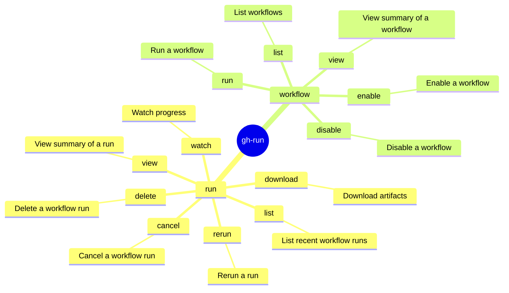

# gh-run Skill

Use `gh run` and `gh workflow` to interact with GitHub Actions workflows. Prefer structured output and explicit
routing over brittle shell post-processing.

## Mindmap of Commands



## Workflow Run Diagnostics

- **Checking Latest Runs for a Pull Request**:
  - Use the native tool mapping directly to the PR's HEAD commit to elegantly
    output standard CI/CD checks (successes, failures, skips) and obtain direct
    URLs to workflow jobs:

    ```bash
    gh pr checks <number> --repo <owner>/<repo>
    ```

  - **Limitation**: `gh pr checks` is fast but only evaluates the *latest* runs on the HEAD commit.
    It completely misses manually triggered (`workflow_dispatch`) or comment-triggered (`issue_comment`) agent runs.
  - **Workaround**: To find **all** workflow runs robustly associated with a PR
    (including custom actions and agent triggers), you must match the PR's
    `headRefName` OR `title` via the API. Refer to the `gh-api` skill for
    exactly how to query the `/actions/runs` endpoint robustly for this purpose.

- **Fetching Logs for In-Progress Runs or Multiple Attempts**:
  - `gh run view --log` only fetches logs for the *latest completed* attempt and often fails on in-progress runs
    or expired attempts.
  - The API endpoint `/repos/<owner>/<repo>/actions/jobs/<job_id>/logs` often fails during
    redirect (403 AuthenticationFailed) if called dynamically with `gh api` or curl.
  - **Robust Solution**: Use the ZIP log endpoint which encapsulates all job logs for a specific full run attempt,
    even if the run is still in progress:

    ```bash
    gh api /repos/<owner>/<repo>/actions/runs/<run_id>/attempts/<attempt_num>/logs > /tmp/logs.zip
    unzip /tmp/logs.zip -d /tmp/logs
    ```

    *(Note: This requires `unzip` and shell redirection to be available in the environment.)*
    This produces a structure where logs are either:
    1. In a directory matching the *Job Name* (e.g. `Job Name/1_Set up job.txt`).
    2. A single raw `.txt` file at the root level prefixed with a number but suffixed with the job name
       (e.g. `0_copilot.txt`) for monolithic/agent runs.
    Check both locations and concatenate the `.txt` files to reliably provide the full job execution logs
    regardless of progress state.

- `gh run view <run_id> --log-failed` is only reliable when the relevant job
  or run concluded with failure.
- Prefer structured inspection with
  `gh run view <run_id> --json databaseId,status,conclusion,jobs,url` or
  `gh run view <run_id>` metadata. Only use external filters like `rg` if shell
  policy explicitly permits them.
- Jobs can conclude `success` while still containing pathological agent
  behavior; inspect run/job metadata before assuming failed-only logs are
  sufficient.
- Do not pass both run ID and job ID to `gh run view`; the CLI warns and
  ignores the run ID.
- Treat `gh run view ... --log` as environment-sensitive. If it returns
  empty output (which often happens with older runs, cached pipelines, or
  canceled overarching matrix runs), do not loop on it.
  **Alternative Workaround for Empty Job Logs**:
  See the `gh-api` skill for instructions on downloading the full run logs zip via the API to bypass console streaming limitations.
- Probe one run or one job first before launching parallel diagnostics.

## Structured Query Patterns

- `gh run list --json databaseId,name,workflowName,status,conclusion,url --limit 20`
- `gh run list --json databaseId,headBranch,name,event,status,conclusion,createdAt,url \`
  `-q '.[] | select(.headBranch == "<branch_name>")' --repo <owner>/<repo> --limit 10`
- `gh run list --repo <owner>/<repo>`

## Failure Signatures

- Warning like `both run and job IDs specified; ignoring run ID` means the
  command did not execute the way you intended; fix arguments before
  continuing.
- Repeated `403` from `gh api` on log/archive endpoints usually indicates
  redirect or signed-URL handling issues, not missing repository access.
  Classify as `LOG_ACCESS_UNSUPPORTED` and pivot to metadata or artifacts.

## What to Avoid

- Do not assume Actions log retrieval is uniform across public pages, API
  endpoints, and CLI subcommands.

## Related Skills

- **gh**:
  Must be loaded when working with `gh` command.
- **gh-pr**:
  Must be loaded when working with `gh pr` command.
- **gh-models**:
  Must be loaded when working with `gh models` command.
