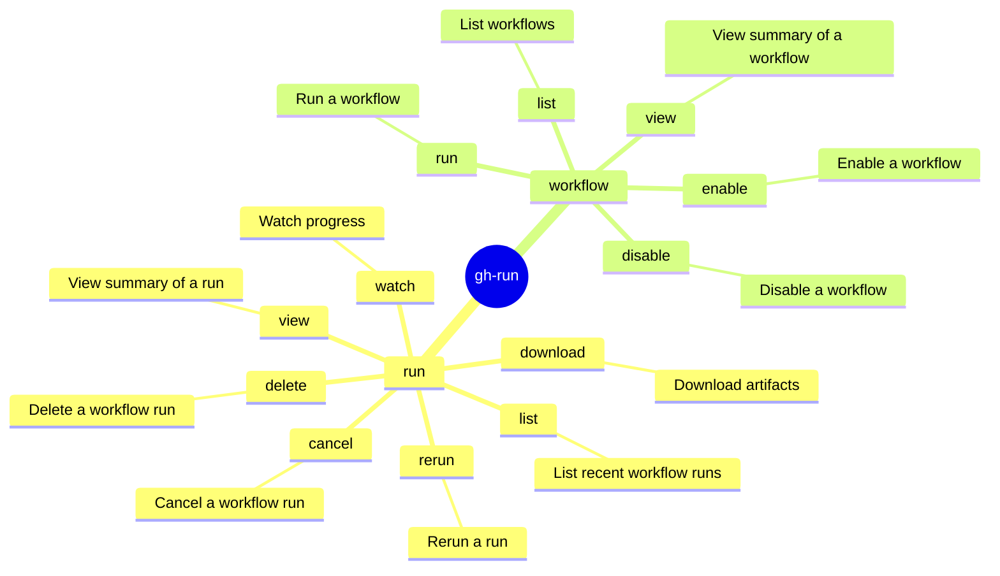

<!-- markdownlint-disable MD003 MD022 MD026 MD041 -->
---
name: gh-run
description: >-
  Use when planning or executing GitHub CLI (`gh run` and `gh workflow`)
  commands for workflow runs, jobs, logs, and attempts.
---
# gh-run Skill

Use `gh run` and `gh workflow` to interact with GitHub Actions workflows. Prefer structured output and explicit
routing over brittle shell post-processing.

## Mindmap of Commands



## Workflow Run Diagnostics

- **Checking Runs for a Pull Request**:
  - Instead of parsing commit hashes or wrestling with `gh run list --branch <branch_name>`
    (which lacks branch filtering in newer versions or gets complicated),
    use the native tool mapping directly to the PR's HEAD commit:

    ```bash
    gh pr checks <number> --repo <owner>/<repo>
    ```

    This outputs all CI/CD checks (successes, failures, skips) and provides direct URLs to the workflow jobs.

- **Fetching Logs for In-Progress Runs or Multiple Attempts**:
  - `gh run view --log` only fetches logs for the *latest completed* attempt and often fails on in-progress runs
    or expired attempts.
  - The API endpoint `/repos/<owner>/<repo>/actions/jobs/<job_id>/logs` often fails during
    redirect (403 AuthenticationFailed) if called dynamically with `gh api` or curl.
  - **Robust Solution**: Use the ZIP log endpoint which encapsulates all job logs for a specific full run attempt,
    even if the run is still in progress:

    ```bash
    gh api /repos/<owner>/<repo>/actions/runs/<run_id>/attempts/<attempt_num>/logs > logs.zip
    unzip logs.zip
    ```

    *(Note: This requires `unzip` and shell redirection to be available in the environment.)*
    This produces a structure where logs are either:
    1. In a directory matching the *Job Name* (e.g. `Job Name/1_Set up job.txt`).
    2. A single raw `.txt` file at the root level prefixed with a number but suffixed with the job name
       (e.g. `0_copilot.txt`) for monolithic/agent runs.
    Check both locations and concatenate the `.txt` files to reliably provide the full job execution logs
    regardless of progress state.

- `gh run view <run_id> --log-failed` is only reliable when the relevant job
  or run concluded with failure.
- Prefer structured inspection with
  `gh run view <run_id> --json databaseId,status,conclusion,jobs,url` or
  `gh run view <run_id>` metadata. Only use external filters like `rg` if shell
  policy explicitly permits them.
- Jobs can conclude `success` while still containing pathological agent
  behavior; inspect run/job metadata before assuming failed-only logs are
  sufficient.
- Do not pass both run ID and job ID to `gh run view`; the CLI warns and
  ignores the run ID.
- Treat `gh run view ... --log` as environment-sensitive. If it returns
  empty output, do not loop on it; switch to metadata, artifacts, or another
  supported log source.
- Probe one run or one job first before launching parallel diagnostics.

## Structured Query Patterns

- `gh run list --limit 20 --json databaseId,name,workflowName,status,conclusion,url`
- `gh api repos/<owner>/<repo>/actions/jobs/<job_id>`

## Failure Signatures

- Warning like `both run and job IDs specified; ignoring run ID` means the
  command did not execute the way you intended; fix arguments before
  continuing.
- Repeated `403` from `gh api` on log/archive endpoints usually indicates
  redirect or signed-URL handling issues, not missing repository access.
  Classify as `LOG_ACCESS_UNSUPPORTED` and pivot to metadata or artifacts.

## What to Avoid

- Do not assume Actions log retrieval is uniform across public pages, API
  endpoints, and CLI subcommands.

## Related Skills

- **gh**: For general GitHub CLI usage (issues, PRs, and REST API).
- **gh-pr**: For detailed pull request creation, management, and review workflows.
- **gh-models**: For running and evaluating AI models via GitHub Models CLI.
