<!-- markdownlint-disable MD003 MD022 MD026 MD041 -->
---
name: gh
description: >-
  Use when planning or executing GitHub CLI (`gh`) commands for issues, pull
  requests, workflow runs, reviews, or API queries, especially in restricted
  shells where structured output and fallback choice matter.
---
# gh Skill

Use `gh` as a structured client first. Prefer native fields, explicit routing,
and bounded fallbacks over brittle shell post-processing.

## Mindmap of Commands

```mermaid
mindmap
  root((gh))
    agent-task
      create
        Create an agent task
      list
        List agent tasks
      view
        View an agent task session
    alias
      delete
        Delete set aliases
      import
        Import aliases
      list
        List aliases
      set
        Create a shortcut
    api
      Make authenticated API request
    attestation
      download
        Download attestations
      trusted-root
        Output trusted root
      verify
        Verify integrity
    auth
      login
        Log in to a GitHub account
      logout
        Log out of a GitHub account
      refresh
        Refresh stored authentication credentials
      setup-git
        Set up Git with GitHub CLI
      status
        Display active account and authentication state
      switch
        Switch active GitHub account
      token
        Print the authentication token
    browse
      Open repositories, issues, PRs in browser
    cache
      delete
        Delete GitHub Actions caches
      list
        List GitHub Actions caches
    codespace
      code
        Open in VS Code
      cp
        Copy files
      create
        Create a codespace
      delete
        Delete codespaces
      edit
        Edit a codespace
      jupyter
        Open in JupyterLab
      list
        List codespaces
      logs
        Access codespace logs
      ports
        List ports
      rebuild
        Rebuild a codespace
      ssh
        SSH into a codespace
      stop
        Stop a codespace
      view
        View details
    config
      clear-cache
        Clear cli cache
      get
        Print value
      list
        Print keys/values
      set
        Update configuration
    extension
      browse
        UI for extensions
      create
        Create new extension
      exec
        Execute extension
      install
        Install extension
      list
        List extensions
      remove
        Remove extension
      search
        Search extensions
      upgrade
        Upgrade extensions
    gist
      clone
        Clone locally
      create
        Create new gist
      delete
        Delete a gist
      edit
        Edit a gist
      list
        List gists
      rename
        Rename a file in a gist
      view
        View a gist
    gpg-key
      add
        Add a GPG key
      delete
        Delete a GPG key
      list
        List GPG keys
    issue
      close
        Close issue
      comment
        Add a comment
      create
        Create a new issue
      delete
        Delete issue
      develop
        Manage linked branches
      edit
        Edit issues
      list
        List issues
      lock
        Lock conversation
      pin
        Pin an issue
      reopen
        Reopen issue
      status
        Show status
      transfer
        Transfer issue
      unlock
        Unlock conversation
      unpin
        Unpin an issue
      view
        View an issue
    label
      clone
        Clone labels
      create
        Create new label
      delete
        Delete a label
      edit
        Edit a label
      list
        List labels
    models
      (Load gh-models skill if required)
    org
      list
        List organizations
    pr
      (Load gh-pr skill if required)
    project
      close
        Close a project
      copy
        Copy a project
      create
        Create a project
      delete
        Delete a project
      edit
        Edit a project
      field-create
        Create a field
      field-delete
        Delete a field
      field-list
        List fields
      item-add
        Add item
      item-archive
        Archive item
      item-create
        Create item
      item-delete
        Delete item
      item-edit
        Edit item
      item-list
        List items
      link
        Link project
      list
        List projects
      mark-template
        Mark as template
      unlink
        Unlink project
      view
        View a project
    release
      create
        Create a new release
      delete
        Delete a release
      delete-asset
        Delete an asset
      download
        Download assets
      edit
        Edit a release
      list
        List releases
      upload
        Upload assets
      verify
        Verify attestation
      verify-asset
        Verify asset
      view
        View information
    repo
      archive
        Archive a repository
      autolink
        Manage autolink references
      clone
        Clone locally
      create
        Create a new repository
      delete
        Delete a repository
      deploy-key
        Manage deploy keys
      edit
        Edit settings
      fork
        Create a fork
      gitignore
        List gitignore templates
      license
        Explore licenses
      list
        List repositories
      rename
        Rename a repository
      set-default
        Configure default
      sync
        Sync a repository
      unarchive
        Unarchive
      view
        View a repository
    ruleset
      check
        View rules for branch
      list
        List rulesets
      view
        View information
    run
      (Load gh-run skill if required)
    search
      code
        Search within code
      commits
        Search for commits
      issues
        Search for issues
      prs
        Search for pull requests
      repos
        Search for repositories
    secret
      delete
        Delete secrets
      list
        List secrets
      set
        Create or update secrets
    ssh-key
      add
        Add an SSH key
      delete
        Delete an SSH key
      list
        List SSH keys
    status
      Show work status
    variable
      delete
        Delete variables
      get
        Get variables
      list
        List variables
      set
        Create or update variables
    workflow
      (Load gh-run skill if required)
```



## When to Activate

- User asks to use `gh`, GitHub CLI, or to query GitHub from shell.
- Task involves issues, PRs, reviews, workflow runs, jobs, discussions, or GitHub REST endpoints.
- Execution is inside CI, Codespaces, or another restricted shell.

## Core Process

1. Verify availability and auth first: `gh --version`, then `gh auth status`.
2. Choose the narrowest native `gh` surface before reaching for `gh api`:
   - `gh issue view/comment` for issues
   - `gh pr view/comment/review` for pull requests and reviews
   - `gh api` only when native subcommands do not expose the needed field
3. Prefer structured output over shell filtering:
   - use `--json`, `--jq`, or `--template` instead of `grep`/`rg`
   - use `gh api` for metadata, not ad hoc HTML scraping
4. Query the smallest object that answers the question:
   - issue or PR metadata before comments
5. After each command, verify progress explicitly:
   - non-empty stdout or expected JSON field
   - no warning that changes command semantics
   - result actually answers the current question
6. If the same normalized command shape fails twice with the same warning,
   error, or empty result, pivot strategy instead of retrying.

## API Parameter Handling

When using `gh api` (including `gh api graphql`), choose the correct flag for parameters:

- Use `-F` (`--field`) for **magic type conversion**:
  - **File expansion**: `-F body=@path/to/file.md` (reads file content).
  - **Typed values**: `-F is_public=true`, `-F count=42`, `-F parent=null`.
  - **Placeholders**: `-F repo={repo}`, `-F owner={owner}`.
- Use `-f` (`--raw-field`) for **static strings**:
  - Use this when you want the literal value.
  - **CAUTION**: `-f` DOES NOT expand `@`. Using `-f body=@file` posts the literal string "@file".
  - For GraphQL, `query` is usually passed with `-f` to avoid accidental expansion or type conversion of the query string itself.

**Large Bodies & Files**:
- Prefer `-F body=@path/to/file.md` for large content.
- **Process Substitution**: Avoid `-F body=@<(...)` in `gh api`; it is brittle across shells. Write to a temporary file first, then use `-F body=@tempfile`.

**GraphQL Variables**:
For `gh api graphql`, all fields other than `query` and `operationName` are automatically passed as GraphQL variables.
Example: `gh api graphql -f query='mutation($title: String!) { ... }' -F title=@title.txt`

## Structured Query Patterns

- Use `gh pr view <number> --json headRefName,baseRefName,commits` to extract PR commit history
  (e.g. for visualization to generate topology data like `mermaid` `gitGraph` diagrams without cloning explicitly)
- Prefer native JSON first:
  - `gh issue view <number> --json comments,number,title,state,author,url`
  - `gh pr view <number> --json number,title,state,reviewDecision,url`
- Use `gh api` for objects that native subcommands do not expose cleanly:
  - `gh api repos/<owner>/<repo>/issues/<number>/comments`
- Use `--jq` or `--template` before external filters.

## Discussion Patterns (via GraphQL)

Since `gh` often lacks a native `discussion` subcommand, use `gh api graphql`. Avoid process substitution for the body; use a temporary file.

- **Get repositoryId and categoryId**:
  ```bash
  gh api graphql -f query='query {
    repository(owner: "OWNER", name: "REPO") {
      id
      discussionCategories(first: 10) {
        nodes { id name }
      }
    }
  }'
  ```
- **Create Discussion**:
  ```bash
  gh api graphql -F repositoryId="$REPO_ID" -F categoryId="$CAT_ID" \
    -F title="Title" -F body=@body.md \
    -f query='mutation($repositoryId:ID!, $categoryId:ID!, $title:String!, $body:String!){
      createDiscussion(input:{repositoryId:$repositoryId,categoryId:$categoryId,title:$title,body:$body}){
        discussion{url}
      }
    }'
  ```
- **Comment on Discussion**:
  ```bash
  gh api graphql -F discussionId="$DISCUSSION_ID" -F body=@comment.md \
    -f query='mutation($discussionId:ID!, $body:String!){
      addDiscussionComment(input:{discussionId:$discussionId,body:$body}){
        comment{url}
      }
    }'
  ```

## Preferred Patterns

- Comment directly without touching workspace files:
  `gh issue comment <number> --body "..."`
- Reply through the originating GitHub surface:
  - issue thread -> `gh issue comment`
  - PR thread -> `gh pr comment` or `gh pr review`
  - inline review thread -> `gh api .../replies`
- For long comments, use a HEREDOC body:
  `gh issue comment <number> --body "$(cat <<'EOF'
  ...
  EOF
  )"`
- For GraphQL mutations with large bodies from files:
  `gh api graphql -f query='mutation($body: String!) { ... }' -F body=@file.md`
- For non-code-change tasks, verify workspace cleanliness after posting.

## GitHub Actions Runtime

When executing autonomously within a GitHub Actions environment, adhere strictly to these interaction constraints:

### OpenCode PR Context & Response Routing

**Context & Targeting Invariants**:

- **Extract Context**: Parse the `## Pull Request Context` block containing `**Base Branch:**` dynamically.
- **Dynamic PR Targeting**: ALWAYS target this explicitly provided **Base Branch** when creating/updating PRs.

**Response Detection & Routing**: Check `github.event_name` and payload to identify trigger source:

- **General PR comment** (`issue_comment`):
  - Condition: `if: ${{ github.event.issue.pull_request }}`
  - Reply Method: `gh pr comment`
- **Issue comment** (`issue_comment`):
  - Condition: `if: ${{ !github.event.issue.pull_request }}`
  - Reply Method: `gh issue comment`
- **Inline code review** (`pull_request_review_comment`):
  - Reply Method: `gh api repos/{owner}/{repo}/pulls/{pr}/comments/{comment_id}/replies -f body="..."`

**Routing Invariants**:

- **Symmetric Routing**: ALWAYS reply via the exact originating channel. NEVER cross threads.
- Parse `github.event.comment.id` and `in_reply_to_id` to maintain thread continuity.

### Branch Sync Policy (No Rebase During Runtime)

When the prompt asks to "pull" or "sync with base" in GitHub Actions runtime, the
agent MUST integrate remote changes with a merge commit workflow.

- **MUST NOT** run any rebase-based update command during runtime.
- **FORBIDDEN**: `gh pr update-branch --rebase`, `git pull --rebase`, `git rebase`,
  or any history rewrite that changes commit SHAs.
- **MUST** use pull-with-merge semantics: `git pull --no-rebase`.
- **MUST** preserve remote branch compatibility for post-run auto PR/push logic.

**Execution Steps (strict order)**:

1. Determine PR base/head from context (`## Pull Request Context`, `gh pr view`).
2. Ensure work is on the PR head branch (not detached HEAD).
3. Sync head branch from remote with merge semantics: `git pull --no-rebase origin <head-branch>`.
4. If base changes must be integrated into head, merge base explicitly:
   `git fetch origin <base-branch> && git merge --no-ff origin/<base-branch>`.
5. Resolve conflicts, commit merge if required, then push normally (no force).

**Verification Gate (required before push)**:

- Confirm no rebase command was executed in this run.
- Confirm `git log --oneline --graph -n 10` shows merge topology (no rewritten linearized history from rebase).
- Proceed with normal `git push` only after these checks pass.

### GitHub Runtime Decision Policy

- **Default to Best Practice:** Implement the most recommended path autonomously when multiple options exist.
- **Document Trade-offs:** Capture unresolved decisions, explicit options, and impacts in the PR description.
- **Never Stall:** Proceed immediately with safe defaults. Request preference feedback in the PR instead of waiting.
- **Report Defensively:** Present recommended option first; list alternatives only if they alter scope or risk.

## Restricted Shell Rules

- In allowlisted shells, do not assume `grep`, `rg`, or complex pipelines are
  permitted just because `gh` is permitted.
- Prefer `gh --json/--jq/--template` over external text filters.
- Probe one command shape first before parallel fan-out.
- If a shell policy blocks a `gh`-adjacent command shape, classify it as
  `POLICY_DENIED` and pivot immediately.

## Failure Signatures

- Empty stdout from a supposedly successful `gh` query is a signal, not a
  success. Check whether the subcommand supports the requested mode in this
  environment.
- If a shell policy blocks a `gh`-adjacent command shape, classify it as
  `POLICY_DENIED` and pivot immediately.

## What to Avoid

- Do not use `-f` (`--raw-field`) when you intend to read a value from a file
  using `@`; always use `-F` (`--field`) for file expansion.
- Do not build `gh ... | grep ... | grep ...` chains as the default diagnostic
  path.
- Do not retry the same `gh` command shape after semantic warnings.
- Do not create temp files for comments or analysis when direct `gh`
  subcommands are available.

## Maintenance

Update this skill when new `gh` failure signatures, routing patterns, or
reliable structured-query workflows are discovered.

## Related Skills

- **gh-pr**: For detailed pull request creation, management, and review workflows.
- **gh-run**: For interacting with GitHub Actions workflows and checking run/job status.
- **gh-models**: For running and evaluating AI models via GitHub Models CLI.
