# Skill: github-aw-agentics

<!-- markdownlint-disable MD013 MD023 MD031 MD032 -->

A collection of reusable GitHub Agentic Workflows
from [githubnext/agentics](https://github.com/githubnext/agentics/tree/main/docs).

## When to Use This Skill

- User is looking for inspiration or ideas for new agentic workflows to implement
- User needs to implement or optimize a new agentic workflow based on existing patterns
- User wants to explore the catalog of available GitHub Agentic Workflows
- User wants to reference official documentation for specific workflows
- User wants to understand the "How It Works" logic (mermaid diagrams) for specific agents


## Maintainer Workflows

Make software maintenance enjoyable! From basic issue triage to Repo Assist - a powerful triage multi-task backlog burner, issue labeller, bug fixer and general repository assistant. Other workflows help gate your repository.

### 🏷️ Issue Triage

Triage labelling of issues and pull requests and not much more.

**Automatically triage issues when they are created or reopened**

The Issue Triage workflow runs when issues are created or reopened to analyze content, check related items, set issue type, add labels, detect duplicates, and post structured triage reports.

**Reference:** [https://github.com/githubnext/agentics/blob/main/docs/issue-triage.md](https://github.com/githubnext/agentics/blob/main/docs/issue-triage.md)

### How It Works (Issue Triage)

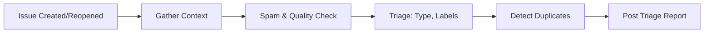

The workflow may search for relevant documentation, error messages, or similar issues online to assist with triage.

### 🌈 Repo Assist

A regular, pervasive all-tools repository assistant that triages issues, investigates issues, replies with comments, fixes bugs, proposes engineering improvements, and maintains activity summaries.

The Repo Assist workflow is a [GitHub Agentic Workflow](https://github.blog/ai-and-ml/automate-repository-tasks-with-github-agentic-workflows/) for a friendly repository assistant that runs regularly to support contributors and maintainers. It can also be triggered on-demand via `/repo-assist <instructions>` to perform specific tasks. Each run it selects three tasks via a weighted random draw based - favouring issue labelling, investigation and fixing when the backlog is large, then shifting to engineering, testing, and forward progress as the backlog clears. It maintains a monthly activity summary for maintainer visibility.

[Read more in this blog](https://dsyme.net/2026/02/25/repo-assist-a-repository-assistant/).

**Reference:** [https://github.com/githubnext/agentics/blob/main/docs/repo-assist.md](https://github.com/githubnext/agentics/blob/main/docs/repo-assist.md)

### How It Works (Repo Assist)

````mermaid
graph LR
    P[Fetch repo data] --> W[Compute task weights]
    W --> S[Select 3 tasks]
    S --> A[Read Memory]
    A --> T1[Task 1: Issue Labelling]
    A --> T2[Task 2: Issue Investigation + Comment]
    A --> T3[Task 3: Issue Investigation + Fix]
    A --> T4[Task 4: Engineering Investments]
    A --> T5[Task 5: Coding Improvements]
    A --> T6[Task 6: Maintain Repo Assist PRs]
    A --> T7[Task 7: Stale PR Nudges]
    A --> T8[Task 8: Performance Improvements]
    A --> T9[Task 9: Testing Improvements]
    A --> T10[Task 10: Take Repo Forward]
    T1 & T2 & T3 & T4 & T5 & T6 & T7 & T8 & T9 & T10 --> T11[Task 11: Monthly Activity Summary]
    T11 --> M[Save Memory]
````

Each run a deterministic pre-step fetches live repo data (open issues, unlabelled issues, open PRs) and computes a **weighted probability** for each task. Three tasks are selected and printed in the workflow logs, then communicated to the agent via prompting. The weights adapt naturally: when unlabelled issues are high, labelling dominates; when there are many open issues, commenting and fixing dominate; as the backlog clears, engineering and forward-progress tasks draw more evenly.

### 🛡️ AI Moderator

Automatically detect and moderate spam, link spam, and AI-generated content.

**Automatically detect spam, link spam, and AI-generated content in GitHub issues, comments, and pull requests**

The AI Moderator workflow helps maintain quality discussions and protect your repository from malicious or low-quality contributions by automatically moderating incoming content.

**Reference:** [https://github.com/githubnext/agentics/blob/main/docs/ai-moderator.md](https://github.com/githubnext/agentics/blob/main/docs/ai-moderator.md)

### How It Works (AI Moderator)

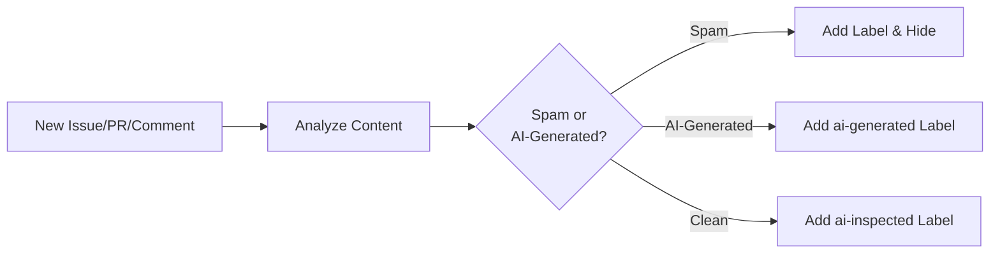

The workflow reads new issues, comments, and pull request diffs, then applies appropriate labels (`spam`, `link-spam`, `ai-generated`, or `ai-inspected`). It can hide comments detected as spam. Requires `issues: write` and `pull-requests: write` permissions for full functionality.

## Fault Analysis Workflows

Investigate faults proactively and improve CI.

### 🏥 CI Doctor

Monitor CI workflows and investigate failures automatically.

**Automated CI failure investigator that analyzes root causes and provides actionable recommendations**

The CI Doctor workflow monitors your GitHub Actions workflows and automatically investigates CI failures. When a monitored workflow fails, it conducts deep analysis to identify root causes, patterns, and provides recommendations for fixing issues.

**Reference:** [https://github.com/githubnext/agentics/blob/main/docs/ci-doctor.md](https://github.com/githubnext/agentics/blob/main/docs/ci-doctor.md)

### How It Works (CI Doctor)

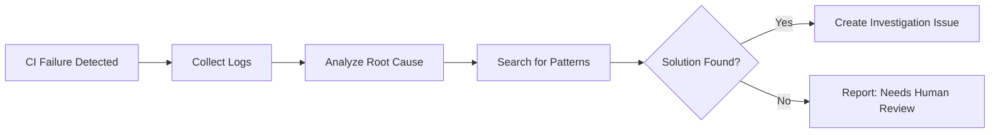

The workflow collects failed workflow logs, analyzes root causes, searches for patterns in historical issues, and creates detailed investigation issues with recommendations.

### 🚀 CI Coach

Optimize CI workflows for speed and cost efficiency.

**Automated CI/CD optimization expert that analyzes your GitHub Actions workflows and proposes efficiency improvements**

The CI Coach workflow is your personal CI/CD optimization consultant. It runs regularly (daily by default) to analyze workflows, collect performance metrics, identify optimization opportunities, and propose concrete improvements through pull requests.

**Reference:** [https://github.com/githubnext/agentics/blob/main/docs/ci-coach.md](https://github.com/githubnext/agentics/blob/main/docs/ci-coach.md)

### How It Works (CI Coach)

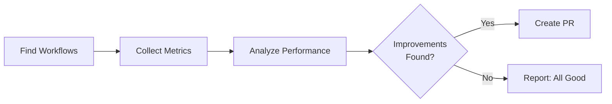

The workflow analyzes job parallelization, caching strategy, test distribution, resource allocation, artifact management, and conditional execution. All suggestions are backed by actual workflow run data and performance metrics.

### 💰 Cost Tracker

Post per-run agent spend summaries on pull requests using token-usage.jsonl from gh-aw's firewall.

**Automated agent cost reporter that posts a spend summary after every agent workflow run**

The Cost Tracker workflow fires after your configured agent workflows complete, downloads the `token-usage.jsonl` data written by gh-aw's firewall, calculates per-model spend, and posts a cost breakdown on the associated pull request or creates a cost report issue.

**Reference:** [https://github.com/githubnext/agentics/blob/main/docs/cost-tracker.md](https://github.com/githubnext/agentics/blob/main/docs/cost-tracker.md)

### How It Works (Cost Tracker)

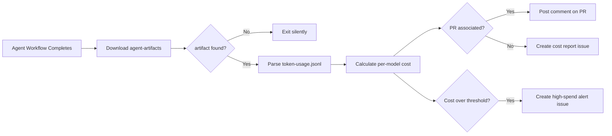

The workflow reads `token-usage.jsonl` from the `agent-artifacts` artifact written by
gh-aw's firewall on every agent run. It calculates cost using a built-in per-model
pricing table and posts the result where it is most useful — the PR that triggered the
agent run, or a new issue when there is no PR.

Runs that do not produce an `agent-artifacts` artifact (non-agent CI workflows) are
skipped silently.

## Code Review Workflows

### 😤 Grumpy Reviewer

On-demand opinionated code review by a grumpy but thorough senior developer.

**On-demand code review by a grumpy but thorough senior developer**

The Grumpy Reviewer workflow is an on-demand code reviewer with personality. Invoke it on any pull request to get an opinionated, thorough review focused on real problems: security risks, performance issues, bad naming, and missing error handling.

**Reference:** [https://github.com/githubnext/agentics/blob/main/docs/grumpy-reviewer.md](https://github.com/githubnext/agentics/blob/main/docs/grumpy-reviewer.md)

### How It Works (Grumpy Reviewer)

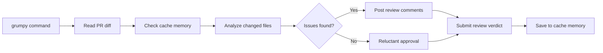

The reviewer hunts for code smells, security concerns, performance issues, and best practices violations. Posts up to 5 specific, actionable inline comments and submits a verdict (approve, request changes, or comment).

### 🔍 PR Nitpick Reviewer

On-demand fine-grained code review focusing on style, conventions, and subtle improvements.

**On-demand fine-grained code review focusing on style, conventions, and subtle improvements**

The PR Nitpick Reviewer workflow provides detailed, line-level feedback on pull requests, catching the subtle issues that automated linters miss: inconsistent naming, unclear variable names, missing context in comments, overly complex nesting, and other code quality concerns. It complements the Grumpy Reviewer — where Grumpy focuses on deep opinionated analysis of real problems, the Nitpick Reviewer zooms in on the small improvements that accumulate into a high-quality codebase.

**Reference:** [https://github.com/githubnext/agentics/blob/main/docs/pr-nitpick-reviewer.md](https://github.com/githubnext/agentics/blob/main/docs/pr-nitpick-reviewer.md)

### How It Works (PR Nitpick Reviewer)

```mermaid
graph LR
    A[/nit command] --> B[Load cache memory]
    B --> C[Fetch PR diff]
    C --> D[Analyze changed code]
    D --> E{Nitpicks found?}
    E -->|Yes| F[Post inline comments]
    E -->|No| G[Positive summary]
    F --> H[Submit review]
    G --> H
    H --> I[Update cache memory]
```

The reviewer analyzes changed files for subtle issues linters miss — inconsistent naming, magic numbers, misleading comments, unnecessary complexity — and posts up to 10 specific inline comments with explanations. It then submits an overall review body summarizing the key themes and any positive highlights. Cache memory keeps standards consistent across multiple reviews of the same repository.

### 🔍 Contribution Check

Regularly review batches of open PRs against contribution guidelines and create prioritized reports.

**Batch review of open pull requests against repository contribution guidelines**

The Contribution Check workflow runs every 4 hours to review open pull requests against your CONTRIBUTING.md. It helps maintainers efficiently prioritize community contributions by categorizing PRs as ready to review, needing work, or outside contribution guidelines.

**Reference:** [https://github.com/githubnext/agentics/blob/main/docs/contribution-check.md](https://github.com/githubnext/agentics/blob/main/docs/contribution-check.md)

### How It Works (Contribution Check)

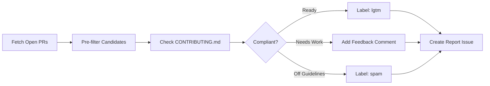

The workflow creates report issues with PRs grouped by readiness level (🟢 Ready, 🟡 Needs work, 🔴 Off-guidelines), adds comments with constructive feedback, and applies labels based on quality signals.

### ✅ Contribution Guidelines Checker

Review pull requests for compliance with contribution guidelines.

**Verify incoming pull requests comply with repository contribution guidelines**

The Contribution Guidelines Checker workflow reviews incoming PRs against your CONTRIBUTING.md and similar documentation, then either labels the PR as ready or provides constructive feedback on what needs improvement.

**Reference:** [https://github.com/githubnext/agentics/blob/main/docs/contribution-guidelines-checker.md](https://github.com/githubnext/agentics/blob/main/docs/contribution-guidelines-checker.md)

### How It Works (Contribution Guidelines Checker)

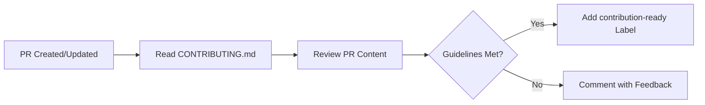

The workflow automatically runs on pull requests.

## Research, Status & Planning Workflows

### 🔄 Autoloop

Loop anything in your repo to continuously research, develop and maintain.

Autoloop has moved to its own repository: **<https://github.com/githubnext/autoloop>**

Please refer to that repository for the latest documentation, installation instructions, and source code.

**Reference:** [https://github.com/githubnext/autoloop](https://github.com/githubnext/autoloop)

### How It Works (Autoloop)

Autoloop's workflow mechanics and implementation details are documented in the
[Autoloop repository](https://github.com/githubnext/autoloop). See that
documentation for the current architecture, loop behavior, and setup details.

### 🧠 Repo Mind Light

External shared workflow that gives gh-aw agents holistic repository context.

Repo Mind Light gives GitHub Agentic Workflows a way to query holistic repository context before they act.

Unlike most workflows in this repository, its reusable workflow packaging lives in a dedicated public distribution repository: **<https://github.com/githubnext/repo-mind-light-aw>**. That repository exists as the public workflow channel for Repo Mind Light because the original implementation repository is private and the workflow has more functionality under the hood than a typical single-file workflow.

This repository still lists it because The Agentics is a central place to discover and share useful reusable workflows.

The shared workflow prepares or restores a Repo Mind Light index, starts the Repo Mind Light MCP server, and gives consuming workflows a focused repository-context query tool.

See the [Repo Mind Light distribution repository](https://github.com/githubnext/repo-mind-light-aw) for the latest usage, configuration, permissions, timeout guidance, and operational notes. If you run into any issues or have questions about using Repo Mind Light, please open an issue in that repository.

**Reference:** [https://github.com/githubnext/agentics/blob/main/docs/repo-mind-light-aw.md](https://github.com/githubnext/agentics/blob/main/docs/repo-mind-light-aw.md)

### 📚 Weekly Research

Collect research updates and industry trends.

**Collect research updates and post them to a new issue each Monday morning**

The Weekly Research workflow runs each Monday to search industry news, analyze trends, gather team updates, and generate a comprehensive research report issue.

**Reference:** [https://github.com/githubnext/agentics/blob/main/docs/weekly-research.md](https://github.com/githubnext/agentics/blob/main/docs/weekly-research.md)

### How It Works (Weekly Research)

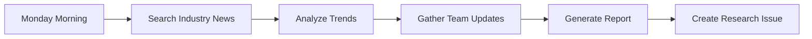

The workflow searches for latest trends from software industry sources, related products, research papers, and market opportunities.

### 📊 Weekly Issue Activity

Weekly issue activity report with trend charts and recommendations.

**Generate comprehensive weekly reports on issue activity with trend charts and recommendations**

The Weekly Issue Activity workflow runs every Monday at 3 PM UTC to collect issue data, generate trend charts, and create a detailed discussion with statistics and actionable recommendations.

**Reference:** [https://github.com/githubnext/agentics/blob/main/docs/weekly-issue-activity.md](https://github.com/githubnext/agentics/blob/main/docs/weekly-issue-activity.md)

### How It Works (Weekly Issue Activity)

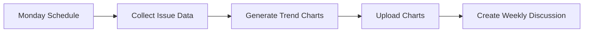

The workflow produces two charts:
- **Issue Activity Trends**: Weekly opened vs. closed counts and running open total
- **Resolution Time Trends**: Average and median days-to-close over time

Older `[Weekly Summary]` discussions are automatically closed when new ones are created.

### 👥 Daily Repo Status

Assess repository activity and create status reports.

**Assess repository activity and create status report issues**

The Daily Repo Status workflow gathers activity data, analyzes PRs and issues, checks workflow results, and creates status report issues. Previous reports are automatically closed when new ones are created.

**Reference:** [https://github.com/githubnext/agentics/blob/main/docs/repo-status.md](https://github.com/githubnext/agentics/blob/main/docs/repo-status.md)

### How It Works (Daily Repo Status)

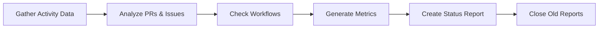

Reports are created with the `[team-status]` prefix.

### 👥 Daily Team Status

Create upbeat team activity summaries with productivity insights.

**Create daily team status reports with upbeat activity summaries**

The Daily Team Status workflow gathers recent repository activity (issues, PRs, discussions, releases, code changes) and generates engaging status issues with productivity insights, community highlights, and project recommendations.

**Reference:** [https://github.com/githubnext/agentics/blob/main/docs/team-status.md](https://github.com/githubnext/agentics/blob/main/docs/team-status.md)

### How It Works (Daily Team Status)

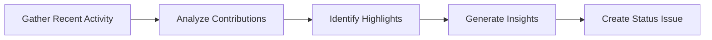

Issues are created with the `[team-status]` prefix using a positive, encouraging tone.

### 📰 Daily Repository Chronicle

Transform repository activity into an engaging newspaper-style narrative with trend charts.

**Transform daily repository activity into an engaging newspaper-style narrative**

The Daily Repository Chronicle workflow collects recent repository activity — commits, pull requests, issues, and discussions — and narrates it like a newspaper editor, producing a vivid, human-centered account of the day's development story. Two trend charts visualize the last 30 days of activity.

**Reference:** [https://github.com/githubnext/agentics/blob/main/docs/repo-chronicle.md](https://github.com/githubnext/agentics/blob/main/docs/repo-chronicle.md)

### How It Works (Daily Repository Chronicle)

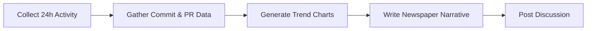

A new discussion is posted each weekday with the `📰` prefix. Older chronicles are automatically closed when a new one is created.

### 📋 Daily Plan

Break down issues into actionable sub-tasks with /plan command.

**Run daily to update a planning issue for the team with current priorities**

The Daily Plan workflow reads repository contents and pull request metadata, assesses priorities, and creates or updates planning issues that other workflows can reference for team priorities.

**Reference:** [https://github.com/githubnext/agentics/blob/main/docs/plan.md](https://github.com/githubnext/agentics/blob/main/docs/plan.md)

### How It Works (Daily Plan)

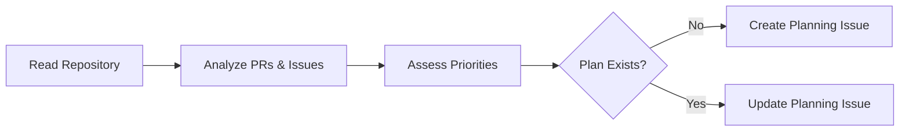

### 🔍 Discussion Task Miner

Extract actionable improvement tasks from GitHub Discussions and create tracked issues.

**Automatically extract actionable tasks from GitHub Discussions and create trackable issues**

The Discussion Task Miner workflow runs regularly (daily by default) to scan recent GitHub Discussions for actionable improvement opportunities. It identifies concrete, well-scoped tasks and converts them into GitHub issues (up to 5 per run), bridging the gap between discussion insights and tracked work items.

**Reference:** [https://github.com/githubnext/agentics/blob/main/docs/discussion-task-miner.md](https://github.com/githubnext/agentics/blob/main/docs/discussion-task-miner.md)

### How It Works (Discussion Task Miner)

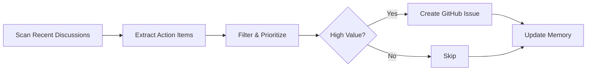

The workflow reads discussions from the last 7 days, analyzes their content for recommendations, action items, and improvement suggestions, then converts the top findings into focused, actionable GitHub issues. It uses repo-memory to avoid re-processing the same discussions across runs.

### 🗺️ Weekly Repository Map

Visualize repository file structure and size distribution with a weekly ASCII tree map.

**Visualize your repository's file structure and size distribution with a weekly ASCII tree map**

The Weekly Repository Map workflow analyzes your repository's structure every week using standard bash tools, then creates a GitHub issue containing an ASCII tree map visualization showing directory hierarchy, file sizes, and key statistics.

**Reference:** [https://github.com/githubnext/agentics/blob/main/docs/weekly-repo-map.md](https://github.com/githubnext/agentics/blob/main/docs/weekly-repo-map.md)

### How It Works (Weekly Repository Map)

````mermaid
graph LR
    A[Collect File Statistics] --> B[Compute Sizes & Counts]
    B --> C[Generate ASCII Tree Map]
    C --> D[Compute Key Statistics]
    D --> E[Create Issue Report]
````

### 📰 Tech Content Editorial Board

Daily tech content editorial-board review of technical rigor, wording, structure, and editorial quality.

**Daily editorial-board review of the repository's technical rigor, wording, structure, and editorial quality**

The Tech Content Editorial Board workflow is a [GitHub Agentic Workflow](https://github.blog/ai-and-ml/automate-repository-tasks-with-github-agentic-workflows/) for reviewing a technical content repository as if it were being examined by a demanding editorial board of principal engineers, technical writers, and domain specialists. It focuses on content quality first: clarity, rigor, structure, examples, caveats, flow, and reader trust.

Rather than producing a passive report, the workflow is biased toward action. When it finds a safe, focused content improvement, it prefers to ship one small content pull request in the same run. It can also create a single tracking issue for materially new editorial backlog that is not already covered by an open issue or pull request.

**Reference:** [https://github.com/githubnext/agentics/blob/main/docs/tech-content-editorial-board.md](https://github.com/githubnext/agentics/blob/main/docs/tech-content-editorial-board.md)

### How It Works (Tech Content Editorial Board)

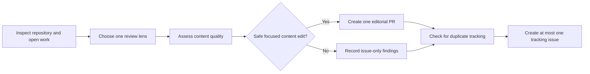

Each run starts by inspecting the repository, recent work, and open issues or pull requests so it does not duplicate existing tracking. It then selects a review lens and evaluates the repository as a technical publishing asset, looking for weaknesses in:

- Technical rigor and accuracy
- Wording, clarity, and flow
- Structure and narrative coherence
- Examples, diagrams, and caveats
- Reader trust and practical usefulness

When a low-risk, article-level improvement is available, the workflow should prefer making that edit and opening a focused pull request. Any broader or remaining backlog is then summarized in at most one tracking issue.

For scheduled runs, the workflow is skipped if there are already 8 or more open PRs with its title prefix, to avoid overwhelming maintainers.

## Dependency Management Workflows

### 📦 Dependabot PR Bundler

Create pull requests to bundle together as many dependabot updates as possible.

**Bundle Dependabot alerts into grouped pull requests with full dependency updates**

The Dependabot PR Bundler workflow checks for Dependabot alerts, groups updates, updates dependencies to latest versions, tests compatibility, and creates bundled pull requests.

**Reference:** [https://github.com/githubnext/agentics/blob/main/docs/dependabot-pr-bundler.md](https://github.com/githubnext/agentics/blob/main/docs/dependabot-pr-bundler.md)

### How It Works (Dependabot PR Bundler)

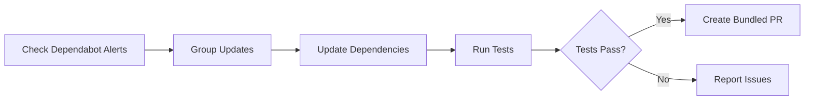

### 📦 Dependabot Issue Bundler

Create issues that group together dependabot updates related to the same ecosystem.

**Check for Dependabot alerts and manage issues that group updates by runtime/ecosystem**

The Dependabot Issue Bundler workflow checks for Dependabot alerts and creates issues grouping updates by ecosystem (Go, Java, etc.).

**Reference:** [https://github.com/githubnext/agentics/blob/main/docs/dependabot-issue-bundler.md](https://github.com/githubnext/agentics/blob/main/docs/dependabot-issue-bundler.md)

### How It Works (Dependabot Issue Bundler)

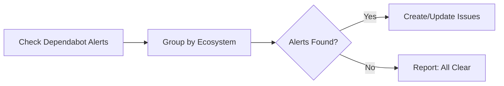

## Documentation Workflows

### 📖 Regular Documentation Update

Update documentation automatically on every push to main.

**Automatically update documentation on each push to main**

The Update Documentation workflow runs on each push to main to analyze changes and create pull requests with documentation updates. It defaults to using Astro Starlight for documentation generation.

**Reference:** [https://github.com/githubnext/agentics/blob/main/docs/update-docs.md](https://github.com/githubnext/agentics/blob/main/docs/update-docs.md)

### How It Works (Regular Documentation Update)

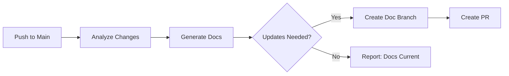

The workflow may search for best practices, examples, or technical references online to improve documentation.

### 📖 Daily Documentation Updater

Automatically update documentation based on recent code changes and merged PRs.

**Automatically review and update documentation based on recent code changes and merged pull requests**

The Daily Documentation Updater workflow scans changes from the last 24 hours, identifies documentation gaps, and creates pull requests with updates to reflect new features, modifications, or deprecations.

**Reference:** [https://github.com/githubnext/agentics/blob/main/docs/doc-updater.md](https://github.com/githubnext/agentics/blob/main/docs/doc-updater.md)

### How It Works (Daily Documentation Updater)

```mermaid
graph LR
    A[Scan Recent PRs] --> B[Find Code Changes]
    B --> C[Identify Doc Gaps]
    C --> D{Updates Needed?}
    D -->|Yes| E[Update Documentation]
    E --> F[Create PR]
    D -->|No| G[Report: Docs Current]
```

The workflow follows your repository's existing documentation structure and style.

For scheduled runs, the workflow is skipped if there are already 8 or more open PRs with its title prefix, to avoid overwhelming maintainers.

### 📖 Agentic Wiki Writer

Automatically generate and maintain GitHub wiki pages from source code.

**Automatically generates and maintains GitHub wiki pages from your source code**

The Agentic Wiki Writer workflow keeps your project's GitHub wiki synchronized with the codebase. Once a day (if any pull requests were merged to the default branch), it reads a `PAGES.md` template to understand what to document, then writes wiki pages directly from the source code. You can also trigger it manually on demand.

### How It Works (Agentic Wiki Writer)

```mermaid
graph LR
    A[Daily schedule / manual trigger] --> B{Any merges today?}
    B -->|No| C[Skip - no wiki update needed]
    B -->|Yes| D{PAGES.md exists?}
    D -->|No| E[Generate PAGES.md template]
    D -->|Yes| F[Read PAGES.md template]
    E --> G[Save template to .github/agentic-wiki/]
    F --> H[Identify changed files from recent merges]
    H --> I[Read relevant source files]
    I --> J[Write wiki pages]
    J --> K[Push wiki pages]
    K --> L[Create PR if source changes needed]
```

On the first run (or when `regenerate-template` is enabled), the workflow generates a `PAGES.md` template describing the wiki structure it will maintain. On subsequent runs it follows the template — reading only the source files relevant to the recently merged PRs, then writing updated wiki content.

### Key Features

- **Incremental updates**: Uses repo memory to track content hashes and skip unchanged pages
- **Template-driven**: A `PAGES.md` file in `.github/agentic-wiki/` controls what gets documented
- **Paired with Agentic Wiki Coder**: Together they form a bidirectional sync between wiki and source code

### 🔧 Agentic Wiki Coder

Implement code changes described in GitHub wiki edits.

**Turns wiki edits into code — automatically implements changes described in your GitHub wiki**

The Agentic Wiki Coder workflow is the reverse of the Agentic Wiki Writer: instead of writing wiki pages from code, it reads wiki edits and implements the described changes in the codebase. When a collaborator edits a wiki page to describe new behavior or updated functionality, this workflow detects the change and opens a pull request with the corresponding code implementation.

**Reference:** [https://github.com/githubnext/agentics/blob/main/docs/agentic-wiki-coder.md](https://github.com/githubnext/agentics/blob/main/docs/agentic-wiki-coder.md)

### How It Works (Agentic Wiki Coder)

```mermaid
graph LR
    A[Wiki page edited] --> B[Check for feedback loop]
    B --> C[Check processed-edits cache]
    C --> D{Code changes needed?}
    D -->|No| E[Noop: typo fix, etc.]
    D -->|Yes| F[Understand codebase]
    F --> G[Plan implementation]
    G --> H[Implement changes & tests]
    H --> I[Create PR]
```

The workflow triggers on GitHub's `gollum` event (wiki edits). It reads the changed wiki pages, decides whether code changes are needed (skipping pure documentation fixes like typos), then implements the changes following the project's existing conventions.

### 📖 Glossary Maintainer

Automatically maintain project glossary based on codebase changes.

**Automatically maintain project glossary by scanning code changes and keeping technical terms up-to-date**

The Glossary Maintainer workflow runs on weekdays to scan recent changes, identify new technical terminology, and create pull requests with glossary updates.

**Reference:** [https://github.com/githubnext/agentics/blob/main/docs/glossary-maintainer.md](https://github.com/githubnext/agentics/blob/main/docs/glossary-maintainer.md)

### How It Works (Glossary Maintainer)

```mermaid
graph LR
    A[Scan Recent Changes] --> B[Identify New Terms]
    B --> C[Check Glossary]
    C --> D{Updates Needed?}
    D -->|Yes| E[Add/Update Definitions]
    E --> F[Create PR]
    D -->|No| G[Report: Glossary Current]
```

- **Daily (Mon-Fri)**: Incremental scan of last 24 hours
- **Monday**: Full scan of last 7 days for comprehensive review

The workflow locates your glossary file automatically (common paths: `docs/glossary.md`, `GLOSSARY.md`) and follows your existing structure and style.

For scheduled runs, the workflow is skipped if there are already 8 or more open PRs with its title prefix, to avoid overwhelming maintainers.

### 🎙️ Dictation Prompt Generator

Generate and maintain a project-specific `DICTATION.md` file with speech-to-text vocabulary and error-correction guidance.

**Generate and maintain a project-specific dictation instruction file for speech-to-text workflows**

The Dictation Prompt Generator workflow runs weekly on Sundays. It scans your documentation for technical vocabulary, builds an NLP word-frequency histogram, and creates or updates `DICTATION.md` — a concise dictation instruction file that teaches your speech-to-text engine your project's terminology.

Pairs naturally with [dictationmd](https://github.com/pelikhan/dictationmd), a tool that reads `DICTATION.md` and configures speech recognition profiles accordingly.

**Reference:** [https://github.com/githubnext/agentics/blob/main/docs/dictation-prompt.md](https://github.com/githubnext/agentics/blob/main/docs/dictation-prompt.md)

### How It Works (Dictation Prompt Generator)

```mermaid
graph LR
    A[Run NLP Histogram Step] --> B[Scan Documentation]
    B --> C[Extract 256 Terms]
    C --> D[Build DICTATION.md]
    D --> E[Create PR]
```

1. **Setup step**: A shell script scans common documentation locations (`docs/`, `documentation/`, `wiki/`, `pages/`, `content/`, `site/`, and root-level markdown files) and prints a word-frequency histogram of backtick-quoted tokens and technical identifiers.
2. **Agent**: Uses the histogram output and targeted semantic searches to extract the 256 most relevant project-specific terms, then creates or updates `DICTATION.md` with:
   - A 256-term project glossary (alphabetically sorted)
   - Speech-to-text error correction guidance (ambiguous terms, spacing, hyphenation)
   - Text "agentification" rules: removing filler words and improving clarity

### 🔗 Link Checker

Daily automated link checker that finds and fixes broken links in documentation.

**Scan documentation for broken links, find replacements, and create PRs with fixes**

The Link Checker workflow scans markdown files for HTTP(S) links, tests each one, finds replacements for broken links, and creates pull requests with fixes. Uses cache memory to avoid repeated attempts on unfixable links.

**Reference:** [https://github.com/githubnext/agentics/blob/main/docs/link-checker.md](https://github.com/githubnext/agentics/blob/main/docs/link-checker.md)

### How It Works (Link Checker)

```mermaid
graph LR
    A[Scan Markdown Files] --> B[Extract Links]
    B --> C[Test Each Link]
    C --> D{Broken?}
    D -->|Yes| E[Search for Replacement]
    E --> F{Fixable?}
    F -->|Yes| G[Update Link]
    F -->|No| H[Add to Cache]
    D -->|No| I[Skip]
    G --> J[Create PR]
```

A bash script pre-processes links before the AI agent runs. The agent investigates broken links, tries common variations (www, http vs https), and uses web-fetch to find where content moved.

### 🗜️ Documentation Unbloat

Automatically simplify documentation by reducing verbosity while maintaining clarity.

**Review and simplify documentation by removing verbosity while maintaining clarity**

The Documentation Unbloat workflow runs regularly (daily by default) to remove duplicate content, excessive bullet points, redundant examples, and verbose descriptions - while preserving all essential information, links, and technical details.

**Reference:** [https://github.com/githubnext/agentics/blob/main/docs/unbloat-docs.md](https://github.com/githubnext/agentics/blob/main/docs/unbloat-docs.md)

### How It Works (Documentation Unbloat)

```mermaid
graph LR
    A[Scan Documentation] --> B[Identify Verbosity]
    B --> C{Bloat Found?}
    C -->|Yes| D[Remove Redundancy]
    D --> E[Preserve Accuracy]
    E --> F[Create PR]
    C -->|No| G[Report: Docs are Lean]
```

The workflow improves exactly **one file per run** for easy review. Files with `disable-agentic-editing: true` in frontmatter are skipped. Uses cache memory to track previously cleaned files.

For scheduled runs, the workflow is skipped if there are already 8 or more open PRs with its title prefix, to avoid overwhelming maintainers.

### 📝 Markdown Linter

Run Markdown quality checks on all documentation files and get a prioritized issue report of violations.

**Run Markdown quality checks across all documentation files and get a prioritized issue report of violations**

The Markdown Linter workflow runs the [Super Linter](https://github.com/super-linter/super-linter) tool on every Markdown file in your repository, then uses an AI agent to analyze the results and create a detailed GitHub issue listing each violation with suggested fixes. Only Markdown files are checked — other file types are unaffected.

**Reference:** [https://github.com/githubnext/agentics/blob/main/docs/markdown-linter.md](https://github.com/githubnext/agentics/blob/main/docs/markdown-linter.md)

### How It Works (Markdown Linter)

```mermaid
graph LR
    A[Scheduled Trigger] --> B[Run Super Linter]
    B --> C[Check Markdown Files]
    C --> D{Violations Found?}
    D -->|Yes| E[AI Analyzes Results]
    E --> F[Create Issue Report]
    D -->|No| G[Noop: All Clear]
```

The workflow runs in two jobs. The first job runs Super Linter to lint all Markdown files and uploads the log as an artifact. The second job (the AI agent) downloads that log, categorizes violations by severity, and creates a prioritized GitHub issue with recommended fixes. Previous issues expire after 2 days to avoid accumulation.

### 📱 Multi-Device Docs Tester

**Build and test your documentation site across mobile, tablet, and desktop devices to catch responsive design issues before they reach users**

The Multi-Device Docs Tester workflow builds your documentation site locally, serves it, and runs Playwright-powered tests across a range of device viewports. It checks for layout problems, inaccessible navigation, overflowing content, and broken interactive elements — then creates a GitHub issue with a detailed report when problems are found.

**Reference:** [https://github.com/githubnext/agentics/blob/main/docs/multi-device-docs-tester.md](https://github.com/githubnext/agentics/blob/main/docs/multi-device-docs-tester.md)

### How It Works (Multi-Device Docs Tester)

```mermaid
graph LR
    A[Build Docs Site] --> B[Start Preview Server]
    B --> C[Test Each Device]
    C --> D{Issues Found?}
    D -->|Yes| E[Create Issue Report]
    D -->|No| F[Noop: All Passed]
```

The workflow builds your docs site using npm, starts a local preview server, and runs Playwright browser automation across mobile, tablet, and desktop viewports. For each device it checks page load, navigation usability, content readability, image sizing, interactive element reachability, and basic accessibility.

## Code Improvement Workflows (by analysis, producing report)

These workflows analyze the repository, code, and activity to produce reports, insights, and recommendations for improvements. They do not make any changes to the codebase directly but can be used as input for maintainers to take action.

### 🔍 Daily Accessibility Review

Review application accessibility by automatically running and using the application.

**Perform accessibility reviews checking for WCAG 2.2 compliance and documenting problems found**

The Daily Accessibility Review workflow scans your repository, analyzes accessibility against WCAG 2.2 guidelines, and creates issues documenting any accessibility problems found.

**Reference:** [https://github.com/githubnext/agentics/blob/main/docs/accessibility-review.md](https://github.com/githubnext/agentics/blob/main/docs/accessibility-review.md)

### How It Works (Daily Accessibility Review)

```mermaid
graph LR
    A[Scan Repository] --> B[Analyze Accessibility]
    B --> C[Check WCAG 2.2]
    C --> D{Issues Found?}
    D -->|Yes| E[Create Issue Report]
    D -->|No| F[Report: All Accessible]
```

### 🔧 Q - Agentic Workflow Optimizer

Expert system that analyzes and optimizes agentic workflows.

**Expert system for optimizing and fixing agentic workflows**

The Q workflow analyzes workflow performance, identifies missing tools, detects inefficiencies, and creates pull requests with optimized configurations.

**Reference:** [https://github.com/githubnext/agentics/blob/main/docs/q.md](https://github.com/githubnext/agentics/blob/main/docs/q.md)

### How It Works (Q - Agentic Workflow Optimizer)

```mermaid
graph LR
    A["/q Command"] --> B[Analyze Workflows]
    B --> C[Check Logs & Metrics]
    C --> D{Issues Found?}
    D -->|Yes| E[Optimize Configuration]
    E --> F[Create PR]
    D -->|No| G[Report: All Optimized]
```

The workflow downloads recent workflow logs and audit information, examines workflow files, researches best practices, and validates changes using the compile tool.

### 🗂️ Large File Simplifier

Identify the largest source file and create a detailed refactoring plan as an issue.

**Analyze source files to identify the largest and create an actionable refactoring issue with a detailed split plan**

The Large File Simplifier workflow scans your repository for oversized source files and, when one exceeds a healthy size threshold, creates a detailed issue with a concrete plan for splitting it into smaller, focused modules.

**Reference:** [https://github.com/githubnext/agentics/blob/main/docs/large-file-simplifier.md](https://github.com/githubnext/agentics/blob/main/docs/large-file-simplifier.md)

### How It Works (Large File Simplifier)

```mermaid
graph LR
    A[Scan Source Files] --> B[Find Largest File]
    B --> C{≥ 500 lines?}
    C -->|No| D[Report: All Files Healthy]
    C -->|Yes| E[Analyze Structure]
    E --> F[Plan File Splits]
    F --> G[Create Issue]
```

The workflow identifies logical boundaries within the file — distinct responsibilities, related function clusters, utility code — and produces a concrete refactoring plan with proposed file names, contents, and acceptance criteria.

## Code Improvement Workflows (by making changes, producing pull requests)

### 🧹 Code Simplifier

Automatically simplify recently modified code for improved clarity and maintainability.

**Automatically analyze recently modified code and create pull requests with simplifications that improve clarity and maintainability**

The Code Simplifier workflow runs regularly (daily by default) to review code modified in the last 24 hours and apply targeted improvements that enhance clarity, reduce complexity, and follow project conventions—all while preserving functionality.

### How It Works (Code Simplifier)

```mermaid
graph LR
    A[Find Recent Changes] --> B[Analyze Code Quality]
    B --> C{Simplifications<br/>Possible?}
    C -->|Yes| D[Apply Improvements]
    D --> E[Run Tests]
    E --> F[Create PR]
    C -->|No| G[Report: Code is Clean]
```

Common improvements include reducing nested conditionals, extracting repeated logic, improving naming, consolidating error handling, and applying idiomatic language features.

### 🔍 Duplicate Code Detector

Identify duplicate code patterns and suggest refactoring opportunities.

**Automatically identify duplicate code patterns and suggest refactoring opportunities**

The Duplicate Code Detector workflow runs regularly (daily by default) to analyze recent code changes and detect duplicate patterns. It creates focused issues (max 3 per run) for significant duplication patterns, automatically assigned to @copilot for potential remediation.

**Reference:** [https://github.com/githubnext/agentics/blob/main/docs/duplicate-code-detector.md](https://github.com/githubnext/agentics/blob/main/docs/duplicate-code-detector.md)

### How It Works (Duplicate Code Detector)

```mermaid
graph LR
    A[Analyze Recent Changes] --> B[Detect Patterns]
    B --> C[Find Duplicates]
    C --> D{Significant?}
    D -->|Yes| E[Create Refactoring Issue]
    D -->|No| F[Report: Code is DRY]
```

The workflow reports identical or nearly identical functions, repeated code blocks, similar classes with overlapping functionality, and copy-pasted code. It excludes standard boilerplate, test setup code, config files, and small snippets (<5 lines).

### 🧪 Daily Test Improver

Improve test coverage by adding meaningful tests to under-tested areas.

The Daily Test Improver workflow is a testing-focused repository assistant that runs regularly (daily by default) to improve test quality and coverage. It can also be triggered on-demand via `/test-assist <instructions>` to perform specific tasks. It discovers build/test/coverage commands, identifies high-value testing opportunities, implements test improvements with measured impact, maintains its own PRs, comments on testing issues, invests in test infrastructure, and maintains a monthly activity summary for maintainer visibility.

**Reference:** [https://github.com/githubnext/agentics/blob/main/docs/test-improver.md](https://github.com/githubnext/agentics/blob/main/docs/test-improver.md)

### How It Works (Daily Test Improver)

```mermaid
graph LR
    A[Read Memory] --> B[Discover Commands]
    A --> C[Identify Opportunities]
    A --> D[Implement Tests]
    A --> E[Maintain PRs]
    A --> F[Comment on Issues]
    A --> G[Invest in Infrastructure]
    A --> H[Update Activity Summary]
    B --> H
    C --> H
    D --> H
    E --> H
    F --> H
    G --> H
    H --> I[Save Memory]
```

### 🌱 Daily Efficiency Improver

Improve energy efficiency and computational footprint across code, data, network, and UI.

The Daily Efficiency Improver workflow is an energy-efficiency-focused repository assistant that runs regularly (daily by default) to identify and implement improvements that reduce computational footprint. It discovers build/test/benchmark commands, identifies opportunities across code, data, network/I/O, and frontend behavior, implements measurable changes, maintains its own PRs, comments on relevant issues, invests in measurement infrastructure, and maintains a monthly activity summary for maintainer visibility.

**Reference:** [https://github.com/githubnext/agentics/blob/main/docs/efficiency-improver.md](https://github.com/githubnext/agentics/blob/main/docs/efficiency-improver.md)

### How It Works (Daily Efficiency Improver)

```mermaid
graph LR
    A[Read Memory] --> B[Discover Commands]
    A --> C[Identify Opportunities]
    A --> D[Implement Improvements]
    A --> E[Maintain PRs]
    A --> F[Comment on Issues]
    A --> G[Invest in Infrastructure]
    A --> H[Update Activity Summary]
    B --> H
    C --> H
    D --> H
    E --> H
    F --> H
    G --> H
    H --> I[Save Memory]
```

### ⚡ Daily Performance Improver

Analyze and improve code performance through benchmarking and optimization.

The Daily Performance Improver workflow is a performance-focused repository assistant that runs regularly (daily by default) to identify and implement performance improvements. It can also be triggered on-demand via `/perf-assist <instructions>` to perform specific tasks. It discovers build/benchmark commands, identifies optimization opportunities, implements improvements with measured impact, maintains its own PRs, comments on performance issues, invests in measurement infrastructure, and maintains a monthly activity summary for maintainer visibility.

**Reference:** [https://github.com/githubnext/agentics/blob/main/docs/perf-improver.md](https://github.com/githubnext/agentics/blob/main/docs/perf-improver.md)

### How It Works (Daily Performance Improver)

```mermaid
graph LR
    A[Read Memory] --> B[Discover Commands]
    A --> C[Identify Opportunities]
    A --> D[Implement Improvements]
    A --> E[Maintain PRs]
    A --> F[Comment on Issues]
    A --> G[Invest in Infrastructure]
    A --> H[Update Activity Summary]
    B --> H
    C --> H
    D --> H
    E --> H
    F --> H
    G --> H
    H --> I[Save Memory]
```

For scheduled runs, the workflow is skipped if there are already 8 or more open PRs with its title prefix, to avoid overwhelming maintainers.

### 📊 Repository Quality Improver

Daily rotating analysis of repository quality across code, documentation, testing, security, and custom dimensions.

The Repository Quality Improver workflow analyzes your repository from a different quality angle every weekday, producing an issue with findings and actionable improvement tasks.

**Reference:** [https://github.com/githubnext/agentics/blob/main/docs/repository-quality-improver.md](https://github.com/githubnext/agentics/blob/main/docs/repository-quality-improver.md)

### How It Works (Repository Quality Improver)

````mermaid
graph LR
    A[Load Focus History] --> B[Select Focus Area]
    B --> C{Strategy?}
    C -->|60%| D[Custom: Repo-specific area]
    C -->|30%| E[Standard: Code/Docs/Tests/Security...]
    C -->|10%| F[Reuse: Most impactful recent area]
    D --> G[Analyze Repository]
    E --> G
    F --> G
    G --> H[Create Issue Report]
    H --> I[Update Cache Memory]
````

### Focus Area Strategy

The workflow follows a deliberate diversity strategy across runs:

- **60% Custom areas** — Repository-specific issues the agent discovers by inspecting the codebase: e.g., "Error Message Clarity", "Contributor Onboarding Experience", "API Consistency"
- **30% Standard categories** — Established quality dimensions: Code Quality, Documentation, Testing, Security, Performance, CI/CD, Dependencies, Code Organization, Accessibility, Usability
- **10% Revisits** — Revisit the most impactful area from recent history for follow-up

Over ten runs, the agent will typically explore 6–7+ unique quality dimensions.

## Command-Triggered Agentic Workflows

These workflows are triggered by specific "/" commands in issue or pull request comments, allowing for on-demand agentic assistance. Only maintainers or those with write access can trigger these workflows by commenting with the appropriate command.

You can use the "/plan" agent to turn the reports into actionable issues which can then be assigned to the appropriate team members or agents.

### 📊 Archie - Mermaid Diagram Generator

Generate Mermaid diagrams to visualize issue and pull request relationships with /archie command.

**On-demand Mermaid diagram generation for issues and pull requests**

The Archie workflow analyzes issue or pull request content and generates clear Mermaid diagrams that visualize the key concepts, relationships, and flows described within. Invoke it with `/archie` to instantly get a visual representation of any complex issue or PR.

**Reference:** [https://github.com/githubnext/agentics/blob/main/docs/archie.md](https://github.com/githubnext/agentics/blob/main/docs/archie.md)

### How It Works (Archie)

```mermaid
graph LR
    A["/archie command"] --> B["Fetch issue or PR details"]
    B --> C["Extract relationships and concepts"]
    C --> D["Select diagram types"]
    D --> E["Generate 1-3 Mermaid diagrams"]
    E --> F["Validate syntax"]
    F --> G["Post comment with diagrams"]
```

Archie fetches the full content of the triggering issue or PR, identifies key entities and relationships, picks the most appropriate Mermaid diagram type (flowchart, sequence, class diagram, gantt, etc.), and posts a well-formatted comment with between 1 and 3 diagrams.

### 🔧 PR Fix

Analyze failing CI checks and implement fixes for pull requests.

**Analyze and fix failing CI checks in pull requests**

The PR Fix workflow analyzes failing CI checks, identifies root causes, implements fixes, and pushes them to the PR branch.

**Reference:** [https://github.com/githubnext/agentics/blob/main/docs/pr-fix.md](https://github.com/githubnext/agentics/blob/main/docs/pr-fix.md)

### How It Works (PR Fix)

```mermaid
graph LR
    A[/pr-fix Command] --> B[Analyze CI Failures]
    B --> C[Identify Root Cause]
    C --> D[Implement Fix]
    D --> E[Push to Branch]
    E --> F[Comment on PR]
```

The workflow searches for error message documentation and solutions online, and can create issues for complex problems requiring human intervention.

### 🔍 Repo Ask

Intelligent research assistant for repository questions and analysis.

**Intelligent research assistant for your repository**

The Repo Ask workflow provides accurate, well-researched answers to questions about your codebase, features, documentation, or any repository-related topics by leveraging web search, repository analysis, and bash commands.

**Reference:** [https://github.com/githubnext/agentics/blob/main/docs/repo-ask.md](https://github.com/githubnext/agentics/blob/main/docs/repo-ask.md)

### How It Works (Repo Ask)

```mermaid
graph LR
    A[/repo-ask Question] --> B[Analyze Repository]
    B --> C[Search Codebase]
    C --> D[Research Online]
    D --> E[Compose Answer]
    E --> F[Post Comment]
```

The workflow searches for relevant documentation online, looks up technical information, and runs repository analysis commands to answer questions.

## Security Workflows

### 🔍 Daily Malicious Code Scan

Scan recent code changes for suspicious patterns indicating malicious activity or supply chain attacks.

The Daily Malicious Code Scan workflow examines files changed in the past 72 hours, searching for secret exfiltration, out-of-context code, suspicious network activity, system access patterns, obfuscation, and supply chain indicators. Findings appear as GitHub code-scanning alerts with threat scores and remediation recommendations.

**Reference:** [https://github.com/githubnext/agentics/blob/main/docs/malicious-code-scan.md](https://github.com/githubnext/agentics/blob/main/docs/malicious-code-scan.md)

### How It Works (Daily Malicious Code Scan)

```mermaid
graph LR
    A[Scheduled] --> B[Fetch Recent Changes]
    B --> C[Scan for Patterns]
    C --> D{Threats Found?}
    D -->|Yes| E[Create Code Scanning Alert]
    D -->|No| F[Report: All Clear]
```

### 🔒 VEX Generator

Auto-generate OpenVEX statements for dismissed Dependabot alerts, capturing security assessments in a machine-readable format.

**Auto-generate OpenVEX statements for dismissed Dependabot alerts**

The VEX Generator workflow captures Dependabot alert dismissal decisions as machine-readable [OpenVEX v0.2.0](https://openvex.dev/) statements, making them consumable by downstream vulnerability scanners and SBOM tools.

**Reference:** [https://github.com/githubnext/agentics/blob/main/docs/vex-generator.md](https://github.com/githubnext/agentics/blob/main/docs/vex-generator.md)

### How It Works (VEX Generator)

```mermaid
graph LR
    A[Trigger: workflow_dispatch] --> B[Read Alert Details]
    B --> C{Dismissal Reason?}
    C -->|not_used / inaccurate / tolerable_risk| D[Map to VEX Status]
    C -->|no_bandwidth| E[Skip: Post Comment]
    D --> F[Construct Package URL]
    F --> G[Generate OpenVEX JSON]
    G --> H[Write .vex/<ghsa-id>.json]
    H --> I[Open Pull Request]
```

## Formal Verification Workflows

### 🔬 Lean Squad

Progressively apply Lean 4 formal verification to your codebase: research targets, extract specs, write Lean propositions, translate implementations, and attempt proofs — finding bugs or issuing stamps of confidence.

The Lean Squad workflow is a [GitHub Agentic Workflow](https://github.blog/ai-and-ml/automate-repository-tasks-with-github-agentic-workflows/) that applies Lean 4 formal verification to your codebase progressively and optimistically — without requiring any prior FV expertise. Each run it selects tasks weighted to the current phase of FV progress, from initial research all the way through to completed proofs, correspondence reviews, project reports, and even a LaTeX conference paper. Maybe it finds a bug; maybe it proves something; either way, it makes forward progress.

**Reference:** [https://github.com/githubnext/agentics/blob/main/docs/lean-squad.md](https://github.com/githubnext/agentics/blob/main/docs/lean-squad.md)

### How It Works (Lean Squad)

````mermaid
graph LR
    P[Assess FV state] --> W[Compute phase weights]
    W --> S[Select 2 tasks]
    S --> A[Read repo-memory]
    A --> T1[Task 1: Research & Target Identification]
    A --> T2[Task 2: Informal Spec Extraction]
    A --> T3[Task 3: Formal Spec Writing]
    A --> T4[Task 4: Implementation Extraction]
    A --> T5[Task 5: Proof Assistance]
    A --> T6[Task 6: Correspondence Review]
    A --> T7[Task 7: Proof Utility Critique]
    A --> T8[Task 8: Correspondence Validation]
    A --> T9[Task 9: CI Automation]
    A --> T10[Task 10: Project Report]
    A --> T11[Task 11: Conference Paper]
    T1 & T2 & T3 & T4 & T5 & T6 & T7 & T8 & T9 & T10 & T11 --> TF[Task Final: Update FV Status Issue]
    TF --> M[Save repo-memory]
````

A deterministic pre-step counts FV artifacts in the repository (Lean files, spec docs, open issues and PRs) and computes a **phase-weighted probability** for each task. Two tasks are drawn and communicated to the agent; the agent confirms them against its memory and executes them. Task Final (status update) always runs. All notes, targets, choices, and progress live in persistent **repo-memory** so each run builds on the last.

The weighting scheme adapts automatically: when no FV work exists Task 1 dominates; once research is done Task 2 rises; as informal specs accumulate Task 3 gains weight; and so on up to proofs. Once implementation models exist, Task 8 becomes available and is weighted heavily when no runnable correspondence tests exist yet.

## Meta-Workflows

### 🔍 Daily Ad hoc QA

**Perform ad hoc quality assurance by following README instructions, tutorials, and walkthroughs**

The Daily Ad hoc QA workflow reads your documentation, follows instructions, tests build and run processes, and creates issues for problems found.

**Reference:** [https://github.com/githubnext/agentics/blob/main/docs/adhoc-qa.md](https://github.com/githubnext/agentics/blob/main/docs/adhoc-qa.md)

### How It Works (Daily Ad hoc QA)

```mermaid
graph LR
    A[Read README/Tutorials] --> B[Follow Instructions]
    B --> C[Test Build/Run]
    C --> D{Issues Found?}
    D -->|Yes| E[Create QA Issue]
    D -->|No| F[Report: QA Passed]
```

For scheduled runs, the workflow is skipped if there are already 8 or more open PRs with its title prefix, to avoid overwhelming maintainers.

## Issue Farming Workflows

### 🔒 Sub-Issue Closer

Automatically close parent issues when all their sub-issues are complete.

The Sub-Issue Closer workflow automatically closes parent issues when all of their sub-issues have been completed, keeping your issue tracker clean and organized.

**Reference:** [https://github.com/githubnext/agentics/blob/main/docs/sub-issue-closer.md](https://github.com/githubnext/agentics/blob/main/docs/sub-issue-closer.md)

### How It Works (Sub-Issue Closer)

````mermaid
graph LR
    A[Find Open Parent Issues] --> B[Check Sub-Issue Status]
    B --> C{All Sub-Issues Closed?}
    C -->|Yes| D[Close Parent Issue]
    D --> E[Add Closure Comment]
    E --> F{Parent Has Its Own Parent?}
    F -->|Yes| B
    F -->|No| G[Done]
    C -->|No| H[Skip - Keep Open]
````

### Recursive Closure

The workflow processes issue trees bottom-up. If you have a hierarchy like:

```
Epic #1: "Launch v2.0"
  ├── Feature #2: "User auth" (all sub-issues closed)
  │     ├── #3: "Login page" [CLOSED]
  │     └── #4: "Logout" [CLOSED]
  └── Feature #5: "Dashboard" (sub-issue still open)
        └── #6: "Chart widget" [OPEN]
```

The workflow would close Feature #2 (all sub-issues done), then check if Epic #1 can be closed too (it cannot, because Feature #5 is still open).

### 🌳 Issue Arborist

Automatically organize issues by linking related issues as parent-child sub-issues.

**Daily automated workflow that organizes your issue tracker by linking related issues as parent-child relationships**

The Issue Arborist workflow keeps your issue tracker tidy and navigable. Every day it analyzes your open issues, detects natural parent-child relationships (epics with tasks, bugs with root causes, related feature clusters), and links them as GitHub sub-issues. When it finds five or more related issues with no common parent, it creates one.

**Reference:** [https://github.com/githubnext/agentics/blob/main/docs/issue-arborist.md](https://github.com/githubnext/agentics/blob/main/docs/issue-arborist.md)

### How It Works (Issue Arborist)

```mermaid
graph LR
    A[Fetch 100 open issues] --> B[Analyze relationships]
    B --> C{Cluster of 5+?}
    C -->|Yes| D[Create parent issue]
    D --> E[Link sub-issues]
    C -->|No| F{Existing hierarchy?}
    F -->|Yes| E
    F -->|No| G[Noop: no action needed]
    E --> H[Done]
```

The workflow downloads the 100 most recent open issues (excluding those already linked as sub-issues), then applies semantic analysis to detect clusters and hierarchies. It only acts when it's confident — it's designed to be conservative and precise, creating links only when the relationship is clear.

## 🧩 Shared Workflow Fragments

Shared workflow fragments are reusable building blocks that can be imported into other workflows using `imports: [shared/name.md]`. They provide pre-configured tools, MCP servers, and setup steps.

### MCP Servers

- **arXiv** - Access arXiv research papers: search, get paper details, and retrieve PDFs
- **MarkItDown** - Convert PDFs, Word documents, PowerPoints, HTML, and other formats to Markdown
- **Microsoft Docs** - Access Microsoft's documentation via `learn.microsoft.com`

### Tools & Setup

- **FFmpeg** - Install and use FFmpeg for video/audio processing (extract audio, frames, scene detection, etc.)
- **sq** - Install and use `sq` for querying structured data (CSV, Excel, JSON, SQL databases) with jq-like syntax

### Formatting & Reporting

- **Formatting** - Standard content structure with overview and collapsible details sections
- **Reporting** - Guidelines for reporting workflow run information with clickable run ID links

## 🚀 Non-Coding Use Cases

While The Agentics focuses on engineering workflows, agentic workflows are equally powerful for product, operations, compliance, and leadership teams. [**Agentics Beyond Code**](https://github.com/chrizbo/agentics-beyond-code) is a companion collection built for non-engineering roles — no coding required. A few highlights:

- **[Launch Readiness Checker](https://github.com/chrizbo/agentics-beyond-code/blob/main/.github/workflows/launch-readiness.md)** — Monday morning readiness report across all launches: completeness, risk, blockers, and sign-offs
- **[Compliance Review](https://github.com/chrizbo/agentics-beyond-code/blob/main/.github/workflows/compliance-review.md)** — automated evaluation against Security, Privacy, Accessibility, and Responsible AI rubrics, with per-team status reports
- **[Weekly Status](https://github.com/chrizbo/agentics-beyond-code/blob/main/.github/workflows/weekly-status.md)** — Friday rollup of What Shipped, What We Learned, FYIs, and SOSes across all initiatives, ready for leadership
- **[Leadership Briefs](https://github.com/chrizbo/agentics-beyond-code/blob/main/.github/workflows/leadership-brief.md)** — personalized Monday briefings per leader, with Give Kudos, Give Feedback, and Get Involved sections tailored to each person's domain and management style
- **[Process Analyzer](https://github.com/chrizbo/agentics-beyond-code/blob/main/.github/workflows/process-analyzer.md)** — weekly retro that detects process drift between transcripts and how-we-work docs, surfaces automation gaps, and proposes update PRs
- **[Adversarial PM](https://github.com/chrizbo/agentics-beyond-code/blob/main/.github/workflows/adversarial-pm.md)** — weekly grumpy challenge of the team's most consequential decisions, arguing against them using pre-mortem, reversibility, and opportunity cost lenses
- **[Decision Log](https://github.com/chrizbo/agentics-beyond-code/blob/main/.github/workflows/decision-log.md)** — scans issue comments and meeting transcripts to create structured decision records
- **[GTM Content](https://github.com/chrizbo/agentics-beyond-code/blob/main/.github/workflows/gtm-content.md)** — generate and refresh changelog drafts and public roadmap items following org voice & tone guidelines

## References

- [GitHub Agentic Workflows](https://github.com/githubnext/agentics)
  On changes to the Agentics repository, this skill should be updated to reflect the latest workflows and capabilities.
