# Mermaid Beta Skill

Expert in creating, optimizing, and troubleshooting experimental Mermaid.js beta diagrams.

## Important note

If you have only read part of this skill file and your task involves creating a diagram type not covered in those lines,
you **MUST** read the rest of the file to access the relevant expert guidance and examples.

## When to Activate

- User wants to use experimental beta Mermaid diagram types like Architecture, Flow, Sankey, etc.
- Working with newer versions of Mermaid.js.

## Related Instructions

- **mermaid.instructions.md**: Formatting standards, best
  practices, and anti-patterns for Mermaid.js.

## Related Skills

- **mermaid**:
  Must be loaded when creating or maintaining Mermaid.js diagrams.

## Diagram Types & Patterns

### Architecture Diagrams

An Architecture diagram is specialized for mapping out topological structures,
infrastructure components, and their network or logical relationships.

- Use `architecture-beta` to initialize the diagram.
- Define logical groupings using `group <alias>(<icon>)[<Label>]`.
- Define individual services using `service <alias>(<icon>)[<Label>]`.
- Nest a service inside a group by appending `in <group_alias>`.
- Connect components by specifying their connection sides (`L`, `R`, `T`, `B`)
  separated by `--` (e.g., `serviceA:R -- L:serviceB`).

Example mapping out a cloud-based serverless architecture:

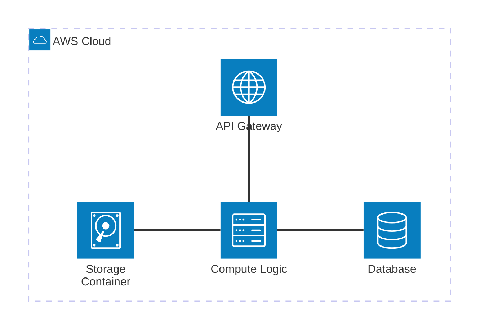

Docs: <https://mermaid.js.org/syntax/architecture.html>

### Block Diagrams

A Block diagram is well-suited for visualizing architectures, systems, or process
flows by arranging blocks in a customizable grid layout.

- Use `block-beta` to initialize the diagram type.
- Define grid columns using `columns <number>` (e.g., `columns 3`).
- Define blocks by using an ID, optionally with text and shape (e.g., `DB(("Database"))`).
- Group blocks within a parent block using `block:<ID>` or `block:<ID>:<width>` and close with `end`.
- Use `space` or `space:<number>` to skip grid columns.
- Connect blocks using arrows (e.g., `A --> B`) and apply styles using the `style` directive.

Example demonstrating a grid-based architecture layout:

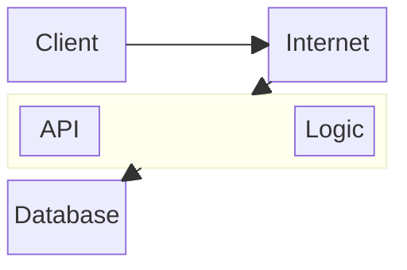

Docs: <https://mermaid.js.org/syntax/block.html>

### Ishikawa Diagram (v11.12.3+)

An Ishikawa diagram (also known as a fishbone or cause-and-effect diagram) is used
to represent the causes of a specific event or problem.

- Use `ishikawa-beta` to initialize the diagram type.
- The first line after the declaration represents the main event or problem (the "head").
- Subsequent lines are the major categories of causes.
- Indent lines to create nested "fishbone" sub-causes under their parent categories.

Example mapping out the causes of a website outage:

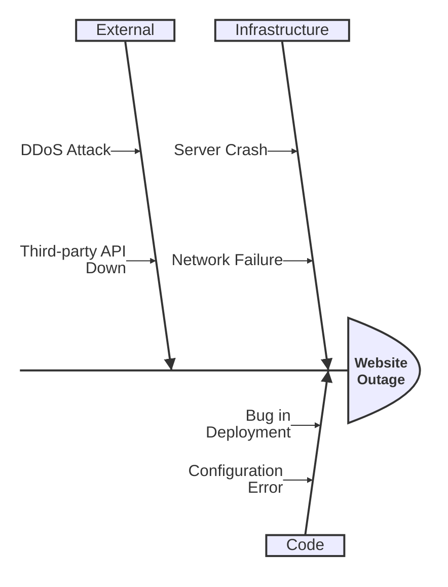

Docs: <https://mermaid.js.org/syntax/ishikawa.html>

### Packet Diagram

A Packet diagram is typically used to visualize network protocols or binary data
structures, showing the bits and bytes that make up headers or payloads.

- Use `packet-beta` to initialize the diagram type.
- Add an optional `title` to describe the structure.
- Define bits mapping using ranges representing bit boundaries (e.g., `0-7`).
- Add descriptive labels for each bit range (e.g., `0-7: "Field Name"`).
- The diagram automatically wraps fields into 32-bit rows by default.

Example using a binary block, such as the PNG magic signature file header:

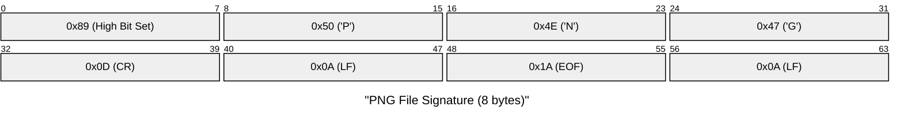

Docs: <https://mermaid.js.org/syntax/packet.html>

### Radar Diagram (v11.6.0+)

A Radar diagram (or spider chart) is a graphical method of displaying multivariate data
in the form of a two-dimensional chart of three or more quantitative variables represented
on axes starting from the same central point.

- Use `radar-beta` to initialize the diagram.
- Include an optional `title` to identify what the radar chart represents.
- Specify the variable categories along the perimeter using `axis` and a comma-separated list.
- Provide the numeric datasets for each entity using `curve <label> {values}`.

Example representing a team skill assessment:

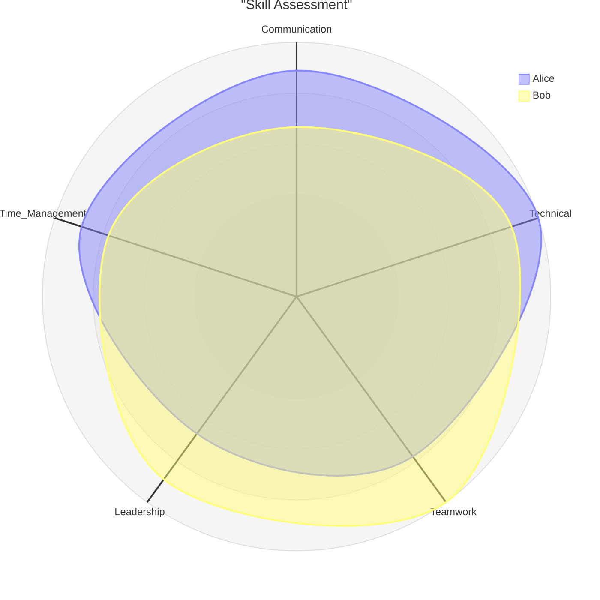

Docs: <https://mermaid.js.org/syntax/radar.html>

### Sankey Diagram

A Sankey diagram is a flow diagram in which the width of the bands is proportional
to the flow rate. It is typically used to visualize energy, material, or cost
transfers between processes.

- Use `sankey-beta` to initialize the diagram.
- Define flows using comma-separated values in the format `source, target, value`.
- The `value` specifies the thickness of the connection between nodes.
- Define nodes via their usage; no prior declaration is needed.

Example visualizing energy flows:

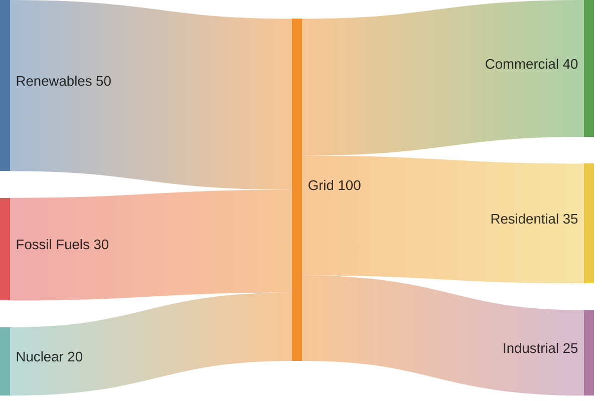

Docs: <https://mermaid.js.org/syntax/sankey.html>

### Treemap Diagram

A Treemap diagram represents hierarchical data as a set of nested rectangles, where
the area of each rectangle is proportional to its value.

- Use `treemap-beta` to initialize the diagram type.
- Define hierarchical structures using consistent indentation. Ensure string labels are enclosed in double quotes.
- Specify values for leaf nodes by appending a colon and a number after the label (`"label": <value>`).
- The diagram will automatically calculate the size of parent nodes based on their children.

Example representing a company's budget breakdown:

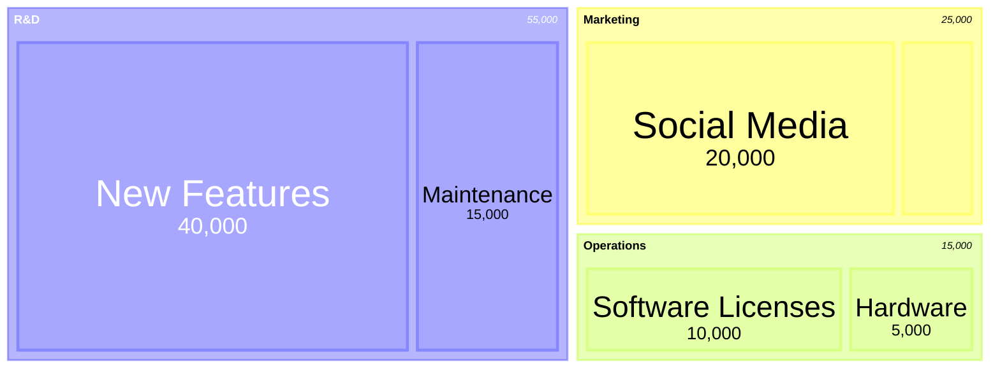

Docs: <https://mermaid.js.org/syntax/treemap.html>

### TreeView Diagram (v11.14.0+)

A TreeView diagram is used to represent hierarchical data in the form of a directory-like structure.

- Use `treeView-beta` to initialize the diagram type.
- Define items as strings enclosed in double quotes (e.g., `"folder name"`).
- Establish hierarchy and parent-child relationships purely through line indentation.

Example mapping out a project directory structure:

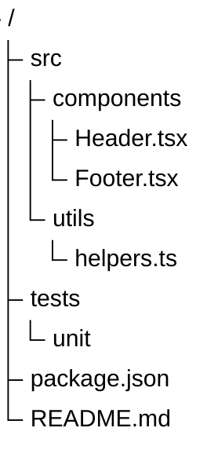

Docs: <https://mermaid.js.org/syntax/treeView.html>

### Venn Diagrams (v11.12.3+)

Venn diagrams visually represent the relationships between sets using overlapping circles.

- Use `venn-beta` to initialize the diagram type.
- Define a single set using the `set` keyword (e.g., `set Frontend`).
- Define the overlap of two or more sets using `union` (e.g., `union Frontend,Backend`).
- Custom display labels can be assigned using bracket syntax (e.g., `set Dev["Developers"]`).
- Specify sizes for sets or unions by appending a suffix `:N` (e.g., `set Dev:20`).
- Place additional labels inside a set or union using the `text` keyword on an indented line.

Example representing overlapping capabilities:

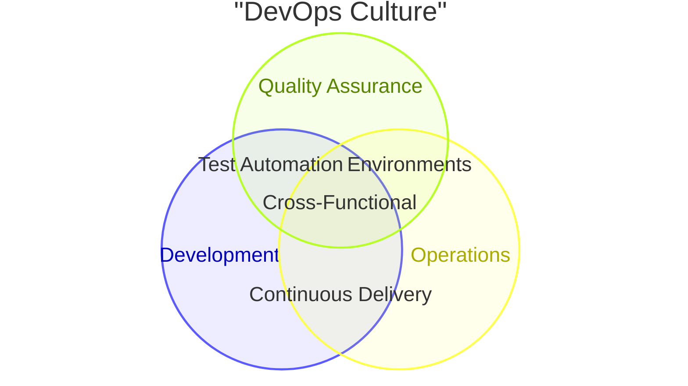

Docs: <https://mermaid.js.org/syntax/venn.html>

### XY Chart

An XY chart is an essential data visualization tool that lets you depict data points
on Cartesian coordinates. It supports visualizing data using line charts and bar charts.

- Use `xychart-beta` to initialize the diagram.
- Define an optional `title` to describe the chart.
- Specify the `x-axis` with specific categories (e.g., `[Jan, Feb]`) or a range.
- Specify the `y-axis` with an optional title and range (e.g., `"Revenue" 0 --> 100`).
- Add data series by using `bar` or `line` followed by an array of values (`[10, 20]`).

Example illustrating monthly sales and targets:

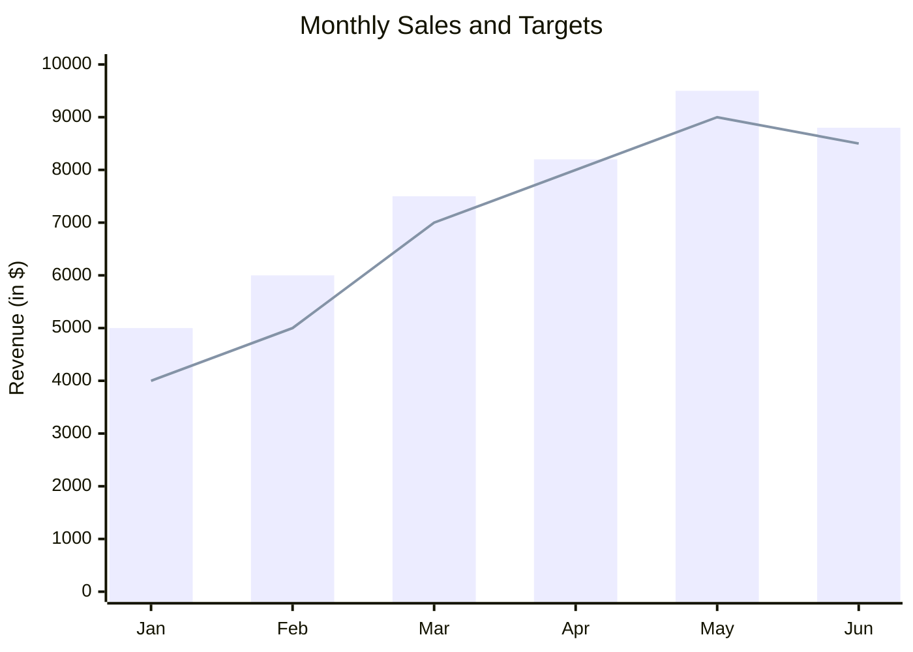

Docs: <https://mermaid.js.org/syntax/xyChart.html>

### ZenUML

ZenUML is an extension that allows you to write sequence diagrams
using a declarative pseudo-code syntax, focusing on speed and readability.
**Important**: ZenUML is an external integration. It requires importing the `@mermaid-js/mermaid-zenuml` plugin
and registering it with `mermaid.registerExternalDiagrams()` before it can be rendered by viewers.

- Use `zenuml` to initialize the diagram type.
- Add an optional `title` to label the diagram.
- Use `A->B: message` or `A->B: method() { ... }` for synchronous or asynchronous messages.
- Utilize programming constructs like `if (condition)`, `else`, `for`, `while`,
  and `try/catch` to build complex flow logic naturally.
- Use `return` statements to denote explicit responses.

Example of a ZenUML Sequence Diagram:

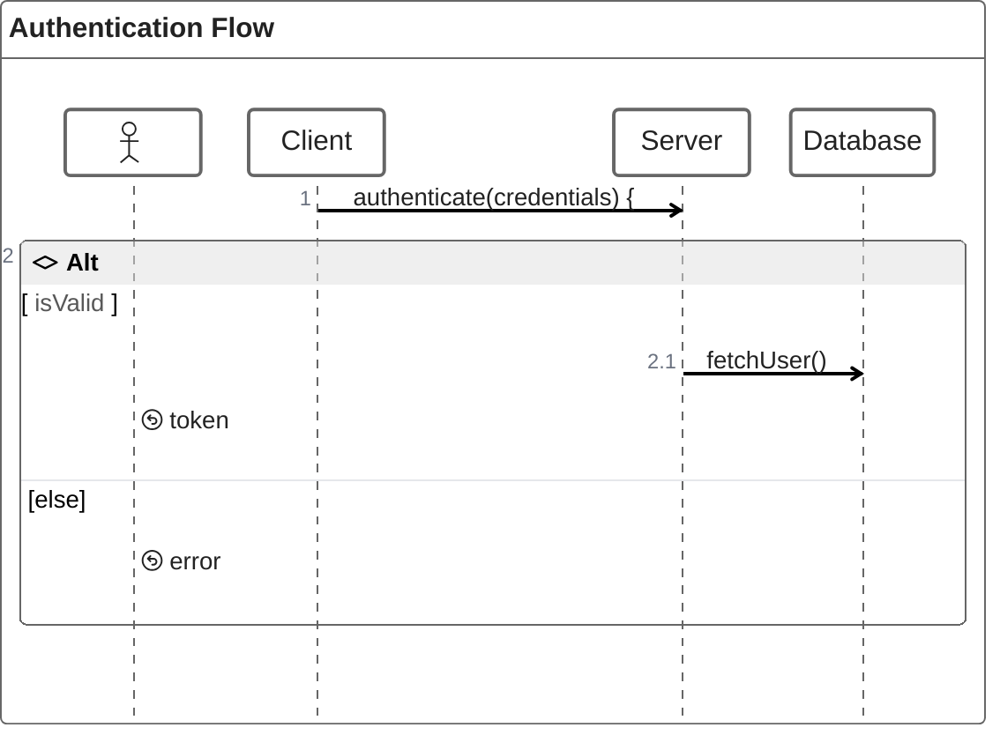

Docs: <https://mermaid.js.org/syntax/zenuml.html>

## Troubleshooting

```mermaid
mindmap
  root((Troubleshooting))
    %% Keep items in alphabetical order within branches
    Parsing Issues
      Hierarchy breaks
        ::icon(fa fa-indent)
        "Fix: Use strict indentation"
    Rendering Issues
      Architecture connection
        ::icon(fa fa-network-wired)
        "Fix: Use side indicators (L,R,T,B)"
      Missing ZenUML
        ::icon(fa fa-puzzle-piece)
        "Fix: Register external plugin"
    Version Issues
      Beta Volatility
        ::icon(fa fa-flask)
        "Fix: Check official docs for changes"
```
