---
<!-- markdownlint-disable MD003 MD022 MD026 MD041 -->
name: mermaid
description: >-
  Expert guide for creating, optimizing, troubleshooting, and maintaining **stable** Mermaid.js diagrams (v11+).
  Covers C4, Class, Entity Relationship, Flowchart (with v11.3+ shapes/icons/images), Gantt, GitGraph, Kanban,
  Mindmap, Pie, Quadrant, Requirement, Sequence, State, Timeline, User Journey.
  Emphasizes clarity, render-portability, and Doc-Rot prevention.

  Maintained at: <https://github.com/Cogni-AI-OU/cogni-ai-agent-skills>
license: MIT
---

# Mermaid Skill (Stable – v11+)

**Expert in generating production-grade, cross-platform Mermaid.js diagrams.** Prioritizes **clarity first**,
**render compatibility** (GitHub, VS Code, Mermaid Live Editor, Markdown), **minimalism**, and **Easy-To-Change (ETC)**
design so diagrams remain maintainable as systems evolve.

## Important note

If you have only read part of this skill file and your task involves creating a diagram type not covered in those lines,
you **MUST** read the rest of the file to access the relevant expert guidance and examples.

## When to Activate

- Agent must explain complex logic, system architecture, or requirements via diagrams.
- Generating diagrams that must render correctly in GitHub, Obsidian, Notion,
  or production docs.
- Updating or troubleshooting existing Mermaid code blocks in Markdown.
- User requests visualization of processes, architecture, sequences, data flows,
  timelines, or user journeys.

## Related Skills

- **mermaid-beta**: Guide for experimental and beta Mermaid.js diagram types.

## Related Instructions

- **mermaid.instructions.md**: Formatting standards, best
  practices, and anti-patterns for Mermaid.js.

## General Usage & Configuration

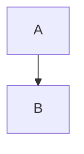

- **Live Editor**: Primary verification tool – paste code, preview instantly, export SVG/PNG.
- **Markdown Integration**: Use fenced code blocks with language `mermaid`.
- **Styling**: `classDef`, `linkStyle`, `style` keywords. Register icons via config for FontAwesome.
- **Security Note**: For public sites, Mermaid sanitizes input; use sandboxed iframe for user-generated diagrams.

## Diagram Types & Patterns

### C4 Diagrams

The C4 model is a lean graphical notation technique for modeling the
architecture of software systems at different levels of abstraction.

- Use `C4Context`, `C4Container`, `C4Component`, or `C4Dynamic` to
  initialize the appropriate diagram level.
- Define an optional `title` to specify the diagram's purpose.
- Use entity definitions like `Person`, `System`, `System_Ext`,
  `Container`, and `Component` with the format
  `Type(alias, "Label", "Optional Description")`.
- Structure the layout using boundaries such as
  `Enterprise_Boundary(alias, "Label") { ... }`.
- Connect entities using `Rel(from, to, "Label", "Optional Tech")`.

Example demonstrating a System Context Diagram:

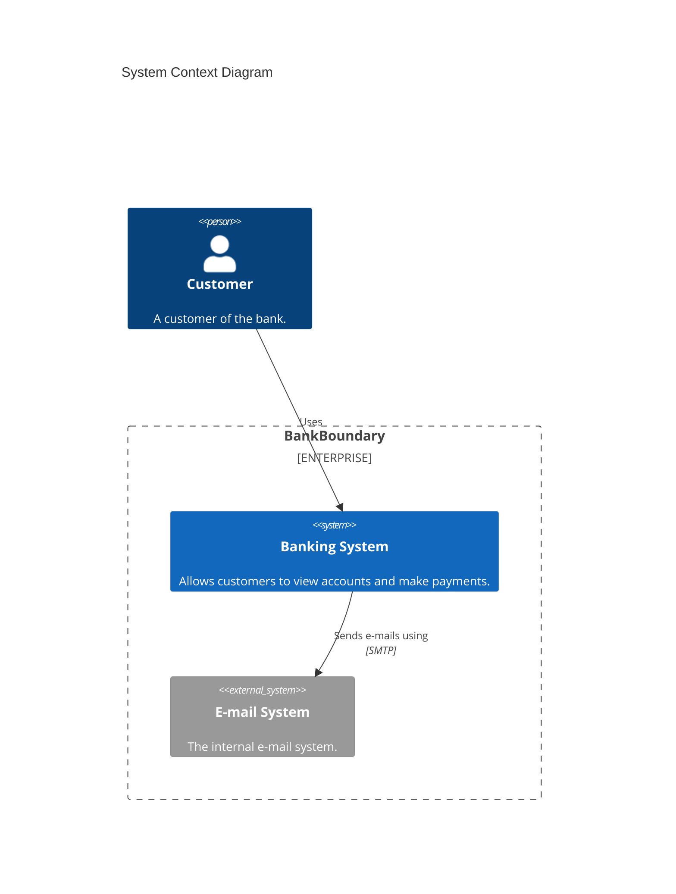

Docs: <https://mermaid.js.org/syntax/c4.html>

### Class Diagrams

A Class diagram is a static structure diagram that describes the
structure of a system by detailing its classes, attributes,
operations (or methods), and the relationships among objects.

- Use `classDiagram` to model object-oriented structures, including classes, interfaces, and their relationships.
- Define class members with visibility modifiers (`+` public, `-` private, `#` protected, `~` package/internal).
- Use relationships like inheritance (`<|--`), composition (`*--`), aggregation (`o--`), and dependency (`<..`).
- Include multiplicity (e.g., `"1"` to `"*"`) and annotations (e.g., `<<interface>>`, `<<abstract>>`) for detailed modeling.

Example with Relationships and Multiplicity:

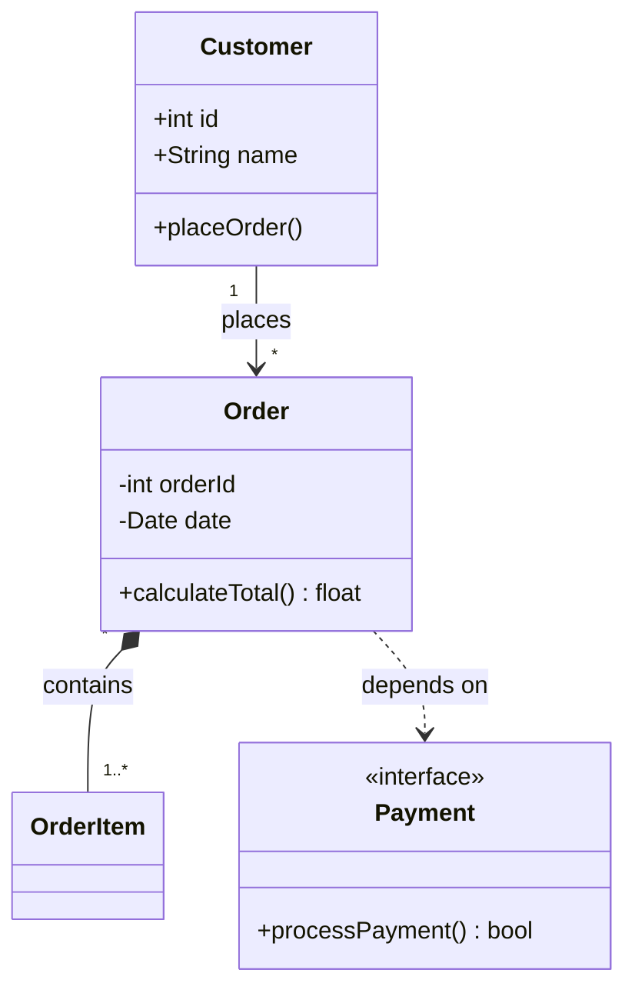

Example with Generic Types, Abstract Classes, and Visibility:

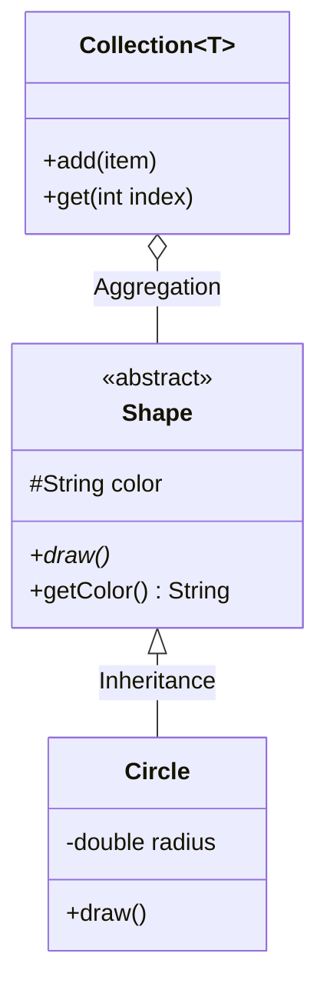

Docs: <https://mermaid.js.org/syntax/classDiagram.html>

### Entity Relationship Diagrams

An Entity-Relationship (ER) model describes interrelated things of
interest in a specific domain of knowledge. They specify relationships
that can exist between entity types and instances.

- Use `erDiagram` to model database schemas and entity relations.
- Define relationships using cardinality markers like `||--o{`
  (one-to-zero-or-more), `}o--|{` (zero-or-more to one-or-more), etc.
- Specify entity attributes alongside their data types inside blocks (`{ ... }`).
- Indicate Primary Keys (`PK`), Foreign Keys (`FK`), and Unique constraints (`UK`).

Example with Keys and Relationships:

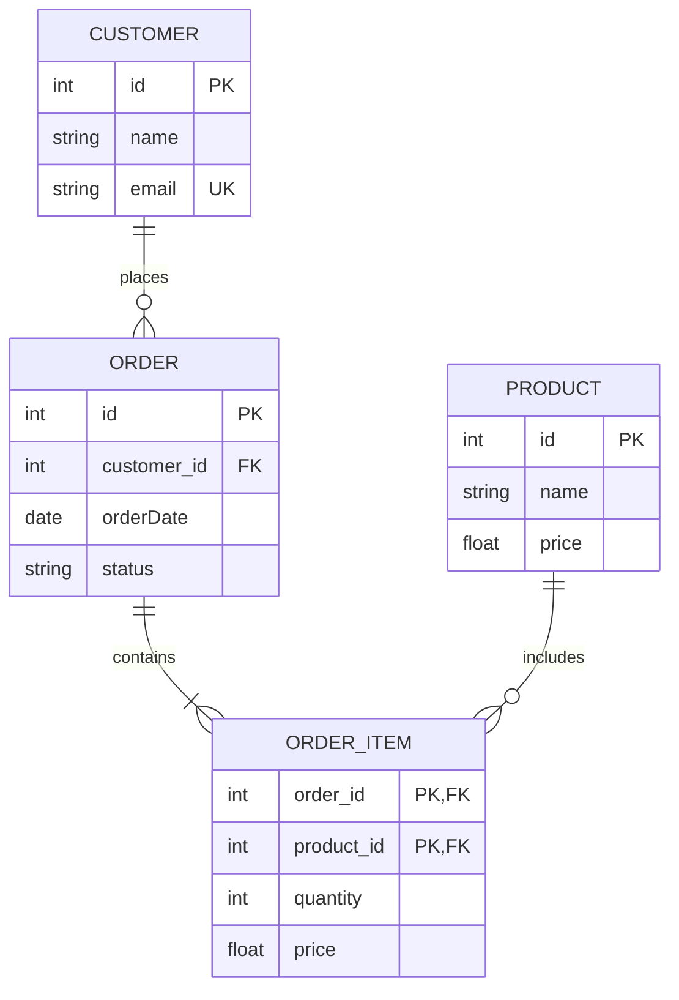

Docs: <https://mermaid.js.org/syntax/entityRelationshipDiagram.html>

### Flowcharts (Enhanced v11.3+)

Use `flowchart` (preferred) or legacy `graph`. Direction: `TD`/`TB`/`LR`/`RL`/`BT`.

- Use `([ ])` for start and end nodes (stadium shape).
- Use `[ ]` for processes and standard steps (rectangular shape).
- Use `{ }` for decisions (diamond shape).
- Use `(( ))` for events or circular nodes.
- Use `[( )]` for databases or persistent storage.

**New v11.3+ Shapes** (use `@{ shape: ..., label: "..." }` syntax):

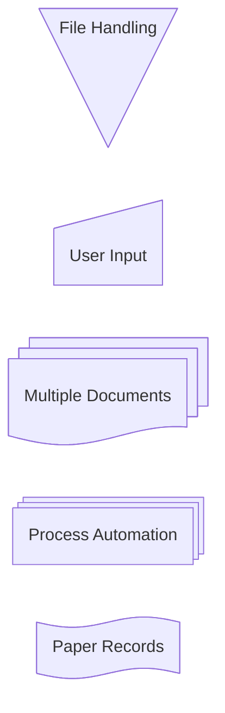

**Icons & Images** (v11.7+):

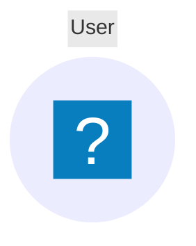

**Markdown Labels**:

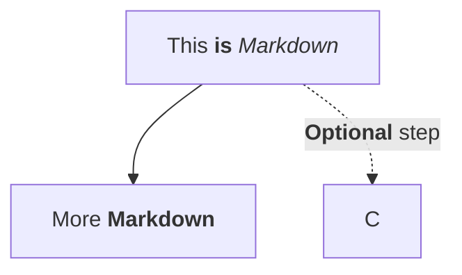

**Styling**:

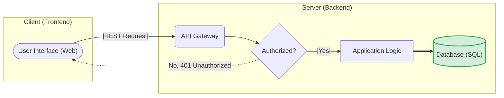

Docs: <https://mermaid.js.org/syntax/flowchart.html>

### Gantt Charts

A Gantt chart is a type of bar chart that illustrates a project
schedule and the amount of time it takes for tasks to finish.

- Use `gantt` for creating project schedules and timelines.
- Define the `dateFormat` to specify how dates are parsed (e.g. `YYYY-MM-DD`).
- Divide tasks into categories using `section`.
- Detail tasks with names, statuses (e.g., `crit`, `done`, `active`), aliases/IDs,
  start times/dependencies (e.g., `after id`), and durations (`10d`, `24h`).
- Exclude days like `weekends` or specific dates using `excludes`.

Example with Sections and Task Dependencies:

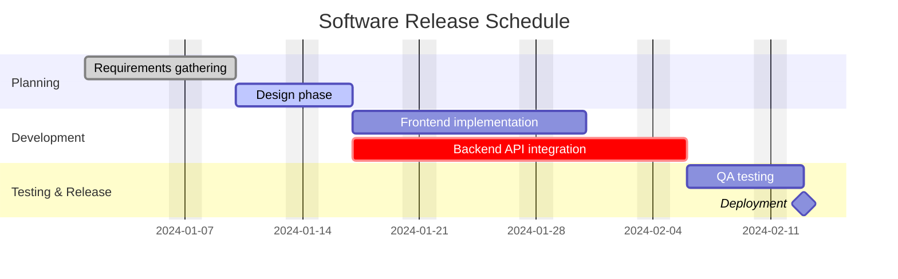

Docs: <https://mermaid.js.org/syntax/gantt.html>

### GitGraph Diagrams

A GitGraph diagram visualizes Git repository structures, including branches,
commit histories, and merge strategies.

- Use `gitGraph` to layout the repository history diagram.
- Add commits to the active branch using the `commit` command. Customize
  its appearance or metadata with `id`, `tag`, or `type` (e.g., `HIGHLIGHT`).
- Create branches using `branch <name>`.
- Switch between existing branches using `checkout <name>`.
- Merge a branch into the current one using `merge <branch_name>`.

Example with Branches, Commits, and Merges:

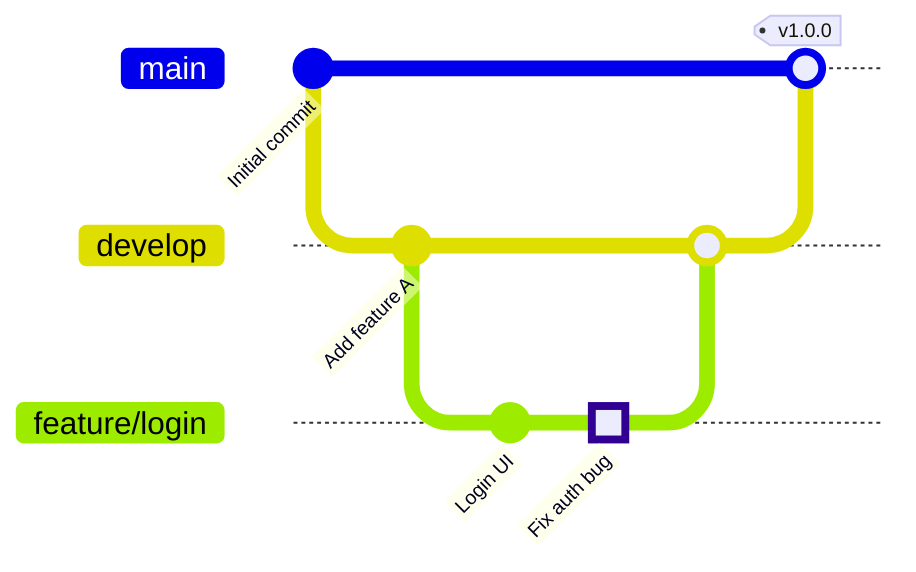

Docs: <https://mermaid.js.org/syntax/gitgraph.html>

### Kanban Diagram

A Kanban diagram visualizes work at various stages of a process, using columns to
represent stages and cards to represent individual work items.

- Use `kanban` to initialize the diagram type.
- Define columns by writing the column name directly (e.g., `Todo`, `Done`).
- Add tasks underneath their corresponding column using square brackets (`[Task Name]`).
- Optionally add metadata like `id: <number>` or `assigned: <name>` indented under a task.

Example demonstrating a simple workflow with assignments:

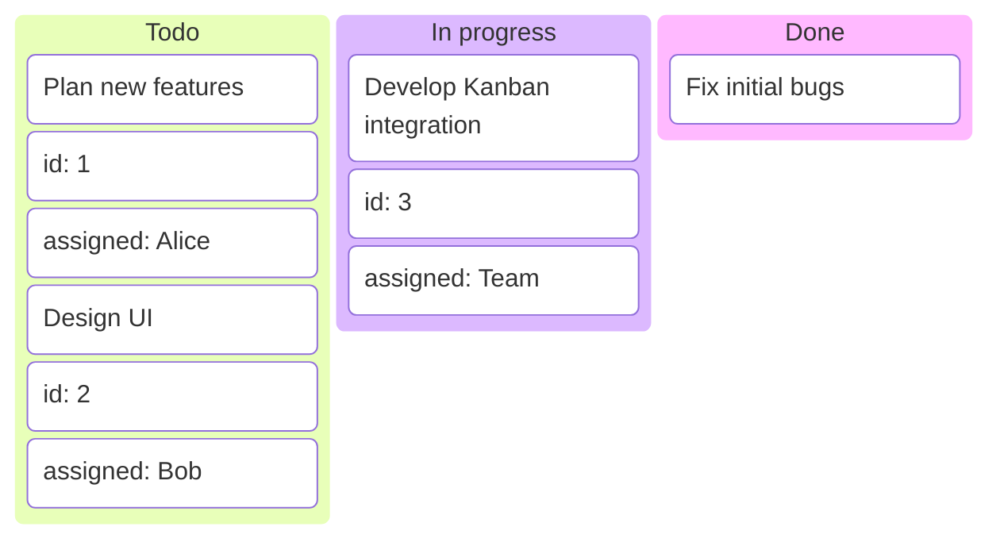

Docs: <https://mermaid.js.org/syntax/kanban.html>

### Mindmap Diagrams

A Mindmap is a diagram used to visually organize information into a hierarchy,
showing relationships and sub-components radiating from a central concept.

- Use `mindmap` to create hierarchical diagrams such as facts stores or brainstorms.
- Establish relationships and hierarchy strictly through indentation.
- Define a central starting node (e.g., `root((Project Name))`).
- Customize node shapes using brackets like `[square]`, `(rounded)`,
  `((circle))`, or `{{hexagon}}`.

Example representing a canonical facts store:

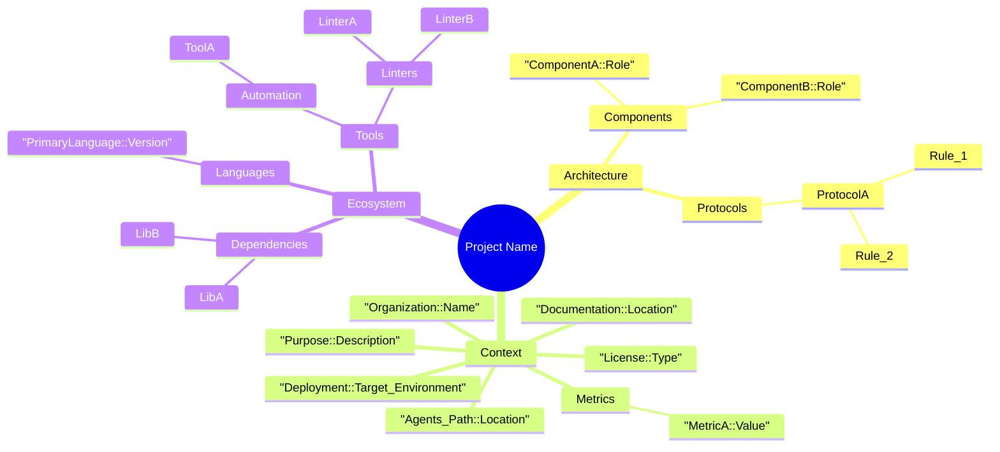

Docs: <https://mermaid.js.org/syntax/mindmap.html>

### Pie chart diagrams

A Pie chart is a circular statistical graphic divided into slices to
illustrate numerical proportions.

- Use `pie` to visualize parts of a whole and percentages.
- Append `showData` after the declaration (e.g., `pie showData`) to display the
  actual data values in the legend alongside their percentages.
- Define an optional `title` to describe the chart.
- Specify data slices using the format `"label" : value`.

Example with data values shown:

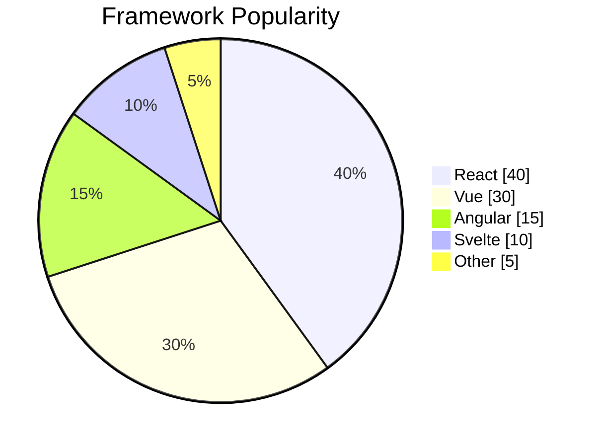

Docs: <https://mermaid.js.org/syntax/pie.html>

### Quadrant Chart

A Quadrant chart visualizes items across a two-dimensional grid
divided into four quadrants. It is often used to evaluate or prioritize
data based on two criteria (e.g., effort versus impact).

- Use `quadrantChart` to evaluate and position items in four quadrants.
- Add an optional `title` to describe the matrix.
- Define axes using `x-axis <left> --> <right>` and `y-axis <bottom> --> <top>`.
- Assign labels to quadrants using `quadrant-1` (top right), `quadrant-2`
  (top left), `quadrant-3` (bottom left), and `quadrant-4` (bottom right).
- Place items using `"Label": [x, y]` coordinates (values between `0.0` and `1.0`).

Example with Axes, Quadrant Labels, and Points:

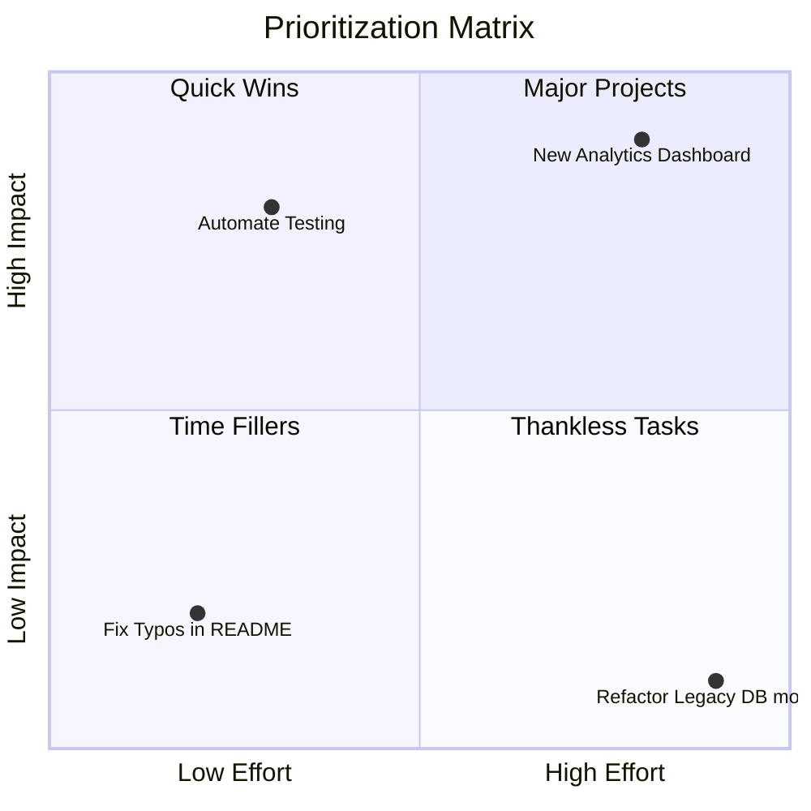

Docs: <https://mermaid.js.org/syntax/quadrantChart.html>

### Requirement Diagram

A Requirement diagram provides a visualization for requirements,
components, and the connections mapping dependencies between them.

- Use `requirementDiagram` to model requirements and system element dependencies.
- Define a `requirement` block with attributes like `id` (numeric), `text`,
  `risk` (Low, Medium, High), and `verifymethod` (Analysis, Demonstration, Inspection, Test).
- Define `element` blocks to represent system components that relate to requirements.
- Use relationships to link elements and requirements applying the format
  `- <type> ->` (e.g., `satisfies`, `contains`, `derives`, `refines`).

Example with Requirements, Elements, and Relationships:

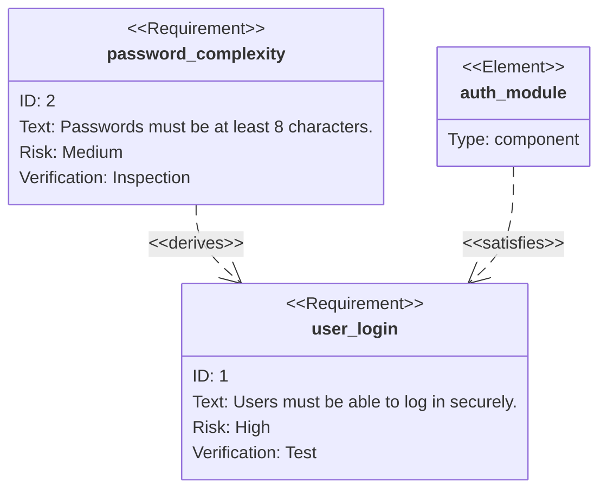

Docs: <https://mermaid.js.org/syntax/requirementDiagram.html>

### Sequence Diagrams

A Sequence diagram is an interaction diagram that shows how processes operate with one another and in what order.

- Use `sequenceDiagram` for interacting components.
- Define explicitly with `participant` or `actor`, and use aliases (`actor U as User`) for concise code.
- Use `autonumber` for automatic step numbering.
- Indicate execution context with activations (`+` / `-` or `activate`/`deactivate`).
- Add logic blocks (`alt` / `else`, `opt`, `loop`).
- Group participants using `box` blocks to denote system boundaries.

Example with Actors, Grouping, Logic, and Activations:

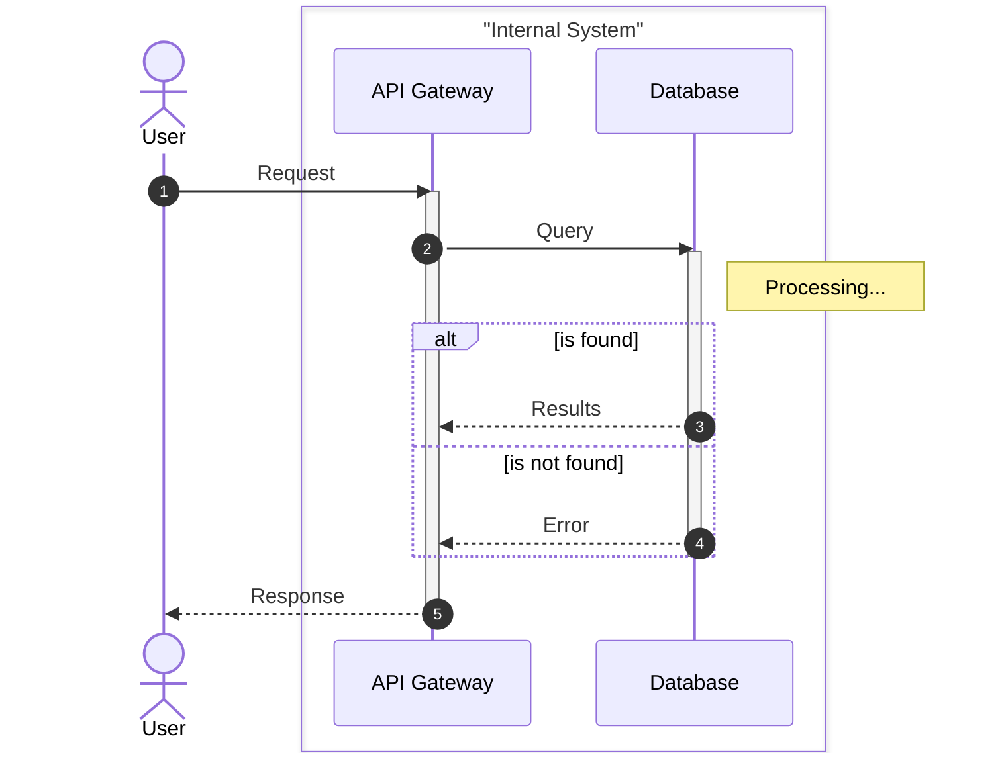

Example with Special Participant Types:

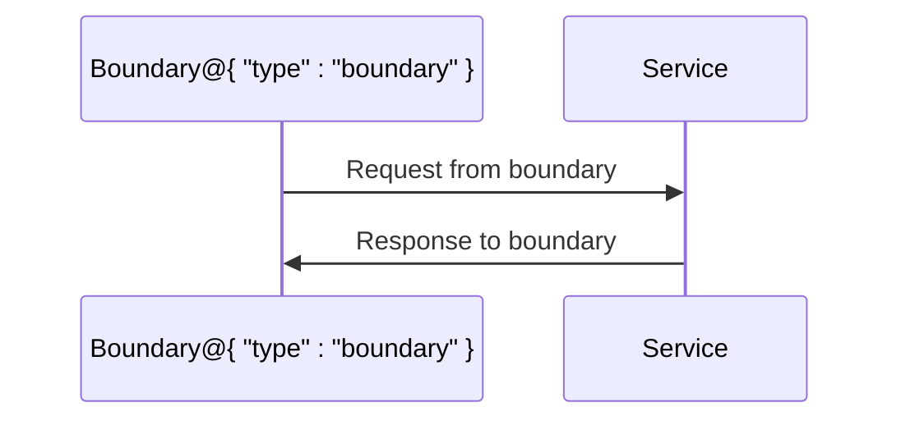

Docs: <https://mermaid.js.org/syntax/sequenceDiagram.html>

### State Diagrams

A State diagram describes the behavior of a system by representing
it as a finite number of states and the transitions between them.

- Use `stateDiagram-v2` for state machine visualization.
- Define states and use `-->` for transitions.
- Use `[*]` to represent the initial and final states.
- Describe transitions (e.g., `State1 --> State2 : Transition text`).
- Group related states logically using composite states.

Example with Transitions and Composite States:

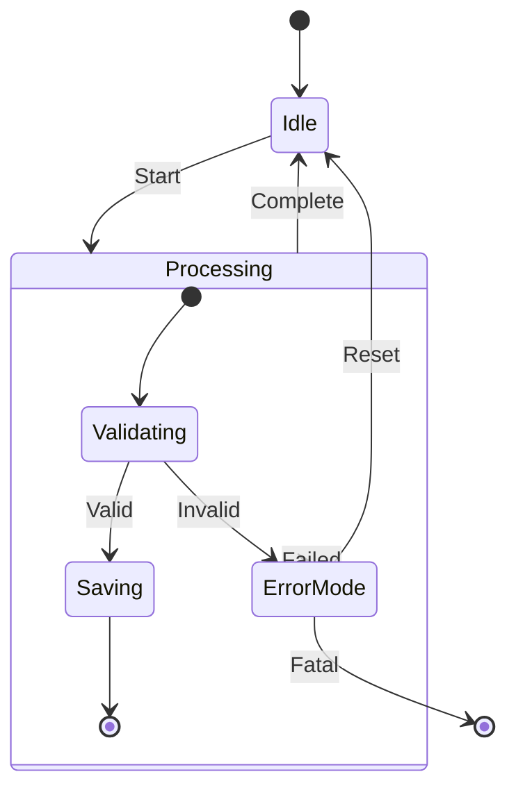

Docs: <https://mermaid.js.org/syntax/stateDiagram.html>

### Timeline Diagram

A Timeline diagram is a graphical representation used to display
a list of events in chronological order.

- Use `timeline` to visualize chronological events and historical progress.
- Include an optional `title` to describe the timeline's subject.
- Group events logically using `section` blocks.
- Define periods and associated events using the format
  `<time period> : <event> : <additional event>`.
- NEVER use colons (`:`) within the text of the `<time period>`,
  it is strictly reserved as the structural delimiter.

Example with Sections and Multiple Events:

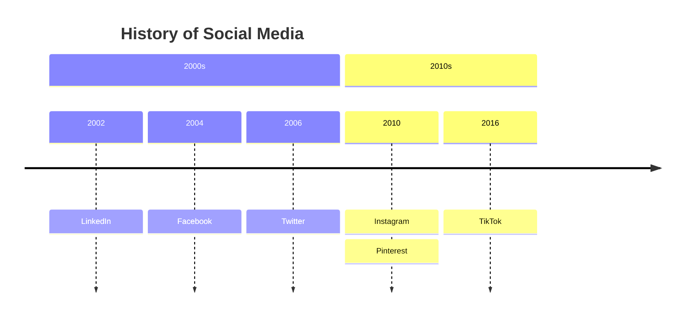

Docs: <https://mermaid.js.org/syntax/timeline.html>

### User Journey Diagram

A User Journey describes at a high level of detail the exact steps
different users take to complete a specific task within a system,
application, or website.

- Use `journey` to visualize user experiences and workflows.
- Define a `title` for the overall journey.
- Divide the journey into logical stages using `section`.
- Define steps using the syntax `Task name: <score 1-7>: <Actor1>, <Actor2>`.
  The score indicates user satisfaction at that step.

Example with Sections, Scores, and Actors:

```mermaid
journey
    title Online Shopping Experience

    section Browsing
      Search for product: 5: Customer
      View product details: 4: Customer
      Read reviews: 3: Customer

    section Checkout
      Add to cart: 6: Customer
      Enter shipping info: 4: Customer
      Process payment: 5: Customer, System

    section Post-Purchase
      Receive confirmation: 6: Customer, System
      Track shipping: 5: Customer
```

Docs: <https://mermaid.js.org/syntax/userJourney.html>

## Configuration & Advanced Styling

- **Themes**: `default`, `dark`, `forest`, `neutral`, `base`.
- **Frontmatter YAML** for renderer, curve style, etc.
- **ELK Renderer** (for very large/complex flowcharts): set `defaultRenderer: "elk"`.
- **Markdown Labels & classDef** (see Flowchart example above).

## Troubleshooting

```mermaid
mindmap
  root((Troubleshooting))
    %% Keep items in alphabetical order within branches
    Parsing Issues
      id_parse1["'end' keyword conflict"]
      ::icon(fa fa-exclamation-triangle)
        id_parse1_fix["Fix: Quote keywords or rename ID"]
      id_parse2["Double double-quotes"]
      ::icon(fa fa-xmark)
        id_parse2_fix["Fix: Avoid using nested double-quotes"]
      id_parse3["Non-ASCII characters (standardize)"]
      ::icon(fa fa-arrow-right)
        id_parse3_fix["Fix: Use standard ASCII (-> or -)"]
      id_parse4["Unquoted strings & parens"]
      ::icon(fa fa-quote-right)
        id_parse4_fix["Fix: Use exactly one pair of double quotes"]
    Rendering Issues
      id_ren1["Missing Icons"]
      ::icon(fa fa-font-awesome)
        id_ren1_fix["Fix: Register icon pack"]
      id_ren2["Performance lag"]
      ::icon(fa fa-clock)
        id_ren2_fix["Fix: Use ELK renderer"]
      id_ren3["Subgraph direction"]
      ::icon(fa fa-compress-arrows-alt)
        id_ren3_fix["Fix: Remove external links"]
    Version Issues
      id_ver1["Rendering mismatch"]
      ::icon(fa fa-sync)
        id_ver1_fix["Fix: Use v11+ syntax consistently"]
    Common Pitfalls
      id_pit1["Avoid accidental edges"]
      ::icon(fa fa-project-diagram)
        id_pit1_fix["Fix: Space before 'o'/'x' in IDs"]
      id_pit2["stroke-dasharray commas"]
      ::icon(fa fa-minus)
        id_pit2_fix["Fix: Escape as '\,'"]
```

## Maintenance

Note that this file should be updated if Mermaid syntax changes or new stable features land.
Separate `mermaid-beta/SKILL.md` is maintained for experimental diagrams.
