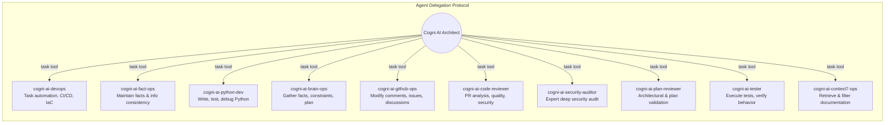
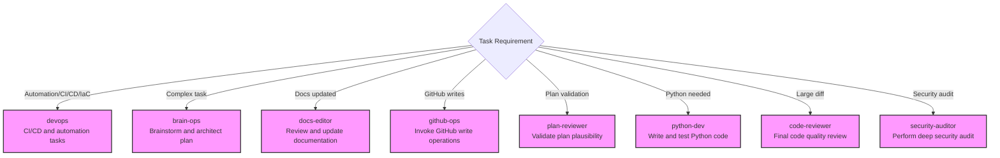

# subagent-task

<!-- markdownlint-disable MD013 MD023 MD031 MD032 -->

Provides policies and examples for using the `task` tool to spawn sub-agents for specialized, parallel, or complex tasks.

## Core Principles

- **Specialization**: Delegate tasks to specialized project agents rather than attempting to handle broad contexts monolithically.
- **Parallelization**: Spawn multiple agents concurrently for independent sub-tasks (e.g., retrieving facts, analyzing logs, validating plans).
- **Context Encapsulation**: Spawning sub-agents prevents the primary agent's context from becoming cluttered. Synthesize results from sub-agents into the final response.

## SUBAGENT DELEGATION POLICY

The use of the `task` tool and spawning sub-agents is permitted for complex, multi-step tasks, but delegation is limited to the project agents explicitly configured by this runtime.

- **Allowed Delegation Targets**: Use only the named project agents exposed by this runtime configuration.
- **Built-in Subagents Disabled**: Built-in `explore` and `general` subagents are not approved for this runtime and MUST NOT be used, even if a host tool still lists them.
- **Maintain Context**: Ensure that the primary agent remains the coordinator and synthesizes the results from sub-agents into the final response.
- **Strategic Delegation**: Delegate only when the task involves broad codebase analysis or independent sub-tasks that can be executed in parallel.

## Example: Agent Delegation Protocol

## Example: Delegation Scenarios

## Usage Patterns

- Always pass a clear `description` and a detailed `prompt` to the sub-agent.
- Provide the `subagent_type` argument to match the desired role. Ensure you check your available tools dynamically to find the currently supported list of project-specific agents rather than relying on a hardcoded list, as this functionality exists and is strongly recommended to be utilized for more specialized agents for relevant context.
- Ensure the primary agent acts as a coordinator, processing the `task_result` from each sub-agent before continuing the plan.
- If a sub-agent misbehaves (e.g., returning an unexpected reply) or fails to meet expectations, report this issue to the user with a clear explanation.
